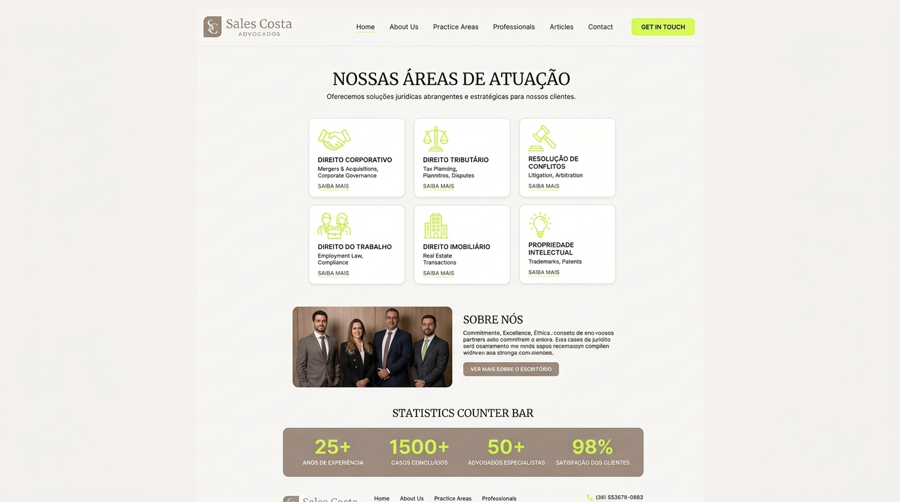

# Landing Page — Sales Costa Advogados

> **Spike de Solução, Especificação Técnica e Documentação Navegável**  
> **Status:** Concluído / Pronto para Implementação  
> **Stack:** HTML5 · Vanilla CSS · Vanilla JS (Zero dependências de build)

---

## 🌐 Documentação Navegável (Spike Viewer)

A documentação completa deste projeto foi compilada em uma página HTML autossuficiente e interativa contendo todos os artefatos, diagramas de fluxo em Mermaid e previews visuais da interface:

👉 **[Abrir Documentação Completa (docs/index.html)](file:///C:/Users/thiag/Documents/projetos/landing-page/docs/index.html)**  
👉 **[Caminho Alternativo (docs/exploracao/index.html)](file:///C:/Users/thiag/Documents/projetos/landing-page/docs/exploracao/index.html)**

---

## 🎨 Previews Visuais do Projeto

### Hero Banner & Sticky Navbar


### Seções de Conteúdo, Áreas de Atuação & Métricas


---

## 📂 Estrutura do Spike (`spike-salescosta/`)

Os arquivos de especificação detalhada estão organizados em seções modulares no diretório `spike-salescosta/`:

| Seção | Arquivo | Descrição |
|---|---|---|
| **01. Overview** | [01-overview.md](file:///C:/Users/thiag/Documents/projetos/landing-page/spike-salescosta/01-overview.md) | Sumário executivo, contexto da marca, benchmark (Lefosse & Higasi Sales) e decisão de stack. |
| **02. Model** | [02-model.md](file:///C:/Users/thiag/Documents/projetos/landing-page/spike-salescosta/02-model.md) | Sistema de cores (Taupe, Cinza Chumbo, Lima), gestão de logos, tipografia e anatomia das 10 seções. |
| **03. Flows** | [03-flows.md](file:///C:/Users/thiag/Documents/projetos/landing-page/spike-salescosta/03-flows.md) | Diagramas Mermaid de navegação, scripts JS da Sticky Navbar, Smooth Scroll, Contadores e Breakpoints. |
| **04. Risks** | [04-risks.md](file:///C:/Users/thiag/Documents/projetos/landing-page/spike-salescosta/04-risks.md) | Matriz de riscos (formulário, imagens provisórias, fontes), dependências e fila de perguntas em aberto. |
| **05. Goals & Not Goals** | [05-goals-and-not-goals.md](file:///C:/Users/thiag/Documents/projetos/landing-page/spike-salescosta/05-goals-and-not-goals.md) | Escopo incluído, fora de escopo (sem CMS/Blog na V1), User Stories (US-01 a US-08) e metas de aceite. |
| **06. Visual Layout** | [06-visual-layout.md](file:///C:/Users/thiag/Documents/projetos/landing-page/spike-salescosta/06-visual-layout.md) | Mapeamento de ativos de imagem, previews visuais e wireframes estruturais das seções. |
| **07. Tasks** | [07-tasks.md](file:///C:/Users/thiag/Documents/projetos/landing-page/spike-salescosta/07-tasks.md) | Checklist detalhado dividido em 7 Épicos de desenvolvimento com critérios de aceitação. |

---

## 🛠️ Como Recompilar a Documentação

Sempre que alterar qualquer arquivo `.md` dentro de `spike-salescosta/`, execute o script compilador em Python para atualizar a página em `docs/index.html`:

```bash
py gerar-docs.py
```

O script detecta os arquivos atualizados, insere o conteúdo formatado e recompila automaticamente os documentos em `docs/index.html` e `docs/exploracao/index.html`.

---

## 🎨 Paleta Cromática Oficial

| Tom | Hexadecimal | RGB | Função no Design |
|---|---|---|---|
| **Personalização (Taupe)** | `#AA9B8F` | `170, 155, 143` | Cor primária da marca, CTAs, headers e bordas |
| **Solidez (Cinza Chumbo)** | `#53565A` | `83, 86, 90` | Background dark, tipografia principal e navbar scrolled |
| **Sagacidade (Lima)** | `#E4FF8F` | `228, 255, 143` | Cor de acento para badges, hover e energia |
| **Off-White** | `#F8F6F4` | `248, 246, 244` | Fundo secundário claro para seções de leitura |
