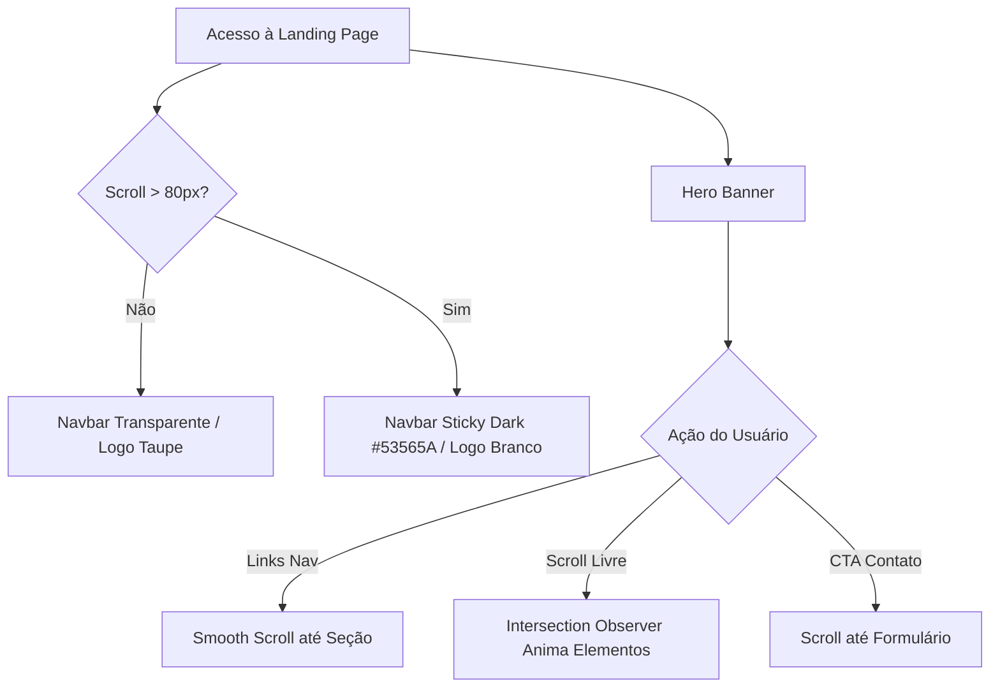

# Spike · Landing Page Sales Costa Advogados

> **Spike de Arquitetura Visual, Especificação Técnica e Solução**  
> **Status:** Concluído / Pronto para Implementação  
> **Visualizador HTML Compilado:** [docs/index.html](file:///C:/Users/thiag/Documents/projetos/landing-page/docs/index.html)

---

## 📑 Índice da Documentação (Espelho do docs/index.html)

Este README reproduz a estrutura exata do menu de navegação e conteúdo presente na página navegável [docs/index.html](file:///C:/Users/thiag/Documents/projetos/landing-page/docs/index.html):

```
Spike · Landing Page Sales Costa Advogados
│
├── 01 · Overview .............. Contexto, Benchmark & Decisão de Stack
├── 02 · Model ................. Cores, Logos, Tipografia & Design Tokens
├── 03 · Flows ................. Diagramas Mermaid, Sticky Nav, JS & Responsividade
├── 04 · Risks ................. Matriz de Riscos, Perguntas em Aberto & Dependências
├── 05 · Goals & Not Goals ..... Escopo V1, User Stories (US-01 a US-08) & Aceite
├── 06 · Visual Layout ......... Mockups Previews, Ativos de Marca & Wireframes
└── 07 · Tasks & Roadmap ....... Checklist de Desenvolvimento em 7 Épicos
```

---

## 🌐 Acesso Rápido à Documentação Compilada

- 🔗 **[Abrir Documentação Compilada no Navegador (docs/index.html)](file:///C:/Users/thiag/Documents/projetos/landing-page/docs/index.html)**
- 🔗 **[Caminho Alternativo (docs/exploracao/index.html)](file:///C:/Users/thiag/Documents/projetos/landing-page/docs/exploracao/index.html)**

---

## 01 · Overview (Visão Geral e Contexto)

> **Arquivo Fonte:** [spike-salescosta/01-overview.md](file:///C:/Users/thiag/Documents/projetos/landing-page/spike-salescosta/01-overview.md)

### Contexto Atual & Ativos
O projeto possui os ativos de marca oficiais no diretório `images/` (logos em PNG com sufixo `_temp` e paleta cromática em PDF). Avalia-se a criação de uma **landing page single-page (one-page)** de alto padrão.

### Benchmarking Cruzado
- **Lefosse (Linguagem Visual):** Estética editorial corporativa, tipografia serifada de luxo, sticky navbar adaptativa e uso estratégico de espaço em branco.
- **Higasi Sales (Estrutura One-Page):** Navegação por ancoragem contínua com 9 seções funcionais (Hero, Sobre, Áreas, Diferenciais, Números, Depoimentos, Equipe, Contato, Rodapé).

### Decisão Técnica de Stack
Adotou-se **HTML5 / Vanilla CSS / Vanilla JS** (sem React/Next.js). Justificativa: zero dependências de build, performance nativa no Lighthouse (98-100), hospedagem gratuita em servidores estáticos e fácil manutenção.

---

## 02 · Model (Arquitetura Visual, Paleta & Componentes)

> **Arquivo Fonte:** [spike-salescosta/02-model.md](file:///C:/Users/thiag/Documents/projetos/landing-page/spike-salescosta/02-model.md)

### Paleta Cromática Oficial

| Cor | Hexadecimal | RGB | Função no Design |
|---|---|---|---|
| **Personalização (Taupe)** | `#AA9B8F` | `170, 155, 143` | Cor primária da marca, CTAs, headers e bordas |
| **Solidez (Cinza Chumbo)** | `#53565A` | `83, 86, 90` | Background dark, tipografia principal e navbar scrolled |
| **Sagacidade (Lima)** | `#E4FF8F` | `228, 255, 143` | Cor de acento para badges, hover e destaques |
| **Off-White** | `#F8F6F4` | `248, 246, 244` | Fundo secundário claro para seções de leitura |

### Tipografia
- **Títulos e Headings:** `Cormorant Garamond` (Google Fonts) — 300 Light / 400 Regular / 600 Italic.
- **Corpo e Labels:** `DM Sans` (Google Fonts) — 400 Regular / 500 Medium Uppercase.

### Anatomia dos Componentes
Especificação detalhada dos componentes de UI para a Navbar Sticky, Hero Banner, Sobre o Escritório, Cards Grid de Áreas de Atuação, Diferenciais Dark, Banner Em Números, Carousel de Depoimentos, Cards da Equipe, Formulário Fale Conosco e Rodapé.

---

## 03 · Flows (Fluxos de Navegação, JS & Responsividade)

> **Arquivo Fonte:** [spike-salescosta/03-flows.md](file:///C:/Users/thiag/Documents/projetos/landing-page/spike-salescosta/03-flows.md)

### Diagrama de Navegação (Mermaid)


### Funcionalidades JavaScript
- **Sticky Navbar:** Transição de background ao rolar (`window.scrollY > 80`).
- **Smooth Scroll:** Rolagem suave para âncoras com compensação de offset (80px).
- **Intersection Observer:** Animação *reveal on scroll* (`[data-animate]`) respeitando `prefers-reduced-motion`.
- **Contador Animado:** Incremento numérico em JS para a seção "Em Números".
- **Breakpoints:** Adaptabilidade fluida em `480px`, `768px`, `1024px` e `1280px`.

---

## 04 · Risks (Riscos, Dependências & Perguntas em Aberto)

> **Arquivo Fonte:** [spike-salescosta/04-risks.md](file:///C:/Users/thiag/Documents/projetos/landing-page/spike-salescosta/04-risks.md)

### Matriz de Riscos Principais
1. **Ausência de Backend de E-mail:** Mitigado via serviço *serverless* (Formspree/EmailJS) ou integração WhatsApp.
2. **Ativos Provisórios (`_temp`):** Mitigado com dimensões relativas e `object-fit: contain`.
3. **Performance de Fontes CDN:** Mitigado com `<link rel="preconnect">` e `font-display: swap`.

### Fila de Perguntas em Aberto
- Serviço final de envio de formulário de contato.
- Lista definitiva das 6 áreas de atuação e membros da equipe.
- Registro e apontamento do domínio `salescosta.com.br`.

---

## 05 · Goals & Not Goals (Escopo, User Stories & Aceite)

> **Arquivo Fonte:** [spike-salescosta/05-goals-and-not-goals.md](file:///C:/Users/thiag/Documents/projetos/landing-page/spike-salescosta/05-goals-and-not-goals.md)

### Objetivos (Goals)
- Landing page one-page responsiva com 10 seções coesas.
- Sticky navbar inteligente, animações no scroll e contadores numéricos.
- Métricas Lighthouse $\ge 90$ em Performance, Acessibilidade e SEO.

### Não-Objetivos (Not Goals V1)
- Sem Painel CMS / Gestor de Conteúdo.
- Sem Blog Corporativo ou Área de Artigos.
- Sem suporte multi-idioma (i18n) ou portal de login de clientes.

### User Stories Mapeadas
Contempla as histórias **US-01** (Hero Banner) a **US-08** (Rodapé Institucional).

---

## 06 · Visual Layout (Mockups, Ativos & Wireframes)

> **Arquivo Fonte:** [spike-salescosta/06-visual-layout.md](file:///C:/Users/thiag/Documents/projetos/landing-page/spike-salescosta/06-visual-layout.md)

### Previews de Interface
  
*Figura 6.1 — Preview da Hero Banner & Sticky Navbar*

  
*Figura 6.2 — Preview do Grid de Áreas de Atuação e Métricas*

---

## 07 · Tasks & Roadmap (Checklist de Desenvolvimento)

> **Arquivo Fonte:** [spike-salescosta/07-tasks.md](file:///C:/Users/thiag/Documents/projetos/landing-page/spike-salescosta/07-tasks.md)

### Roadmap em 7 Épicos
- [ ] **Épico 1:** Setup do Projeto & Design Tokens (`variables.css`, Fonts, Reset).
- [ ] **Épico 2:** Header & Sticky Navigation (Navbar, JS scroll, Drawer Mobile).
- [ ] **Épico 3:** Hero Banner Section (Tipografia Garamond 64px, Overlay, CTAs).
- [ ] **Épico 4:** Seções Institucionais (Sobre o Escritório e Diferenciais Dark).
- [ ] **Épico 5:** Módulos Funcionais (Grid de Áreas, Contadores JS, Depoimentos, Equipe).
- [ ] **Épico 6:** Formulário de Contato & Rodapé (Inputs minimalistas, Validação JS).
- [ ] **Épico 7:** Polimento & Qualidade (Intersection Observer, Lighthouse $\ge 90$).

---

## 🛠️ Como Recompilar a Documentação HTML

Após editar qualquer arquivo `.md` em `spike-salescosta/`, rode:

```bash
py gerar-docs.py
```

O script atualizará automaticamente a página compilada em [docs/index.html](file:///C:/Users/thiag/Documents/projetos/landing-page/docs/index.html).
