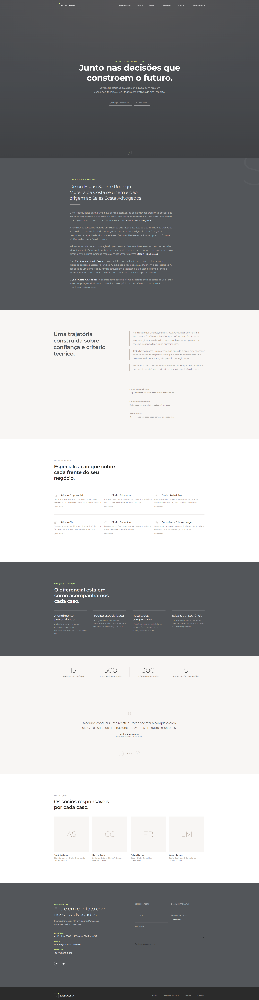

# Spike · Landing Page Sales Costa Advogados

> **Spike de Arquitetura Visual, Especificação Técnica e Solução**  
> **Status:** Concluído com 10 PRDs em Lote Geradas ([spike-salescosta/PRDs/](file:///C:/Users/thiag/Documents/projetos/landing-page/spike-salescosta/PRDs))  
> **Visualizador HTML Compilado:** [docs/index.html](file:///C:/Users/thiag/Documents/projetos/landing-page/docs/index.html)

---

## 🎨 Layout Oficial de Referência

Toda a documentação técnica, requisitos de produto e tarefas de desenvolvimento seguem 100% o layout oficial da landing page:



---

## 📑 Índice da Documentação & PRDs (Espelho do docs/index.html)

```
Spike · Landing Page Sales Costa Advogados
│
├── Documentação do Spike
│   ├── 01 · Overview .............. Contexto, Origem da Banca & Responsividade Universal
│   ├── 02 · Model ................. Cores (#404347 Dark, #AA9B8F Taupe, #E4FF8F Lima) & Specs
│   ├── 03 · Flows ................. Diagramas Mermaid, Links Nav, JS & Breakpoints
│   ├── 04 · Risks ................. Matriz de Riscos & Fila de Decisões
│   ├── 05 · Goals & Not Goals ..... Escopo 11 Seções, User Stories & Lighthouse >= 90
│   ├── 06 · Visual Layout ......... Decomposição nos 10 Componentes Visuais com Imagens
│   └── 07 · Tasks & Roadmap ....... Checklist em 7 Épicos de Desenvolvimento
│
└── PRDs · Requisitos de Produto (spike-salescosta/PRDs/)
    ├── PRD · US-01 Hero Banner ....................... Especificação do Topo e CTAs
    ├── PRD · US-02 Comunicado ao Mercado ............. Notícia Oficial da Fusão dos Sócios
    ├── PRD · US-03 Sobre o Escritório ................ Trajetória e os 3 Pilares
    ├── PRD · US-04 Áreas de Atuação .................. Grid 2x3 de Especialidades
    ├── PRD · US-05 Por Que Sales Costa ............... 4 Diferenciais em Fundo Dark
    ├── PRD · US-06 Em Números ........................ Métricas e Contador Animado JS
    ├── PRD · US-07 Depoimentos ....................... Citação Grupo Vantis e Touch Swipe
    ├── PRD · US-08 Nossa Equipe ...................... Sócios AS, CC, FR, LM
    ├── PRD · US-09 Fale Conosco ...................... Formulário Minimalista e Dados Paulista
    └── PRD · US-10 Rodapé Institucional .............. Logo e Navegação Global
```

---

## 🌐 Acesso Rápido à Documentação Compilada

- 🔗 **[Abrir Documentação Compilada no Navegador (docs/index.html)](file:///C:/Users/thiag/Documents/projetos/landing-page/docs/index.html)**
- 🔗 **[Caminho Alternativo (docs/exploracao/index.html)](file:///C:/Users/thiag/Documents/projetos/landing-page/docs/exploracao/index.html)**

---

## 🛠️ Como Recompilar a Documentação HTML

Após editar qualquer arquivo `.md` em `spike-salescosta/` ou `spike-salescosta/PRDs/`, rode:

```bash
py gerar-docs.py
```
