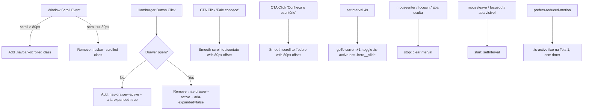

# SPEC — US-01: Hero Banner & Proposta de Valor

> **PRD de Origem:** [US-01-hero-banner.md](../../spike-salescosta/PRDs/US-01-hero-banner.md)  
> **Componente:** Componente 1 (Navbar & Hero Banner)  
> **Stack:** HTML5 Semântico / Vanilla CSS3 / Vanilla JS (ES6+)  
> **Status:** Ready for Development

---

## 1. System Architecture & Component Overview

O componente **Hero Banner & Navbar Sticky** é o elemento visual primário *Above-the-Fold* da landing page institucional do Sales Costa Advogados. Ele combina a cabeceira principal de navegação (`<header class="header">`) e o bloco inicial de impacto visual (`<section id="hero">`).

### Estrutura do Componente:
1. **Header Sticky (`.navbar`):**
   - **Desktop (≥ 1024px):** Logo wordmark (`assets/logo_salescosta.png`) à esquerda e 6 links de ancoragem à direita — sendo o item **"Fale conosco" estilizado como `.btn--primary`** (mesmo peso visual do CTA do hero). Transição de fundo transparente para sólido `#404347` após 80px de scroll.
   - **Mobile/Tablet (< 1024px):** Logo + Botão Hambúrguer (alvo tátil ≥ 44×44px) acionando o Drawer lateral de navegação com transição CSS `transform: translateX()`. No drawer, "Fale conosco" também recebe o tratamento de botão primário.
2. **Hero Content (`.hero`):** todo o conteúdo **centralizado horizontalmente** (`.hero__content { text-align: center }`).
   - Eyebrow em tom **Lima (`#E4FF8F`)** com `letter-spacing: 3px` (token global `--eyebrow-tracking`).
   - Headline H1 em tipografia fluida (`clamp(2rem, 5vw, 4rem)`), `font-weight: 800`.
   - Subtítulo em tom cinza claro (`#D1D5DB`).
   - Dupla de CTAs (`.btn--primary` preenchido e `.btn--outline` vazado), centralizados: lado a lado no desktop, empilhados em 1 coluna (100% largura) no mobile.
   - Indicador animado de scroll (`.hero__scroll-indicator`).
3. **Fundo rotativo do hero (`.hero__bg`)** — banner de 3 telas em **crossfade suave** (`opacity 1.2s`), giro automático **a cada 4 s**:
   - **Tela 1** (`.hero__slide--brand`): **degradê linear vertical** `#4D4F52` (topo) → `#3B3636` (base) — tokens `--hero-grad-top` / `--hero-grad-bottom` — com a marca d'água "S" (`.hero__watermark`, `assets/logo_s_background.png`). Idêntico ao hero anterior.
   - **Tela 2** (`.hero__slide--sp`): foto `assets/banner_saopaulo.png` (1280×720), `background-size: cover`.
   - **Tela 3** (`.hero__slide--floripa`): foto `assets/banner_floripa.png` (1280×720), `background-size: cover`.
   - Telas 2 e 3 recebem um **overlay em degradê** (`::after`): `rgba(0,0,0,0.12)` no topo → `0.40` a 45% → `0.75` na base (leve em cima, escurece embaixo).
   - O `.hero__content` (eyebrow, título, subtítulo, CTAs) e o `.hero__scroll-indicator` ficam **fixos sobre as 3 telas** — só o fundo troca.
   - `.hero__bg` é decorativo (`aria-hidden="true"`); nenhuma live region (o conteúdo semântico não muda).
   - Pausa no `mouseenter`/`focusin` do `.hero` e com a aba em segundo plano; retoma ao sair. Com `prefers-reduced-motion: reduce`, congela na Tela 1 (sem `setInterval`, sem transição).

### Mermaid Diagram: DOM & Event Flow



---

## 2. HTML Structure

```html
<header class="header">
  <nav class="navbar" aria-label="Navegação Principal">
    <div class="navbar__container">
      <a href="#hero" class="navbar__logo" aria-label="Sales Costa Advogados - Início">
        
      </a>

      <!-- Menu Desktop -->
      <ul class="navbar__menu" role="menubar">
        <li role="none"><a href="#comunicado" class="navbar__link" role="menuitem">Comunicado</a></li>
        <li role="none"><a href="#sobre" class="navbar__link" role="menuitem">Sobre</a></li>
        <li role="none"><a href="#areas" class="navbar__link" role="menuitem">Áreas</a></li>
        <li role="none"><a href="#diferenciais" class="navbar__link" role="menuitem">Diferenciais</a></li>
        <li role="none"><a href="#equipe" class="navbar__link" role="menuitem">Equipe</a></li>
        <li role="none"><a href="#contato" class="navbar__link navbar__link--cta" role="menuitem">Fale conosco</a></li>
      </ul>

      <!-- Botão Hambúrguer Mobile -->
      <button type="button" class="navbar__hamburger" aria-label="Abrir menu de navegação" aria-expanded="false" aria-controls="nav-drawer">
        <span class="navbar__hamburger-bar"></span>
        <span class="navbar__hamburger-bar"></span>
        <span class="navbar__hamburger-bar"></span>
      </button>
    </div>
  </nav>

  <!-- Drawer Lateral Mobile -->
  <aside id="nav-drawer" class="nav-drawer" aria-hidden="true">
    <div class="nav-drawer__header">
      
      <button type="button" class="nav-drawer__close" aria-label="Fechar menu de navegação">&times;</button>
    </div>
    <ul class="nav-drawer__menu">
      <li><a href="#comunicado" class="nav-drawer__link">Comunicado</a></li>
      <li><a href="#sobre" class="nav-drawer__link">Sobre</a></li>
      <li><a href="#areas" class="nav-drawer__link">Áreas</a></li>
      <li><a href="#diferenciais" class="nav-drawer__link">Diferenciais</a></li>
      <li><a href="#equipe" class="nav-drawer__link">Equipe</a></li>
      <li><a href="#contato" class="nav-drawer__link nav-drawer__link--cta">Fale conosco</a></li>
    </ul>
  </aside>
</header>

<section id="hero" class="hero" aria-labelledby="hero-title">
  <!-- Fundo rotativo (decorativo): 3 telas em crossfade, giro automático 4s.
       JS alterna .is-active entre os .hero__slide (ver §4). -->
  <div class="hero__bg" aria-hidden="true">
    <div class="hero__slide hero__slide--brand is-active">
      <!-- Marca d'água "S" (logo_s_background.png, 1634x2102) — só na Tela 1 -->
      
    </div>
    <div class="hero__slide hero__slide--photo hero__slide--sp"></div>
    <div class="hero__slide hero__slide--photo hero__slide--floripa"></div>
  </div>

  <div class="hero__container">
    <div class="hero__content">
      <span class="hero__eyebrow">SALES COSTA ADVOGADOS</span>
      <h1 id="hero-title" class="hero__title">Junto nas decisões que constroem o futuro.</h1>
      <p class="hero__subtitle">
        Advocacia estratégica e personalizada, com foco em excelência técnica e resultados corporativos de alto impacto.
      </p>
      <div class="hero__actions">
        <a href="#sobre" class="btn btn--outline">
          Conheça o escritório
          <svg class="btn__icon" width="16" height="16" viewBox="0 0 24 24" fill="none" stroke="currentColor" stroke-width="2" aria-hidden="true"><path d="M5 12h14M12 5l7 7-7 7"/></svg>
        </a>
        <a href="#contato" class="btn btn--primary">
          Fale conosco
          <svg class="btn__icon" width="16" height="16" viewBox="0 0 24 24" fill="none" stroke="currentColor" stroke-width="2" aria-hidden="true"><path d="M5 12h14M12 5l7 7-7 7"/></svg>
        </a>
      </div>
    </div>

    <!-- Indicador de Scroll -->
    <a href="#comunicado" class="hero__scroll-indicator" aria-label="Rolar para a próxima seção">
      <span class="hero__scroll-dot"></span>
    </a>
  </div>
</section>

---

## 3. CSS Specification

```css
/* ==========================================================================
   3.1 Base Styles (Mobile First: < 768px)
   ========================================================================== */
.header {
  position: fixed;
  top: 0;
  left: 0;
  width: 100%;
  z-index: 1000;
  transition: background-color 0.3s ease, box-shadow 0.3s ease;
}

/* Fundo sólido quando a página rola (JS adiciona .navbar--scrolled ao header
   em scrollY > 80). Fica no escopo base para valer em TODOS os breakpoints —
   antes existia só dentro de @media (min-width: 1024px), então no mobile o
   header continuava transparente sobre as seções claras após o scroll. */
.navbar--scrolled {
  background-color: var(--color-dark);   /* #404347 */
  box-shadow: 0 4px 20px rgba(0, 0, 0, 0.3);
}

.navbar {
  width: 100%;
  height: 80px;
}

.navbar__container {
  max-width: var(--container-max);
  margin: 0 auto;
  padding: 0 var(--section-pad-x);
  height: 100%;
  display: flex;
  align-items: center;
  justify-content: space-between;
}

.navbar__logo {
  display: flex;
  align-items: center;
  text-decoration: none;
  color: var(--color-white);
}

/* Wordmark oficial — assets/logo_salescosta.png (520x44).
   Altura conforme layout: 18px mobile · 22px desktop (≥1024px). */
.navbar__logo-img {
  display: block;
  height: 18px;
  width: auto;
}

.navbar__menu {
  display: none; /* Oculto no Mobile */
}

.navbar__hamburger {
  display: flex;
  flex-direction: column;
  justify-content: space-between;
  width: 44px;
  height: 44px;
  padding: 10px;
  background: transparent;
  border: none;
  cursor: pointer;
}

.navbar__hamburger-bar {
  width: 100%;
  height: 2px;
  background-color: var(--color-white);
  transition: transform 0.3s ease;
}

/* Nav Drawer Mobile */
.nav-drawer {
  position: fixed;
  top: 0;
  right: 0;
  width: 280px;
  height: 100vh;
  background-color: var(--color-dark);
  box-shadow: -4px 0 20px rgba(0, 0, 0, 0.4);
  transform: translateX(100%);
  transition: transform 0.3s cubic-bezier(0.4, 0, 0.2, 1);
  z-index: 1001;
  padding: 24px;
  display: flex;
  flex-direction: column;
}

.nav-drawer--active {
  transform: translateX(0);
}

.nav-drawer__header {
  display: flex;
  justify-content: space-between;
  align-items: center;
  margin-bottom: 32px;
}

.nav-drawer__logo-img {
  display: block;
  height: 20px;
  width: auto;
}

.nav-drawer__close {
  background: none;
  border: none;
  color: var(--color-white);
  font-size: 2rem;
  width: 44px;
  height: 44px;
  cursor: pointer;
}

.nav-drawer__menu {
  list-style: none;
  padding: 0;
  margin: 0;
}

.nav-drawer__link {
  display: block;
  padding: 14px 0;
  color: var(--color-white);
  font-size: 1.125rem;
  text-decoration: none;
  border-bottom: 1px solid rgba(255, 255, 255, 0.1);
}

/* "Fale conosco" no drawer — mesmo peso do CTA primário do hero */
.nav-drawer__link--cta {
  margin-top: 16px;
  padding: 14px 20px;
  text-align: center;
  background-color: var(--color-taupe);
  color: var(--color-white);
  border: 1px solid var(--color-taupe);
  border-radius: 4px;
}

/* Hero Section Base */
.hero {
  min-height: 100vh;
  /* fallback escuro antes de o fundo rotativo carregar (= base da Tela 1) */
  background-color: var(--hero-grad-bottom);
  color: var(--color-white);
  display: flex;
  align-items: center;
  position: relative;
  padding-top: 100px;
  padding-bottom: 60px;
  overflow: hidden;
}

/* ── Fundo rotativo: 3 telas em crossfade (JS alterna .is-active) ── */
.hero__bg {
  position: absolute;
  inset: 0;
  z-index: 0;
}

.hero__slide {
  position: absolute;
  inset: 0;
  opacity: 0;
  transition: opacity 1.2s ease-in-out; /* crossfade "bem suave" */
}

.hero__slide.is-active {
  opacity: 1;
}

/* Tela 1 — degradê da marca #4D4F52 (topo) -> #3B3636 (base) */
.hero__slide--brand {
  background: linear-gradient(180deg, var(--hero-grad-top) 0%, var(--hero-grad-bottom) 100%);
}

/* Telas 2 e 3 — fotos */
.hero__slide--photo {
  background-size: cover;
  background-position: center;
}

/* Overlay em degradê: leve no topo, escurece em direção à base */
.hero__slide--photo::after {
  content: "";
  position: absolute;
  inset: 0;
  background: linear-gradient(
    180deg,
    rgba(0, 0, 0, 0.12) 0%,
    rgba(0, 0, 0, 0.40) 45%,
    rgba(0, 0, 0, 0.75) 100%
  );
}

.hero__slide--sp      { background-image: url('../assets/banner_saopaulo.png'); }
.hero__slide--floripa { background-image: url('../assets/banner_floripa.png'); }

/* Marca d'água decorativa — assets/logo_s_background.png (1634x2102),
   ancorada à direita, sangrando topo/base. Vive dentro de .hero__slide--brand,
   acompanha o fade da Tela 1.
   `max-width: none` anula o `img { max-width: 100% }` do reset.css — sem
   isso, no mobile a largura fica presa à do .hero e o "S" deforma (altura
   fixa + largura comprimida). Com a proporção preservada, o excesso
   horizontal vaza e é recortado pelo `overflow: hidden` do .hero. */
.hero__watermark {
  position: absolute;
  right: -6%;
  top: 50%;
  transform: translateY(-50%);
  height: 118%;
  width: auto;
  max-width: none;
  opacity: var(--watermark-opacity); /* 0.3 — token global das marcas d'água */
  pointer-events: none;
  user-select: none;
  z-index: 0;
}

.hero__container {
  max-width: var(--container-max);
  margin: 0 auto;
  padding: 0 var(--section-pad-x);
  width: 100%;
}

/* Conteúdo centralizado horizontalmente e acima da marca d'água.
   O z-index vai no CONTENT (não no container) para que o
   .hero__scroll-indicator posicione-se contra o .hero e fique na base. */
.hero__content {
  position: relative;
  z-index: 1;
  text-align: center;
}

.hero__eyebrow {
  display: inline-block;
  font-size: var(--text-eyebrow);
  font-weight: 500;
  color: var(--color-lima);
  letter-spacing: var(--eyebrow-tracking); /* 3px — token global */
  margin-bottom: 16px;
  text-transform: uppercase;
}

.hero__title {
  font-family: var(--font-display);
  font-size: var(--text-hero);
  line-height: 1.15;
  font-weight: 800;
  margin: 0 auto 24px;
  max-width: 900px;
}

.hero__subtitle {
  font-size: var(--text-body);
  line-height: 1.6;
  color: var(--color-text-light);
  max-width: 640px;
  margin: 0 auto 40px;
  font-weight: 300;
}

.hero__actions {
  display: flex;
  flex-direction: column;
  align-items: center;
  gap: 16px;
  width: 100%;
}

.btn {
  display: inline-flex;
  align-items: center;
  justify-content: center;
  gap: 8px;
  min-height: 48px;
  padding: 14px 28px;
  border-radius: 4px;
  font-size: 1rem;
  font-weight: 500;
  text-decoration: none;
  transition: all 0.3s ease;
  width: 100%;
}

.btn--primary {
  background-color: var(--color-taupe);
  color: var(--color-white);
  border: 1px solid var(--color-taupe);
}

.btn--outline {
  background-color: transparent;
  color: var(--color-white);
  border: 1px solid rgba(255, 255, 255, 0.4);
}

.hero__scroll-indicator {
  position: absolute;
  bottom: 24px;
  left: 50%;
  transform: translateX(-50%);
  z-index: 2;
  width: 24px;
  height: 40px;
  border: 2px solid rgba(255, 255, 255, 0.4);
  border-radius: 12px;
  display: flex;
  justify-content: center;
  padding-top: 6px;
}

.hero__scroll-dot {
  width: 4px;
  height: 8px;
  background-color: var(--color-taupe);
  border-radius: 2px;
  animation: scrollPulse 2s infinite;
}

@keyframes scrollPulse {
  0% { transform: translateY(0); opacity: 1; }
  50% { transform: translateY(12px); opacity: 0.3; }
  100% { transform: translateY(0); opacity: 1; }
}

/* ==========================================================================
   3.2 Tablet Breakpoint (≥ 768px)
   ========================================================================== */
@media (min-width: 768px) {
  .hero__actions {
    flex-direction: row;
    justify-content: center;
    width: auto;
  }

  .btn {
    width: auto;
  }
}

/* ==========================================================================
   3.3 Desktop Breakpoint (≥ 1024px)
   ========================================================================== */
@media (min-width: 1024px) {
  .navbar__hamburger, .nav-drawer {
    display: none;
  }

  .navbar__logo-img {
    height: 22px; /* layout1 desktop */
  }

  .navbar__menu {
    display: flex;
    align-items: center;
    gap: 32px;
    list-style: none;
    margin: 0;
    padding: 0;
  }

  .navbar__link {
    color: var(--color-white);
    text-decoration: none;
    font-size: 0.9375rem;
    transition: color 0.3s ease;
  }

  .navbar__link:hover {
    color: var(--color-taupe);
  }

  /* "Fale conosco" no menu — mesmo peso visual do .btn--primary do hero */
  .navbar__link--cta {
    padding: 10px 22px;
    background-color: var(--color-taupe);
    color: var(--color-white);
    border: 1px solid var(--color-taupe);
    border-radius: 4px;
  }

  .navbar__link--cta:hover {
    color: var(--color-white);
    opacity: 0.9;
  }

  /* .navbar--scrolled agora vive no escopo base (ver §3.1) — não repetir aqui. */
}

/* ==========================================================================
   3.4 States & Reduced Motion
   ========================================================================== */
@media (prefers-reduced-motion: reduce) {
  .hero__scroll-dot {
    animation: none;
  }
  .header, .nav-drawer, .btn {
    transition: none;
  }
  /* fundo rotativo: sem crossfade (o JS também congela na Tela 1) */
  .hero__slide {
    transition: none;
  }
}
```

---

## 4. JavaScript Specification

```javascript
// js/main.js — Sticky Navbar, Drawer & Smooth Scroll

document.addEventListener('DOMContentLoaded', () => {
  const header = document.querySelector('.header');
  const hamburger = document.querySelector('.navbar__hamburger');
  const drawer = document.getElementById('nav-drawer');
  const drawerClose = document.querySelector('.nav-drawer__close');
  const navLinks = document.querySelectorAll('a[href^="#"]');

  // 1. Sticky Navbar Solid Transition
  window.addEventListener('scroll', () => {
    if (window.scrollY > 80) {
      header.classList.add('navbar--scrolled');
    } else {
      header.classList.remove('navbar--scrolled');
    }
  }, { passive: true });

  // 2. Drawer Toggle Logic
  const openDrawer = () => {
    drawer.classList.add('nav-drawer--active');
    drawer.setAttribute('aria-hidden', 'false');
    hamburger.setAttribute('aria-expanded', 'true');
    document.body.style.overflow = 'hidden';
  };

  const closeDrawer = () => {
    drawer.classList.remove('nav-drawer--active');
    drawer.setAttribute('aria-hidden', 'true');
    hamburger.setAttribute('aria-expanded', 'false');
    document.body.style.overflow = '';
  };

  if (hamburger) hamburger.addEventListener('click', openDrawer);
  if (drawerClose) drawerClose.addEventListener('click', closeDrawer);

  // 3. Smooth Scroll with 80px Navbar Offset Compensation
  navLinks.forEach(link => {
    link.addEventListener('click', (e) => {
      const targetId = link.getAttribute('href');
      if (targetId === '#') return;

      const targetSection = document.querySelector(targetId);
      if (targetSection) {
        e.preventDefault();
        closeDrawer();

        const navHeight = 80;
        const targetPosition = targetSection.getBoundingClientRect().top + window.pageYOffset - navHeight;

        window.scrollTo({
          top: targetPosition,
          behavior: 'smooth'
        });
      }
    });
  });
});


// 4. Hero — banner rotativo (3 telas, crossfade, 4s)
function initHeroCarousel() {
  const hero = document.getElementById('hero');
  if (!hero) return;

  const slides = hero.querySelectorAll('.hero__slide');
  if (slides.length < 2) return;

  // prefers-reduced-motion: congela na Tela 1, sem giro automático
  if (window.matchMedia('(prefers-reduced-motion: reduce)').matches) {
    slides.forEach((s, i) => s.classList.toggle('is-active', i === 0));
    return;
  }

  const INTERVAL = 4000;
  let current = 0;
  let timer = null;

  function goTo(index) {
    slides[current].classList.remove('is-active');
    current = (index + slides.length) % slides.length;
    slides[current].classList.add('is-active');
  }

  function start() {
    if (timer) return;
    timer = setInterval(() => goTo(current + 1), INTERVAL);
  }
  function stop() {
    clearInterval(timer);
    timer = null;
  }

  hero.addEventListener('mouseenter', stop);
  hero.addEventListener('mouseleave', start);
  hero.addEventListener('focusin', stop);
  hero.addEventListener('focusout', start);
  document.addEventListener('visibilitychange', () => {
    if (document.hidden) stop(); else start();
  });

  start();
}

if (document.readyState === 'loading') {
  document.addEventListener('DOMContentLoaded', initHeroCarousel);
} else {
  initHeroCarousel();
}
```

---

## 5. Accessibility (A11y) Requirements

- **WCAG AA Conformance:** Contraste de texto `#FFFFFF` sobre fundo `#404347` = 9.5:1 (Aprovado).
- **Keyboard Navigation:** Todos os botões e links possuem `:focus-visible` com contorno evidente (`outline: 2px solid var(--color-taupe)`).
- **ARIA Attributes:** `aria-expanded` para o botão de hambúrguer, `aria-hidden` no drawer lateral e `aria-labelledby` na Hero section.
- **Imagens:** logo da navbar com `alt=""` (o texto acessível vem do `aria-label` do `<a>` pai); logo do drawer com `alt="Sales Costa Advogados"`; `.hero__watermark` com `alt=""` (o wrapper `.hero__bg` já tem `aria-hidden="true"`).
- **Fundo rotativo:** `.hero__bg` com `aria-hidden="true"` (decorativo). Como o conteúdo semântico do hero — título, subtítulo, CTAs — **não muda** entre as telas, não há necessidade de live region nem de `aria-roledescription="carousel"`. As fotos entram como `background-image` (sem `alt`).
- **Motion:** `prefers-reduced-motion: reduce` remove a animação do scroll indicator, o crossfade das telas (`.hero__slide { transition: none }`) e o giro automático (o JS não cria `setInterval` e fixa a Tela 1).
- **Contraste sobre as fotos:** overlay em degradê (`0.12 → 0.40 → 0.75`) garante o título branco (peso 800) e os CTAs legíveis nas telas 2 e 3.

---

## 6. Content Data Model

```json
{
  "hero": {
    "eyebrow": "SALES COSTA ADVOGADOS",
    "title": "Junto nas decisões que constroem o futuro.",
    "subtitle": "Advocacia estratégica e personalizada, com foco em excelência técnica e resultados corporativos de alto impacto.",
    "ctaPrimary": { "label": "Fale conosco", "anchor": "#contato" },
    "ctaOutline": { "label": "Conheça o escritório", "anchor": "#sobre" }
  }
}
```

---

## 7. Acceptance Criteria (Technical)

### CA-01: Exibição da Headline e Subtítulo
- H1 renderizado com tipografia fluida sem transbordamento em resoluções de 320px a 2560px.

### CA-02: Interatividade dos Botões CTA
- Clique no CTA compensa a altura de 80px da navbar sticky com rolagem suave `behavior: 'smooth'`.

### CA-03: Responsividade no Mobile
- Viewports < 1024px exibem hambúrguer com área de clique ≥ 44×44px e CTAs empilhados full width.

### CA-04: Banner rotativo do hero
- 3 `.hero__slide` no DOM; a Tela 1 (`.hero__slide--brand` + marca d'água) inicia com `.is-active`.
- `setInterval` de **4000 ms** avança `.is-active` na ordem 1 → 2 → 3 → 1…; crossfade via `transition: opacity 1.2s`.
- `mouseenter`/`focusin` no `.hero` (e aba em segundo plano) pausam; `mouseleave`/`focusout` (e aba visível) retomam.
- Com `prefers-reduced-motion: reduce`: nenhum `setInterval`, `.is-active` fixo na Tela 1, `.hero__slide { transition: none }`.
- `.hero__content` e `.hero__scroll-indicator` permanecem visíveis e inalterados nas 3 telas.
- Sem rolagem horizontal em 320–2560px (fotos via `background-size: cover`).

---

## 8. Dependencies & Integration Points

- **CSS Variables:** `--color-dark`, `--color-taupe`, `--color-lima`, `--hero-grad-top` (`#4D4F52`), `--hero-grad-bottom` (`#3B3636`), `--watermark-opacity` (`0.3`), `--font-display`, `--font-body`, `--text-hero`.
- **Tipografia (definida em `css/variables.css`):** fonte única **Montserrat** para todo o site.
  `--font-body: 'Montserrat', system-ui, sans-serif;` e `--font-display: 'Montserrat', system-ui, sans-serif;`
  Pesos: **300/400/500/600/700/800** (o `.hero__title` usa **800**). Carregada via Google Fonts com `<link rel="preconnect">` + `display=swap`:
  `family=Montserrat:ital,wght@0,300;0,400;0,500;0,600;0,700;0,800;1,400`
- **Assets de imagem (pasta `assets/` na raiz do site):**
  | Arquivo | Dimensão nativa | Uso | Tamanho de render |
  |---|---|---|---|
  | `assets/logo_salescosta.png` | 520×44 | wordmark da navbar + header do drawer | navbar `height: 18px` (mobile) / `22px` (≥1024px); drawer `height: 20px` |
  | `assets/logo_s_background.png` | 1634×2102 | marca d'água da Tela 1 (`.hero__watermark`) | `height: 118%` do hero, `width: auto`, `max-width: none` (proporção preservada; excesso horizontal recortado por `overflow: hidden`), ancorada à direita, `opacity: var(--watermark-opacity)` (0.3) |
  | `assets/banner_saopaulo.png` | 1280×720 | fundo da Tela 2 (`.hero__slide--sp`) | `background-size: cover; background-position: center` + overlay `::after` (0.12→0.40→0.75) |
  | `assets/banner_floripa.png` | 1280×720 | fundo da Tela 3 (`.hero__slide--floripa`) | idem Tela 2 |
- **Files Affected:** `index.html`, `css/sections.css`, `css/components.css`, `js/main.js`, `assets/` (`logo_salescosta.png`, `logo_s_background.png`, `banner_saopaulo.png`, `banner_floripa.png`).
- **Peso dos assets:** `banner_saopaulo.png` e `banner_floripa.png` têm ~1,2 MB cada (PNG). Recomendado converter para JPG/WebP otimizado (~150–250 KB) antes de publicar — ver Pendências no CHANGELOG.

