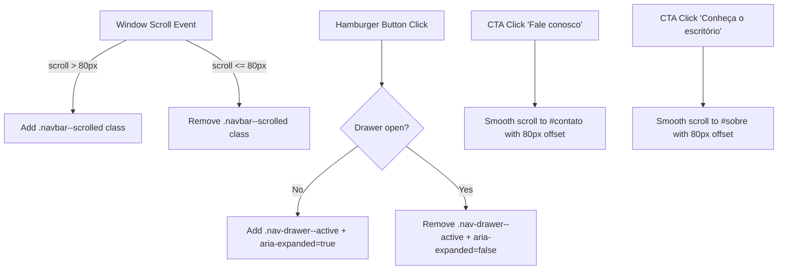

# SPEC — US-01: Hero Banner & Proposta de Valor

> **PRD de Origem:** [US-01-hero-banner.md](../../spike-salescosta/PRDs/US-01-hero-banner.md)  
> **Componente:** Componente 1 (Navbar & Hero Banner)  
> **Stack:** HTML5 Semântico / Vanilla CSS3 / Vanilla JS (ES6+)  
> **Status:** Ready for Development

---

## 1. System Architecture & Component Overview

O componente **Hero Banner & Navbar Sticky** é o elemento visual primário *Above-the-Fold* da landing page institucional do Sales Costa Advogados. Ele combina a cabeceira principal de navegação (`<header class="header">`) e o bloco inicial de impacto visual (`<section id="hero">`).

### Estrutura do Componente:
1. **Header Sticky (`.navbar`):**
   - **Desktop (≥ 1024px):** Logo wordmark `SALES COSTA` à esquerda e 6 links de ancoragem à direita. Transição de fundo transparente para sólido `#404347` após 80px de scroll.
   - **Mobile/Tablet (< 1024px):** Logo `SALES COSTA` + Botão Hambúrguer (alvo tátil ≥ 44×44px) acionando o Drawer lateral de navegação com transição CSS `transform: translateX()`.
2. **Hero Content (`.hero`):**
   - Eyebrow em tom Taupe (`#AA9B8F`) com `letter-spacing: 4px`.
   - Headline H1 em tipografia fluida (`clamp(2rem, 5vw, 4rem)`).
   - Subtítulo em tom cinza claro (`#D1D5DB`).
   - Dupla de CTAs (`.btn--primary` preenchido e `.btn--outline` vazado), dispostos lado a lado no desktop e empilhados em 1 coluna (100% largura) no mobile.
   - Indicador animado de scroll (`.hero__scroll-indicator`).

### Mermaid Diagram: DOM & Event Flow



---

## 2. HTML Structure

```html
<header class="header">
  <nav class="navbar" aria-label="Navegação Principal">
    <div class="navbar__container">
      <a href="#hero" class="navbar__logo" aria-label="Sales Costa Advogados - Início">
        <span class="navbar__logo-text">SALES COSTA</span>
        <span class="navbar__logo-subtext">ADVOGADOS</span>
      </a>

      <!-- Menu Desktop -->
      <ul class="navbar__menu" role="menubar">
        <li role="none"><a href="#comunicado" class="navbar__link" role="menuitem">Comunicado</a></li>
        <li role="none"><a href="#sobre" class="navbar__link" role="menuitem">Sobre</a></li>
        <li role="none"><a href="#areas" class="navbar__link" role="menuitem">Áreas</a></li>
        <li role="none"><a href="#diferenciais" class="navbar__link" role="menuitem">Diferenciais</a></li>
        <li role="none"><a href="#equipe" class="navbar__link" role="menuitem">Equipe</a></li>
        <li role="none"><a href="#contato" class="navbar__link navbar__link--cta" role="menuitem">Fale conosco</a></li>
      </ul>

      <!-- Botão Hambúrguer Mobile -->
      <button type="button" class="navbar__hamburger" aria-label="Abrir menu de navegação" aria-expanded="false" aria-controls="nav-drawer">
        <span class="navbar__hamburger-bar"></span>
        <span class="navbar__hamburger-bar"></span>
        <span class="navbar__hamburger-bar"></span>
      </button>
    </div>
  </nav>

  <!-- Drawer Lateral Mobile -->
  <aside id="nav-drawer" class="nav-drawer" aria-hidden="true">
    <div class="nav-drawer__header">
      <span class="nav-drawer__logo">SALES COSTA</span>
      <button type="button" class="nav-drawer__close" aria-label="Fechar menu de navegação">&times;</button>
    </div>
    <ul class="nav-drawer__menu">
      <li><a href="#comunicado" class="nav-drawer__link">Comunicado</a></li>
      <li><a href="#sobre" class="nav-drawer__link">Sobre</a></li>
      <li><a href="#areas" class="nav-drawer__link">Áreas</a></li>
      <li><a href="#diferenciais" class="nav-drawer__link">Diferenciais</a></li>
      <li><a href="#equipe" class="nav-drawer__link">Equipe</a></li>
      <li><a href="#contato" class="nav-drawer__link nav-drawer__link--cta">Fale conosco</a></li>
    </ul>
  </aside>
</header>

<section id="hero" class="hero" aria-labelledby="hero-title">
  <div class="hero__container">
    <div class="hero__content">
      <span class="hero__eyebrow">SALES COSTA ADVOGADOS</span>
      <h1 id="hero-title" class="hero__title">Junto nas decisões que constroem o futuro.</h1>
      <p class="hero__subtitle">
        Advocacia estratégica e personalizada, com foco em excelência técnica e resultados corporativos de alto impacto.
      </p>
      <div class="hero__actions">
        <a href="#sobre" class="btn btn--outline">
          Conheça o escritório
          <svg class="btn__icon" width="16" height="16" viewBox="0 0 24 24" fill="none" stroke="currentColor" stroke-width="2" aria-hidden="true"><path d="M5 12h14M12 5l7 7-7 7"/></svg>
        </a>
        <a href="#contato" class="btn btn--primary">
          Fale conosco
          <svg class="btn__icon" width="16" height="16" viewBox="0 0 24 24" fill="none" stroke="currentColor" stroke-width="2" aria-hidden="true"><path d="M5 12h14M12 5l7 7-7 7"/></svg>
        </a>
      </div>
    </div>

    <!-- Indicador de Scroll -->
    <a href="#comunicado" class="hero__scroll-indicator" aria-label="Rolar para a próxima seção">
      <span class="hero__scroll-dot"></span>
    </a>
  </div>
</section>

---

## 3. CSS Specification

```css
/* ==========================================================================
   3.1 Base Styles (Mobile First: < 768px)
   ========================================================================== */
.header {
  position: fixed;
  top: 0;
  left: 0;
  width: 100%;
  z-index: 1000;
  transition: background-color 0.3s ease, box-shadow 0.3s ease;
}

.navbar {
  width: 100%;
  height: 80px;
}

.navbar__container {
  max-width: var(--container-max);
  margin: 0 auto;
  padding: 0 var(--section-pad-x);
  height: 100%;
  display: flex;
  align-items: center;
  justify-content: space-between;
}

.navbar__logo {
  display: flex;
  flex-direction: column;
  text-decoration: none;
  color: var(--color-white);
}

.navbar__logo-text {
  font-family: var(--font-body);
  font-weight: 700;
  font-size: 1.25rem;
  letter-spacing: 2px;
}

.navbar__logo-subtext {
  font-size: 0.625rem;
  letter-spacing: 3px;
  color: var(--color-taupe);
}

.navbar__menu {
  display: none; /* Oculto no Mobile */
}

.navbar__hamburger {
  display: flex;
  flex-direction: column;
  justify-content: space-between;
  width: 44px;
  height: 44px;
  padding: 10px;
  background: transparent;
  border: none;
  cursor: pointer;
}

.navbar__hamburger-bar {
  width: 100%;
  height: 2px;
  background-color: var(--color-white);
  transition: transform 0.3s ease;
}

/* Nav Drawer Mobile */
.nav-drawer {
  position: fixed;
  top: 0;
  right: 0;
  width: 280px;
  height: 100vh;
  background-color: var(--color-dark);
  box-shadow: -4px 0 20px rgba(0, 0, 0, 0.4);
  transform: translateX(100%);
  transition: transform 0.3s cubic-bezier(0.4, 0, 0.2, 1);
  z-index: 1001;
  padding: 24px;
  display: flex;
  flex-direction: column;
}

.nav-drawer--active {
  transform: translateX(0);
}

.nav-drawer__header {
  display: flex;
  justify-content: space-between;
  align-items: center;
  margin-bottom: 32px;
}

.nav-drawer__close {
  background: none;
  border: none;
  color: var(--color-white);
  font-size: 2rem;
  width: 44px;
  height: 44px;
  cursor: pointer;
}

.nav-drawer__menu {
  list-style: none;
  padding: 0;
  margin: 0;
}

.nav-drawer__link {
  display: block;
  padding: 14px 0;
  color: var(--color-white);
  font-size: 1.125rem;
  text-decoration: none;
  border-bottom: 1px solid rgba(255, 255, 255, 0.1);
}

/* Hero Section Base */
.hero {
  min-height: 100vh;
  background-color: var(--color-dark);
  color: var(--color-white);
  display: flex;
  align-items: center;
  position: relative;
  padding-top: 100px;
  padding-bottom: 60px;
  overflow: hidden;
}

.hero__container {
  max-width: var(--container-max);
  margin: 0 auto;
  padding: 0 var(--section-pad-x);
  width: 100%;
}

.hero__eyebrow {
  display: inline-block;
  font-size: var(--text-eyebrow);
  font-weight: 500;
  color: var(--color-taupe);
  letter-spacing: 4px;
  margin-bottom: 16px;
  text-transform: uppercase;
}

.hero__title {
  font-family: var(--font-display);
  font-size: var(--text-hero);
  line-height: 1.15;
  font-weight: 400;
  margin-bottom: 24px;
  max-width: 900px;
}

.hero__subtitle {
  font-size: var(--text-body);
  line-height: 1.6;
  color: var(--color-text-light);
  max-width: 640px;
  margin-bottom: 40px;
  font-weight: 300;
}

.hero__actions {
  display: flex;
  flex-direction: column;
  gap: 16px;
  width: 100%;
}

.btn {
  display: inline-flex;
  align-items: center;
  justify-content: center;
  gap: 8px;
  min-height: 48px;
  padding: 14px 28px;
  border-radius: 4px;
  font-size: 1rem;
  font-weight: 500;
  text-decoration: none;
  transition: all 0.3s ease;
  width: 100%;
}

.btn--primary {
  background-color: var(--color-taupe);
  color: var(--color-white);
  border: 1px solid var(--color-taupe);
}

.btn--outline {
  background-color: transparent;
  color: var(--color-white);
  border: 1px solid rgba(255, 255, 255, 0.4);
}

.hero__scroll-indicator {
  position: absolute;
  bottom: 24px;
  left: 50%;
  transform: translateX(-50%);
  width: 24px;
  height: 40px;
  border: 2px solid rgba(255, 255, 255, 0.4);
  border-radius: 12px;
  display: flex;
  justify-content: center;
  padding-top: 6px;
}

.hero__scroll-dot {
  width: 4px;
  height: 8px;
  background-color: var(--color-taupe);
  border-radius: 2px;
  animation: scrollPulse 2s infinite;
}

@keyframes scrollPulse {
  0% { transform: translateY(0); opacity: 1; }
  50% { transform: translateY(12px); opacity: 0.3; }
  100% { transform: translateY(0); opacity: 1; }
}

/* ==========================================================================
   3.2 Tablet Breakpoint (≥ 768px)
   ========================================================================== */
@media (min-width: 768px) {
  .hero__actions {
    flex-direction: row;
    width: auto;
  }

  .btn {
    width: auto;
  }
}

/* ==========================================================================
   3.3 Desktop Breakpoint (≥ 1024px)
   ========================================================================== */
@media (min-width: 1024px) {
  .navbar__hamburger, .nav-drawer {
    display: none;
  }

  .navbar__menu {
    display: flex;
    align-items: center;
    gap: 32px;
    list-style: none;
    margin: 0;
    padding: 0;
  }

  .navbar__link {
    color: var(--color-white);
    text-decoration: none;
    font-size: 0.9375rem;
    transition: color 0.3s ease;
  }

  .navbar__link:hover {
    color: var(--color-taupe);
  }

  .navbar--scrolled {
    background-color: var(--color-dark);
    box-shadow: 0 4px 20px rgba(0, 0, 0, 0.3);
  }
}

/* ==========================================================================
   3.4 States & Reduced Motion
   ========================================================================== */
@media (prefers-reduced-motion: reduce) {
  .hero__scroll-dot {
    animation: none;
  }
  .header, .nav-drawer, .btn {
    transition: none;
  }
}
```

---

## 4. JavaScript Specification

```javascript
// js/main.js — Sticky Navbar, Drawer & Smooth Scroll

document.addEventListener('DOMContentLoaded', () => {
  const header = document.querySelector('.header');
  const hamburger = document.querySelector('.navbar__hamburger');
  const drawer = document.getElementById('nav-drawer');
  const drawerClose = document.querySelector('.nav-drawer__close');
  const navLinks = document.querySelectorAll('a[href^="#"]');

  // 1. Sticky Navbar Solid Transition
  window.addEventListener('scroll', () => {
    if (window.scrollY > 80) {
      header.classList.add('navbar--scrolled');
    } else {
      header.classList.remove('navbar--scrolled');
    }
  }, { passive: true });

  // 2. Drawer Toggle Logic
  const openDrawer = () => {
    drawer.classList.add('nav-drawer--active');
    drawer.setAttribute('aria-hidden', 'false');
    hamburger.setAttribute('aria-expanded', 'true');
    document.body.style.overflow = 'hidden';
  };

  const closeDrawer = () => {
    drawer.classList.remove('nav-drawer--active');
    drawer.setAttribute('aria-hidden', 'true');
    hamburger.setAttribute('aria-expanded', 'false');
    document.body.style.overflow = '';
  };

  if (hamburger) hamburger.addEventListener('click', openDrawer);
  if (drawerClose) drawerClose.addEventListener('click', closeDrawer);

  // 3. Smooth Scroll with 80px Navbar Offset Compensation
  navLinks.forEach(link => {
    link.addEventListener('click', (e) => {
      const targetId = link.getAttribute('href');
      if (targetId === '#') return;

      const targetSection = document.querySelector(targetId);
      if (targetSection) {
        e.preventDefault();
        closeDrawer();

        const navHeight = 80;
        const targetPosition = targetSection.getBoundingClientRect().top + window.pageYOffset - navHeight;

        window.scrollTo({
          top: targetPosition,
          behavior: 'smooth'
        });
      }
    });
  });
});
```

---

## 5. Accessibility (A11y) Requirements

- **WCAG AA Conformance:** Contraste de texto `#FFFFFF` sobre fundo `#404347` = 9.5:1 (Aprovado).
- **Keyboard Navigation:** Todos os botões e links possuem `:focus-visible` com contorno evidente (`outline: 2px solid var(--color-taupe)`).
- **ARIA Attributes:** `aria-expanded` para o botão de hambúrguer, `aria-hidden` no drawer lateral e `aria-labelledby` na Hero section.
- **Motion:** `prefers-reduced-motion: reduce` remove animação no scroll indicator.

---

## 6. Content Data Model

```json
{
  "hero": {
    "eyebrow": "SALES COSTA ADVOGADOS",
    "title": "Junto nas decisões que constroem o futuro.",
    "subtitle": "Advocacia estratégica e personalizada, com foco em excelência técnica e resultados corporativos de alto impacto.",
    "ctaPrimary": { "label": "Fale conosco", "anchor": "#contato" },
    "ctaOutline": { "label": "Conheça o escritório", "anchor": "#sobre" }
  }
}
```

---

## 7. Acceptance Criteria (Technical)

### CA-01: Exibição da Headline e Subtítulo
- H1 renderizado com tipografia fluida sem transbordamento em resoluções de 320px a 2560px.

### CA-02: Interatividade dos Botões CTA
- Clique no CTA compensa a altura de 80px da navbar sticky com rolagem suave `behavior: 'smooth'`.

### CA-03: Responsividade no Mobile
- Viewports < 1024px exibem hambúrguer com área de clique ≥ 44×44px e CTAs empilhados full width.

---

## 8. Dependencies & Integration Points

- **CSS Variables:** `--color-dark`, `--color-taupe`, `--font-display`, `--font-body`, `--text-hero`.
- **Files Affected:** `index.html`, `css/sections.css`, `css/components.css`, `js/main.js`.

