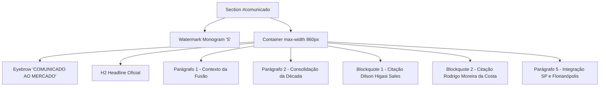

# SPEC — US-02: Comunicado ao Mercado (União das Bancas)

> **PRD de Origem:** [US-02-comunicado-ao-mercado.md](../../spike-salescosta/PRDs/US-02-comunicado-ao-mercado.md)  
> **Componente:** Componente 2 (Comunicado ao Mercado)  
> **Stack:** HTML5 Semântico / Vanilla CSS3 / Vanilla JS (ES6+)  
> **Status:** Ready for Development

---

## 1. System Architecture & Component Overview

A seção **Comunicado ao Mercado** (`<section id="comunicado">`) é um bloco institucional dark focado em storytelling e posicionamento corporativo. Ela oficializa a união estratégica entre a **Higasi Sales Advogados** e **Rodrigo Moreira da Costa**, dando origem ao **Sales Costa Advogados**.

### Características Arquiteturais:
- **Fundo Dark Institucional:** Fundo `#404347` contínuo à Hero Section.
- **Marca d'água "S" Decorativa:** Elemento vetorial/tipográfico com opacidade reduzida (5%) posicionado no plano de fundo.
- **Eyebrow Lima:** Destaque de anúncio oficial em cor Lima `#E4FF8F`.
- **Citações com Destaque:** Parágrafos 3 e 4 formatados como elementos `<blockquote class="comunicado__quote">` com borda lateral Taupe `#AA9B8F`.

### Mermaid Diagram: Layout Structure



---

## 2. HTML Structure

```html
<section id="comunicado" class="comunicado" aria-labelledby="comunicado-title">
  <!-- Marca d'água "S" decorativa -->
  <div class="comunicado__watermark" aria-hidden="true">S</div>

  <div class="comunicado__container">
    <span class="comunicado__eyebrow">COMUNICADO AO MERCADO</span>
    
    <h2 id="comunicado-title" class="comunicado__title">
      Dilson Higasi Sales e Rodrigo Moreira da Costa se unem e dão origem ao Sales Costa Advogados
    </h2>

    <div class="comunicado__content">
      <p class="comunicado__paragraph">
        O mercado jurídico ganha uma nova banca desenvolvida para atuar nas áreas mais críticas das decisões empresariais e familiares. A Higasi Sales Advogados e Rodrigo Moreira da Costa unem suas trajetórias e expertises para celebrar o início do Sales Costa Advogados.
      </p>

      <p class="comunicado__paragraph">
        A nova banca consolida mais de uma década de atuação estratégica dos fundadores no acompanhamento de litígios de alta complexidade, consultoria tributária preventiva, reestruturações societárias e planejamento patrimonial.
      </p>

      <blockquote class="comunicado__quote">
        <p class="comunicado__quote-text">
          "A ideia surgiu de uma constatação simples: nossos clientes exigiam um modelo de advocacia que combinasse rigor técnico artesanal com agilidade e visão de negócios. Unir nossas forças foi o passo natural para oferecer esse padrão de entrega."
        </p>
        <cite class="comunicado__quote-author">— Dilson Higasi Sales, Sócio-Fundador</cite>
      </blockquote>

      <blockquote class="comunicado__quote">
        <p class="comunicado__quote-text">
          "A união reflete uma evolução necessária no atendimento jurídico corporativo. Consolidados entre São Paulo e Florianópolis, aproximamos nossa estrutura física dos principais centros de decisão dos nossos clientes."
        </p>
        <cite class="comunicado__quote-author">— Rodrigo Moreira da Costa, Sócio-Fundador</cite>
      </blockquote>

      <p class="comunicado__paragraph">
        O Sales Costa Advogados inicia suas atividades de forma totalmente integrada entre as sedes de São Paulo e Florianópolis, atuando de forma transversal nas frentes tributária, societária, cível, imobiliária e trabalhista.
      </p>
    </div>
  </div>
</section>

---

## 3. CSS Specification

```css
/* ==========================================================================
   3.1 Base Styles (Mobile First: < 768px)
   ========================================================================== */
.comunicado {
  background-color: var(--color-dark);
  color: var(--color-white);
  padding: var(--section-pad-y) var(--section-pad-x);
  position: relative;
  overflow: hidden;
}

.comunicado__watermark {
  position: absolute;
  right: -20px;
  top: 50%;
  transform: translateY(-50%);
  font-family: var(--font-display);
  font-size: 32rem;
  font-weight: 700;
  color: rgba(255, 255, 255, 0.03);
  user-select: none;
  pointer-events: none;
  z-index: 0;
  line-height: 1;
}

.comunicado__container {
  max-width: 860px;
  margin: 0 auto;
  position: relative;
  z-index: 1;
}

.comunicado__eyebrow {
  display: inline-block;
  font-size: var(--text-eyebrow);
  font-weight: 500;
  color: var(--color-lima);
  letter-spacing: 4px;
  margin-bottom: 16px;
  text-transform: uppercase;
}

.comunicado__title {
  font-family: var(--font-display);
  font-size: var(--text-h2);
  line-height: 1.25;
  font-weight: 400;
  margin-bottom: 32px;
  color: var(--color-white);
}

.comunicado__content {
  display: flex;
  flex-direction: column;
  gap: 20px;
}

.comunicado__paragraph {
  font-size: var(--text-body);
  line-height: 1.7;
  color: var(--color-text-light);
  font-weight: 300;
}

.comunicado__quote {
  border-left: 3px solid var(--color-taupe);
  padding-left: 20px;
  margin: 12px 0;
  background: rgba(255, 255, 255, 0.02);
  padding-top: 12px;
  padding-bottom: 12px;
  padding-right: 16px;
  border-radius: 0 4px 4px 0;
}

.comunicado__quote-text {
  font-family: var(--font-display);
  font-size: 1.125rem;
  font-style: italic;
  line-height: 1.6;
  color: var(--color-white);
  margin-bottom: 8px;
}

.comunicado__quote-author {
  display: block;
  font-size: 0.875rem;
  font-style: normal;
  font-weight: 500;
  color: var(--color-taupe);
}

/* ==========================================================================
   3.2 Desktop Breakpoint (≥ 1024px)
   ========================================================================== */
@media (min-width: 1024px) {
  .comunicado__watermark {
    right: 5%;
    font-size: 40rem;
    color: rgba(255, 255, 255, 0.04);
  }

  .comunicado__quote {
    padding-left: 28px;
    margin: 20px 0;
  }

  .comunicado__quote-text {
    font-size: 1.25rem;
  }
}
```

---

## 4. JavaScript Specification

Esta seção não requer dependências de script ativas complexas além do disparo de classe de animação suave via `IntersectionObserver` genérico do arquivo `js/animations.js`:

```javascript
// js/animations.js — Disparo de entrada da seção Comunicado
document.addEventListener('DOMContentLoaded', () => {
  const comunicadoSection = document.querySelector('.comunicado__container');
  if (comunicadoSection && 'IntersectionObserver' in window) {
    const observer = new IntersectionObserver((entries) => {
      entries.forEach(entry => {
        if (entry.isIntersecting) {
          entry.target.classList.add('is-visible');
          observer.unobserve(entry.target);
        }
      });
    }, { threshold: 0.2 });

    observer.observe(comunicadoSection);
  }
});
```

---

## 5. Accessibility (A11y) Requirements

- **Contraste de Cor (WCAG AAA):** Texto claro `#D1D5DB` sobre `#404347` = 9.8:1. Texto branco `#FFFFFF` = 9.5:1.
- **Marca d'água:** `aria-hidden="true"` com `pointer-events: none` garante que leitores de tela ignorem a letra decorativa "S".
- **Semântica HTML:** Elementos `<blockquote` e `<cite>` estruturam as citações formais dos sócios.

---

## 6. Content Data Model

```json
{
  "comunicado": {
    "eyebrow": "COMUNICADO AO MERCADO",
    "title": "Dilson Higasi Sales e Rodrigo Moreira da Costa se unem e dão origem ao Sales Costa Advogados",
    "paragraphs": [
      "O mercado jurídico ganha uma nova banca...",
      "A nova banca consolida mais de uma década...",
      "O Sales Costa Advogados inicia suas atividades..."
    ],
    "quotes": [
      {
        "text": "A ideia surgiu de uma constatação simples...",
        "author": "Dilson Higasi Sales, Sócio-Fundador"
      },
      {
        "text": "A união reflete uma evolução necessária...",
        "author": "Rodrigo Moreira da Costa, Sócio-Fundador"
      }
    ]
  }
}
```

---

## 7. Acceptance Criteria (Technical)

### CA-01: Exibição do Texto do Comunicado
- Todos os 5 parágrafos e 2 citações dos fundadores devem ser renderizados com legibilidade completa em fundo `#404347`.

### CA-02: Comportamento Responsivo no Mobile
- Em viewports de 320px, a marca d'água "S" permanece em segundo plano sem estourar o container (`overflow-x: hidden`).

---

## 8. Dependencies & Integration Points

- **CSS Variables:** `--color-dark`, `--color-lima`, `--color-taupe`, `--text-h2`, `--font-display`.
- **Files Affected:** `index.html`, `css/sections.css`, `js/animations.js`.

