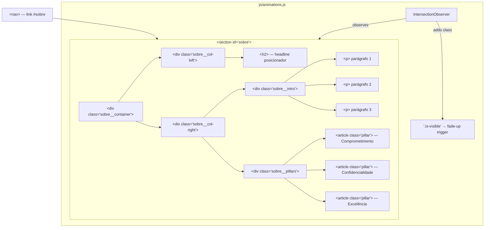

# SPEC — US-03: Sobre o Escritório & Pilares Estratégicos

> **PRD de Origem:** US-03
> **Componente:** Componente 3 — Seção "Sobre o Escritório"
> **Stack:** HTML5 / Vanilla CSS3 / Vanilla JS (ES6+)
> **Status:** Ready for Development

---

## 1. System Architecture & Component Overview

A seção `#sobre` apresenta a identidade institucional do escritório Sales Costa Advogados, comunicando sua trajetória e os três pilares estratégicos que sustentam sua prática jurídica. É a segunda seção de conteúdo da página, posicionada após o Hero (`#hero`) e antes da seção de Áreas de Atuação (`#areas`).

**Responsabilidades do componente:**
- Apresentar o headline posicionador do escritório (coluna esquerda).
- Descrever a trajetória em 3 parágrafos introdutórios (coluna direita, topo).
- Listar os 3 pilares estratégicos com nome em negrito e descrição em itálico (coluna direita, base).
- Adaptar o layout de 2 colunas assimétricas (desktop) para 1 coluna empilhada (mobile).

**Interações com outros módulos:**
- Recebe âncora `#sobre` do link de navegação da `<nav>` em `index.html`.
- Estilos de reset e variáveis CSS são herdados de `css/reset.css` e `css/variables.css`.
- Estilos de layout residem em `css/sections.css`.
- Animações de entrada (fade-up) são gerenciadas por `js/animations.js` via `IntersectionObserver`.



---

## 2. HTML Structure

```html
<!-- =============================================
     SECTION: Sobre o Escritório — #sobre
     File: index.html
     ============================================= -->
<section
  id="sobre"
  class="sobre"
  aria-labelledby="sobre-heading"
>
  <div class="sobre__container">

    <!-- LEFT COLUMN: Headline posicionador (40%) -->
    <div class="sobre__col-left" aria-hidden="false">
      <h2
        id="sobre-heading"
        class="sobre__headline animate-fade-up"
      >
        Uma trajetória construída sobre confiança e critério técnico.
      </h2>
    </div>

    <!-- RIGHT COLUMN: Intro + Pillars (60%) -->
    <div class="sobre__col-right">

      <!-- Introductory paragraphs -->
      <div class="sobre__intro animate-fade-up" data-delay="100">
        <p class="sobre__intro-text">
          Há mais de 15 anos, o escritório Sales Costa Advogados atua na defesa
          de interesses empresariais e individuais com uma abordagem que combina
          profundidade técnica e sensibilidade estratégica.
        </p>
        <p class="sobre__intro-text">
          Nossa trajetória foi forjada em casos complexos, em negociações
          delicadas e na construção de relações de confiança duradouras com
          clientes que nos confiam suas decisões mais críticas.
        </p>
        <p class="sobre__intro-text">
          Entendemos o Direito não como um fim em si mesmo, mas como um
          instrumento preciso a serviço dos seus objetivos — pessoais,
          patrimoniais e empresariais.
        </p>
      </div>

      <!-- Strategic Pillars -->
      <div
        class="sobre__pillars"
        role="list"
        aria-label="Pilares estratégicos do escritório"
      >

        <!-- Pillar 1: Comprometimento -->
        <article
          class="pillar animate-fade-up"
          role="listitem"
          data-delay="200"
        >
          <h3 class="pillar__name">Comprometimento</h3>
          <p class="pillar__description">
            Disponibilidade real com cada cliente e cada causa.
          </p>
        </article>

        <!-- Pillar 2: Confidencialidade -->
        <article
          class="pillar animate-fade-up"
          role="listitem"
          data-delay="300"
        >
          <h3 class="pillar__name">Confidencialidade</h3>
          <p class="pillar__description">
            Sigilo absoluto sobre informações estratégicas.
          </p>
        </article>

        <!-- Pillar 3: Excelência -->
        <article
          class="pillar animate-fade-up"
          role="listitem"
          data-delay="400"
        >
          <h3 class="pillar__name">Excelência</h3>
          <p class="pillar__description">
            Rigor técnico em cada peça, parecer e negociação.
          </p>
        </article>

      </div><!-- /.sobre__pillars -->

    </div><!-- /.sobre__col-right -->

  </div><!-- /.sobre__container -->
</section><!-- /#sobre -->
```

**Notas semânticas:**
- `<section>` com `aria-labelledby` aponta para o `<h2>` da coluna esquerda, tornando o landmark autodescritor para leitores de tela.
- Os pilares usam `<article>` (conteúdo auto-contido) dentro de um `role="list"` explícito, pois o CSS pode remover a semântica de lista nativa.
- `data-delay` é consumido pelo `js/animations.js` para escalonar as animações de entrada.

---

## 3. CSS Specification

Adicionar ao arquivo `css/sections.css`.

### 3.1 Base Styles (Mobile-First, < 768px)

```css
/* =============================================
   SECTION: #sobre — Sobre o Escritório
   Mobile-first (base styles apply to all widths)
   ============================================= */

/* --- Section wrapper --- */
.sobre {
  background-color: var(--color-off-white);
  padding-block: var(--section-pad-y);
  padding-inline: var(--section-pad-x);
  overflow: hidden; /* contain animations */
}

/* --- Inner container --- */
.sobre__container {
  display: flex;
  flex-direction: column; /* stacked on mobile */
  gap: 2rem;
  max-width: var(--container-max);
  margin-inline: auto;
}

/* --- Left column: headline --- */
.sobre__col-left {
  width: 100%;
}

.sobre__headline {
  font-family: var(--font-display);
  font-size: var(--text-h2); /* clamp(1.5rem, 3vw, 2.5rem) */
  font-weight: 400; /* Cormorant Garamond — regular weight for elegance */
  line-height: 1.2;
  color: var(--color-text-dark);
  hanging-punctuation: first;
}

/* --- Right column: intro + pillars --- */
.sobre__col-right {
  width: 100%;
  display: flex;
  flex-direction: column;
  gap: 2rem;
}

/* --- Introductory paragraphs --- */
.sobre__intro {
  display: flex;
  flex-direction: column;
  gap: 1rem;
}

.sobre__intro-text {
  font-family: var(--font-body);
  font-size: var(--text-body); /* 1rem */
  line-height: 1.7;
  color: var(--color-dark-alt);
}

/* --- Pillars container --- */
.sobre__pillars {
  display: flex;
  flex-direction: column; /* stacked on mobile (RN-02) */
  gap: 1rem; /* 16px minimum gap — RN-02 */
  list-style: none;
}

/* --- Individual pillar card --- */
.pillar {
  border-top: 1px solid var(--color-border); /* Taupe #D9D3CE */
  padding-top: 1rem;
}

/* --- Pillar name --- */
.pillar__name {
  font-family: var(--font-body); /* DM Sans */
  font-size: 1rem;
  font-weight: 500; /* DM Sans Medium — RN-01 bold name */
  color: var(--color-text-dark);
  margin-bottom: 0.375rem;
  letter-spacing: 0.01em;
}

/* --- Pillar description --- */
.pillar__description {
  font-family: var(--font-body);
  font-size: var(--text-body);
  font-style: italic; /* RN-01 italic description */
  line-height: 1.6;
  color: var(--color-dark-alt);
}
```

### 3.2 Tablet Breakpoint (≥ 768px)

```css
@media (min-width: 768px) {
  /* Switch pillars to horizontal row on tablet */
  .sobre__pillars {
    flex-direction: row;
    gap: 1.5rem;
  }

  .pillar {
    flex: 1; /* equal width across all 3 pillars */
  }
}
```

### 3.3 Desktop Breakpoint (≥ 1024px)

```css
@media (min-width: 1024px) {
  /* 2-column asymmetric grid: 40% left / 60% right */
  .sobre__container {
    flex-direction: row;
    align-items: flex-start;
    gap: clamp(2rem, 5vw, 4rem);
  }

  .sobre__col-left {
    flex: 0 0 40%;
    max-width: 40%;
    /* Sticky headline — stays in view while right column scrolls */
    position: sticky;
    top: calc(80px + 2rem); /* navbar height (assumed 80px) + breathing room */
  }

  .sobre__col-right {
    flex: 0 0 60%;
    max-width: 60%;
    gap: 2.5rem;
  }

  /* Pillars: keep as horizontal row, refine spacing */
  .sobre__pillars {
    gap: 2rem;
  }
}
```

### 3.4 States & Interactions

```css
/* --- Focus-visible on interactive descendants (if any links are added) --- */
.sobre a:focus-visible {
  outline: 2px solid var(--color-taupe);
  outline-offset: 3px;
  border-radius: 2px;
}

/* --- Pillar hover: subtle border-top color shift --- */
@media (hover: hover) {
  .pillar {
    transition: border-top-color 0.25s ease;
  }

  .pillar:hover {
    border-top-color: var(--color-taupe);
  }
}
```

### 3.5 Animations & Transitions

```css
/* --- Fade-up animation base state --- */
.animate-fade-up {
  opacity: 0;
  transform: translateY(24px);
  transition:
    opacity 0.6s ease,
    transform 0.6s ease;
}

.animate-fade-up.is-visible {
  opacity: 1;
  transform: translateY(0);
}

/* --- Staggered delays via data-delay attribute --- */
.animate-fade-up[data-delay="100"] { transition-delay: 100ms; }
.animate-fade-up[data-delay="200"] { transition-delay: 200ms; }
.animate-fade-up[data-delay="300"] { transition-delay: 300ms; }
.animate-fade-up[data-delay="400"] { transition-delay: 400ms; }

/* --- Respect user motion preference --- */
@media (prefers-reduced-motion: reduce) {
  .animate-fade-up {
    opacity: 1;
    transform: none;
    transition: none;
  }
}
```

---

## 4. JavaScript Specification

### 4.1 Feature Description

A seção `#sobre` não possui lógica interativa própria além das **animações de entrada controladas por `IntersectionObserver`**. As animações são coordenadas centralmente em `js/animations.js`, que observa todos os elementos com a classe `.animate-fade-up` na página, incluindo os desta seção.

Não há JavaScript específico de funcionalidade para esta seção — sem toggles, modais ou fetch de dados. O JS abaixo documenta a implementação esperada em `js/animations.js` com suporte ao atributo `data-delay`.

### 4.2 Full JS Code Snippet

```js
// js/animations.js
// Scroll-triggered fade-up animations via IntersectionObserver.
// Targets all elements with class `.animate-fade-up` across all sections.

(function initScrollAnimations() {
  'use strict';

  // Guard: skip if IntersectionObserver is unsupported (graceful degradation)
  if (!('IntersectionObserver' in window)) {
    document.querySelectorAll('.animate-fade-up').forEach(function (el) {
      el.classList.add('is-visible');
    });
    return;
  }

  // Guard: respect prefers-reduced-motion at the JS level as well
  const prefersReducedMotion = window.matchMedia(
    '(prefers-reduced-motion: reduce)'
  ).matches;

  if (prefersReducedMotion) {
    document.querySelectorAll('.animate-fade-up').forEach(function (el) {
      el.classList.add('is-visible');
    });
    return;
  }

  // Observer configuration
  const observerOptions = {
    root: null,          // viewport
    rootMargin: '0px',
    threshold: 0.15,     // trigger when 15% of element is visible
  };

  const observer = new IntersectionObserver(function (entries) {
    entries.forEach(function (entry) {
      if (!entry.isIntersecting) return;

      const el = entry.target;
      const delay = parseInt(el.dataset.delay, 10) || 0;

      setTimeout(function () {
        el.classList.add('is-visible');
      }, delay);

      // Unobserve after first trigger — animation fires only once
      observer.unobserve(el);
    });
  }, observerOptions);

  // Observe all animate-fade-up elements on DOMContentLoaded
  document.querySelectorAll('.animate-fade-up').forEach(function (el) {
    observer.observe(el);
  });
})();
```

### 4.3 Event Listeners and Target Elements

| Event / Observer | Target | File | Behavior |
|---|---|---|---|
| `IntersectionObserver` | `.animate-fade-up` (global) | `js/animations.js` | Adds `.is-visible` when element enters viewport at 15% threshold |
| `DOMContentLoaded` | `document` | `js/animations.js` | Bootstraps the observer after DOM is parsed |

### 4.4 Edge Cases Handled

| Edge Case | Handling |
|---|---|
| `IntersectionObserver` não suportado | Todos os `.animate-fade-up` recebem `.is-visible` imediatamente |
| `prefers-reduced-motion: reduce` | Animações desabilitadas via CSS e JS; elementos ficam visíveis imediatamente |
| `data-delay` ausente ou não-numérico | `parseInt(...) \|\| 0` garante fallback de `0ms` |
| Elemento já parcialmente visível no load | `threshold: 0.15` evita disparo em elementos visíveis apenas por 1px |
| Re-entrada no viewport após saída | `observer.unobserve()` após o primeiro disparo — animação ocorre apenas uma vez |

---

## 5. Accessibility (A11y) Requirements

### ARIA & Roles

| Elemento | Atributo/Role | Motivo |
|---|---|---|
| `<section>` | `aria-labelledby="sobre-heading"` | Associa o headline H2 como label do landmark |
| `<h2 id="sobre-heading">` | ID referenciado | Serve como label da section |
| `<div class="sobre__pillars">` | `role="list"` + `aria-label="Pilares estratégicos do escritório"` | Mantém semântica de lista mesmo com CSS display customizado |
| `<article class="pillar">` | `role="listitem"` | Complementa o `role="list"` do pai |
| `<h3 class="pillar__name">` | Heading level 3 | Hierarquia correta: H1 (hero) → H2 (sobre) → H3 (pilares) |

### Keyboard Navigation

- Nenhum elemento interativo próprio nesta seção. O foco passa naturalmente pelo conteúdo textual.
- Se links forem adicionados futuramente, o estilo `:focus-visible` está pré-definido (ver §3.4).

### Color Contrast (WCAG AA)

| Combinação | Foreground | Background | Ratio estimado | Status |
|---|---|---|---|---|
| Headline H2 | `#2B2B2B` | `#F8F6F4` | ~15.6:1 | ✅ AAA |
| Texto introdutório | `#484B4F` | `#F8F6F4` | ~8.5:1 | ✅ AAA |
| Nome do pilar | `#2B2B2B` | `#F8F6F4` | ~15.6:1 | ✅ AAA |
| Descrição do pilar | `#484B4F` | `#F8F6F4` | ~8.5:1 | ✅ AAA |
| Border-top pilares | `#D9D3CE` | — | decorativa | N/A |

> Todos os textos passam WCAG AA (4.5:1) e AA Large (3:1) com ampla margem.

### Prefers-Reduced-Motion

Tratado em **dois níveis**:
1. **CSS** (`@media (prefers-reduced-motion: reduce)`): remove `transition` e `transform` dos `.animate-fade-up`.
2. **JS** (`js/animations.js`): detecta a preferência via `window.matchMedia` e aplica `.is-visible` imediatamente, sem `setTimeout`.

---

## 6. Content Data Model

```js
// Source of truth for section #sobre content.
// Use this object to populate the HTML template or a future CMS integration.

const sobreContent = {
  section: {
    id: 'sobre',
    ariaLabelledBy: 'sobre-heading',
  },

  headline: {
    id: 'sobre-heading',
    text: 'Uma trajetória construída sobre confiança e critério técnico.',
    tag: 'h2',
    font: 'Cormorant Garamond',
    weight: 400,
  },

  intro: {
    paragraphs: [
      'Há mais de 15 anos, o escritório Sales Costa Advogados atua na defesa de interesses empresariais e individuais com uma abordagem que combina profundidade técnica e sensibilidade estratégica.',
      'Nossa trajetória foi forjada em casos complexos, em negociações delicadas e na construção de relações de confiança duradouras com clientes que nos confiam suas decisões mais críticas.',
      'Entendemos o Direito não como um fim em si mesmo, mas como um instrumento preciso a serviço dos seus objetivos — pessoais, patrimoniais e empresariais.',
    ],
  },

  pillars: [
    {
      id: 'pillar-comprometimento',
      name: 'Comprometimento',
      description: 'Disponibilidade real com cada cliente e cada causa.',
      animationDelay: 200,
    },
    {
      id: 'pillar-confidencialidade',
      name: 'Confidencialidade',
      description: 'Sigilo absoluto sobre informações estratégicas.',
      animationDelay: 300,
    },
    {
      id: 'pillar-excelencia',
      name: 'Excelência',
      description: 'Rigor técnico em cada peça, parecer e negociação.',
      animationDelay: 400,
    },
  ],
};
```

---

## 7. Acceptance Criteria (Technical)

### CA-01 — 3 pilares visíveis com descrições

**Critério PRD:** Os três pilares (Comprometimento, Confidencialidade, Excelência) devem estar visíveis com nome e descrição.

| Verificação Técnica | Como verificar |
|---|---|
| Existem 3 elementos `.pillar` no DOM | `document.querySelectorAll('.pillar').length === 3` |
| Cada `.pillar__name` contém o texto correto | Inspecionar `textContent` de cada `.pillar__name` |
| Cada `.pillar__description` contém o texto correto | Inspecionar `textContent` de cada `.pillar__description` |
| Nome em `font-weight: 500` | `getComputedStyle(el).fontWeight === '500'` |
| Descrição em `font-style: italic` | `getComputedStyle(el).fontStyle === 'italic'` |
| `border-top: 1px solid #D9D3CE` em cada pilar | `getComputedStyle(el).borderTopColor` → `rgb(217, 211, 206)` |

### CA-02 — Colapsa para 1 coluna em < 768px

**Critério PRD:** Em viewport < 768px, o layout deve ser de 1 coluna empilhada, com mínimo de 16px de gap entre os pilares.

| Verificação Técnica | Como verificar |
|---|---|
| `.sobre__container` tem `flex-direction: column` em mobile | Redimensionar viewport para 375px; inspecionar `getComputedStyle` |
| `.sobre__pillars` tem `flex-direction: column` em mobile | Idem |
| Gap entre pilares ≥ 16px | `getComputedStyle(pillarContainer).gap` ≥ `'16px'` |
| `.sobre__col-left` e `.sobre__col-right` ocupam 100% da largura | `getBoundingClientRect().width` ≈ `window.innerWidth - padding` |
| `position: sticky` da coluna esquerda **não** está ativo em mobile | Coluna esquerda flui normalmente no document flow |

### RN-01 — Nome negrito + descrição itálico

| Verificação | Como verificar |
|---|---|
| Todos os `.pillar__name` têm `font-weight` computado de 500 | Loop em `querySelectorAll('.pillar__name')` |
| Todos os `.pillar__description` têm `font-style: italic` | Loop em `querySelectorAll('.pillar__description')` |

### RN-02 — Gap mínimo de 16px entre cards em mobile

| Verificação | Como verificar |
|---|---|
| `gap` do `.sobre__pillars` é `1rem` (≥ 16px) em mobile | `getComputedStyle(el).gap === '16px'` em viewport 375px |

---

## 8. Dependencies & Integration Points

### CSS Variables Consumidas

| Variável | Valor | Uso |
|---|---|---|
| `--color-off-white` | `#F8F6F4` | Background da section |
| `--color-border` | `#D9D3CE` | `border-top` dos pilares |
| `--color-taupe` | `#AA9B8F` | Hover do `border-top` dos pilares |
| `--color-text-dark` | `#2B2B2B` | Headline H2 e nomes dos pilares |
| `--color-dark-alt` | `#484B4F` | Parágrafos e descrições dos pilares |
| `--font-display` | `'Cormorant Garamond', Georgia, serif` | Headline H2 |
| `--font-body` | `'DM Sans', system-ui, sans-serif` | Todos os demais textos |
| `--text-h2` | `clamp(1.5rem, 3vw, 2.5rem)` | Tamanho do headline |
| `--text-body` | `1rem` | Parágrafos e descrições |
| `--section-pad-y` | `clamp(3rem, 8vw, 6rem)` | Padding vertical da section |
| `--section-pad-x` | `clamp(1.25rem, 5vw, 5rem)` | Padding horizontal da section |
| `--container-max` | `1200px` | Largura máxima do container interno |

### Arquivos Afetados

| Arquivo | Operação | Localização |
|---|---|---|
| `index.html` | Inserir o bloco `<section id="sobre">` | Após `<section id="hero">` |
| `css/sections.css` | Adicionar regras `.sobre`, `.sobre__*`, `.pillar`, `.pillar__*` | Bloco dedicado à seção #sobre |
| `css/sections.css` | Adicionar regras `.animate-fade-up` e `.is-visible` | Bloco de animações globais (ou mover para `components.css`) |
| `js/animations.js` | Implementar o `IntersectionObserver` com suporte a `data-delay` | Módulo central de animações |

### Fontes Externas

```html
<!-- Adicionar no <head> de index.html, caso ainda não presente -->
<link rel="preconnect" href="https://fonts.googleapis.com">
<link rel="preconnect" href="https://fonts.gstatic.com" crossorigin>
<link
  href="https://fonts.googleapis.com/css2?family=Cormorant+Garamond:wght@400;500;600&family=DM+Sans:wght@400;500;700&display=swap"
  rel="stylesheet"
>
```

### Âncoras & Links de Navegação

| ID | Consumidor | Propósito |
|---|---|---|
| `#sobre` | `<nav>` em `index.html` | Link de ancoragem na navegação principal |
| `#sobre-heading` | `aria-labelledby` da `<section>` | Acessibilidade — label do landmark |

### Breakpoints de Referência

| Breakpoint | Valor | Comportamento ativado |
|---|---|---|
| Base (mobile) | `< 768px` | Layout 1 coluna empilhada; pilares em coluna |
| Tablet | `≥ 768px` | Pilares em linha horizontal |
| Desktop | `≥ 1024px` | Grid assimétrico 40/60; headline sticky |
