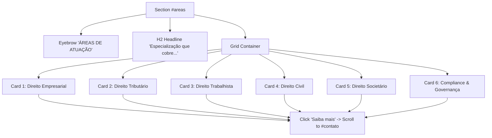

# SPEC — US-04: Áreas de Atuação (Grid de Especialidades)

> **PRD de Origem:** [US-04-areas-de-atuacao.md](../../spike-salescosta/PRDs/US-04-areas-de-atuacao.md)  
> **Componente:** Componente 4 (Grid de Áreas de Atuação)  
> **Stack:** HTML5 Semântico / Vanilla CSS3 / Vanilla JS (ES6+)  
> **Status:** Ready for Development

---

## 1. System Architecture & Component Overview

A seção **Áreas de Atuação** (`<section id="areas">`) apresenta o portfólio de 6 especialidades jurídicas do escritório Sales Costa Advogados. O layout em fundo Branco Puro (`#FFFFFF`) é estruturado em um grid responsivo que adapta a quantidade de colunas conforme o viewport:
- **Desktop (≥ 1024px):** 3 colunas × 2 linhas.
- **Tablet (768px – 1023px):** 2 colunas × 3 linhas.
- **Mobile (< 768px):** 1 coluna × 6 linhas empilhadas.

### Mermaid Diagram: Component Structure



---

## 2. HTML Structure

```html
<section id="areas" class="areas" aria-labelledby="areas-title">
  <div class="areas__container">
    <header class="areas__header">
      <span class="areas__eyebrow">ÁREAS DE ATUAÇÃO</span>
      <h2 id="areas-title" class="areas__title">Especialização que cobre cada frente do seu negócio.</h2>
    </header>

    <div class="areas__grid">
      <!-- Card 1 -->
      <article class="area-card">
        <div class="area-card__icon" aria-hidden="true">
          <svg width="32" height="32" viewBox="0 0 24 24" fill="none" stroke="currentColor" stroke-width="1.5"><rect x="2" y="7" width="20" height="14" rx="2" ry="2"/><path d="M16 21V5a2 2 0 0 0-2-2h-4a2 2 0 0 0-2 2v16"/></svg>
        </div>
        <h3 class="area-card__title">Direito Empresarial</h3>
        <p class="area-card__desc">Estruturação societária, contratos comerciais e assessoria contínua para negócios em crescimento.</p>
        <a href="#contato" class="area-card__link" aria-label="Saiba mais sobre Direito Empresarial">
          Saiba mais <span aria-hidden="true">&rarr;</span>
        </a>
      </article>

      <!-- Card 2 -->
      <article class="area-card">
        <div class="area-card__icon" aria-hidden="true">
          <svg width="32" height="32" viewBox="0 0 24 24" fill="none" stroke="currentColor" stroke-width="1.5"><path d="M12 2v20M17 5H9.5a3.5 3.5 0 0 0 0 7h5a3.5 3.5 0 0 1 0 7H6"/></svg>
        </div>
        <h3 class="area-card__title">Direito Tributário</h3>
        <p class="area-card__desc">Planejamento fiscal, consultoria preventiva e defesa em processos administrativos e judiciais.</p>
        <a href="#contato" class="area-card__link" aria-label="Saiba mais sobre Direito Tributário">
          Saiba mais <span aria-hidden="true">&rarr;</span>
        </a>
      </article>

      <!-- Card 3 -->
      <article class="area-card">
        <div class="area-card__icon" aria-hidden="true">
          <svg width="32" height="32" viewBox="0 0 24 24" fill="none" stroke="currentColor" stroke-width="1.5"><path d="M17 21v-2a4 4 0 0 0-4-4H5a4 4 0 0 0-4 4v2"/><circle cx="9" cy="7" r="4"/><path d="M23 21v-2a4 4 0 0 0-3-3.87"/><path d="M16 3.13a4 4 0 0 1 0 7.75"/></svg>
        </div>
        <h3 class="area-card__title">Direito Trabalhista</h3>
        <p class="area-card__desc">Gestão de risco trabalhista, compliance de RH e representação em ações individuais e coletivas.</p>
        <a href="#contato" class="area-card__link" aria-label="Saiba mais sobre Direito Trabalhista">
          Saiba mais <span aria-hidden="true">&rarr;</span>
        </a>
      </article>

      <!-- Card 4 -->
      <article class="area-card">
        <div class="area-card__icon" aria-hidden="true">
          <svg width="32" height="32" viewBox="0 0 24 24" fill="none" stroke="currentColor" stroke-width="1.5"><path d="M14 2H6a2 2 0 0 0-2 2v16a2 2 0 0 0 2 2h12a2 2 0 0 0 2-2V8z"/><polyline points="14 2 14 8 20 8"/></svg>
        </div>
        <h3 class="area-card__title">Direito Civil</h3>
        <p class="area-card__desc">Contratos, responsabilidade civil e patrimônio, com foco em prevenção e solução célere de conflitos.</p>
        <a href="#contato" class="area-card__link" aria-label="Saiba mais sobre Direito Civil">
          Saiba mais <span aria-hidden="true">&rarr;</span>
        </a>
      </article>

      <!-- Card 5 -->
      <article class="area-card">
        <div class="area-card__icon" aria-hidden="true">
          <svg width="32" height="32" viewBox="0 0 24 24" fill="none" stroke="currentColor" stroke-width="1.5"><circle cx="12" cy="12" r="10"/><path d="M12 6v6l4 2"/></svg>
        </div>
        <h3 class="area-card__title">Direito Societário</h3>
        <p class="area-card__desc">Fusões, aquisições, governança e reestruturação de grupos empresariais e familiares.</p>
        <a href="#contato" class="area-card__link" aria-label="Saiba mais sobre Direito Societário">
          Saiba mais <span aria-hidden="true">&rarr;</span>
        </a>
      </article>

      <!-- Card 6 -->
      <article class="area-card">
        <div class="area-card__icon" aria-hidden="true">
          <svg width="32" height="32" viewBox="0 0 24 24" fill="none" stroke="currentColor" stroke-width="1.5"><path d="M12 22s8-4 8-10V5l-8-3-8 3v7c0 6 8 10 8 10z"/></svg>
        </div>
        <h3 class="area-card__title">Compliance & Governança</h3>
        <p class="area-card__desc">Programas de integridade, auditoria de conformidade e assessoria em governança corporativa.</p>
        <a href="#contato" class="area-card__link" aria-label="Saiba mais sobre Compliance e Governança">
          Saiba mais <span aria-hidden="true">&rarr;</span>
        </a>
      </article>
    </div>
  </div>
</section>

---

## 3. CSS Specification

```css
/* ==========================================================================
   3.1 Base Styles (Mobile First: < 768px)
   ========================================================================== */
.areas {
  background-color: var(--color-white);
  color: var(--color-text-dark);
  padding: var(--section-pad-y) var(--section-pad-x);
}

.areas__container {
  max-width: var(--container-max);
  margin: 0 auto;
}

.areas__header {
  margin-bottom: 48px;
}

.areas__eyebrow {
  display: inline-block;
  font-size: var(--text-eyebrow);
  font-weight: 500;
  color: var(--color-taupe);
  letter-spacing: 4px;
  margin-bottom: 16px;
  text-transform: uppercase;
}

.areas__title {
  font-family: var(--font-display);
  font-size: var(--text-h2);
  line-height: 1.25;
  font-weight: 400;
  color: var(--color-text-dark);
  max-width: 700px;
}

.areas__grid {
  display: grid;
  grid-template-columns: 1fr;
  gap: 24px;
}

.area-card {
  background-color: var(--color-off-white);
  padding: 32px 28px;
  border-radius: 4px;
  border-bottom: 2px solid transparent;
  display: flex;
  flex-direction: column;
  transition: transform 0.3s ease, border-color 0.3s ease, box-shadow 0.3s ease;
}

.area-card:hover {
  transform: translateY(-4px);
  border-bottom-color: var(--color-taupe);
  box-shadow: 0 12px 30px rgba(0, 0, 0, 0.06);
}

.area-card__icon {
  color: var(--color-taupe);
  margin-bottom: 20px;
  display: flex;
  align-items: center;
}

.area-card__title {
  font-family: var(--font-body);
  font-size: 1.25rem;
  font-weight: 600;
  margin-bottom: 12px;
  color: var(--color-text-dark);
}

.area-card__desc {
  font-size: 0.9375rem;
  line-height: 1.6;
  color: #555555;
  margin-bottom: 24px;
  flex-grow: 1;
  font-weight: 300;
}

.area-card__link {
  display: inline-flex;
  align-items: center;
  gap: 8px;
  color: var(--color-taupe);
  font-weight: 500;
  font-size: 0.9375rem;
  text-decoration: none;
  min-height: 44px;
  padding: 8px 0;
  transition: color 0.3s ease, gap 0.3s ease;
}

.area-card__link:hover {
  color: var(--color-dark);
  gap: 12px;
}

/* ==========================================================================
   3.2 Tablet Breakpoint (≥ 768px)
   ========================================================================== */
@media (min-width: 768px) {
  .areas__grid {
    grid-template-columns: repeat(2, 1fr);
  }
}

/* ==========================================================================
   3.3 Desktop Breakpoint (≥ 1024px)
   ========================================================================== */
@media (min-width: 1024px) {
  .areas__grid {
    grid-template-columns: repeat(3, 1fr);
    gap: 32px;
  }
}
```

---

## 4. JavaScript Specification

Smooth scroll behavior for the `Saiba mais →` link pointing to `#contato`:

```javascript
document.addEventListener('DOMContentLoaded', () => {
  const areaLinks = document.querySelectorAll('.area-card__link');
  areaLinks.forEach(link => {
    link.addEventListener('click', (e) => {
      e.preventDefault();
      const target = document.querySelector('#contato');
      if (target) {
        const offset = 80;
        const position = target.getBoundingClientRect().top + window.pageYOffset - offset;
        window.scrollTo({ top: position, behavior: 'smooth' });
      }
    });
  });
});
```

---

## 5. Accessibility (A11y) Requirements

- **WCAG AA Conformance:** Texto escuro sobre fundo `#F8F6F4` possui contraste > 7:1.
- **Touch Targets:** Links `Saiba mais` configurados com `min-height: 44px`.
- **Screen Readers:** Ícones vetoriais com `aria-hidden="true"`, links com `aria-label` descritivos por especialidade.

---

## 6. Content Data Model

```json
{
  "areas": [
    { "title": "Direito Empresarial", "desc": "Estruturação societária...", "anchor": "#contato" },
    { "title": "Direito Tributário", "desc": "Planejamento fiscal...", "anchor": "#contato" },
    { "title": "Direito Trabalhista", "desc": "Gestão de risco trabalhista...", "anchor": "#contato" },
    { "title": "Direito Civil", "desc": "Contratos e responsabilidade...", "anchor": "#contato" },
    { "title": "Direito Societário", "desc": "Fusões e aquisições...", "anchor": "#contato" },
    { "title": "Compliance & Governança", "desc": "Programas de integridade...", "anchor": "#contato" }
  ]
}
```

---

## 7. Acceptance Criteria (Technical)

### CA-01: Renderização dos 6 Cards
- Todos os 6 cards com título, descrição, ícone e link interativo renderizados.

### CA-02: Reordenamento no Mobile
- Viewport de 375px renderiza grid de 1 coluna sem estouro lateral (`overflow-x: hidden`).

---

## 8. Dependencies & Integration Points

- **CSS Variables:** `--color-white`, `--color-off-white`, `--color-taupe`, `--color-text-dark`.
- **Files Affected:** `index.html`, `css/sections.css`, `js/main.js`.

