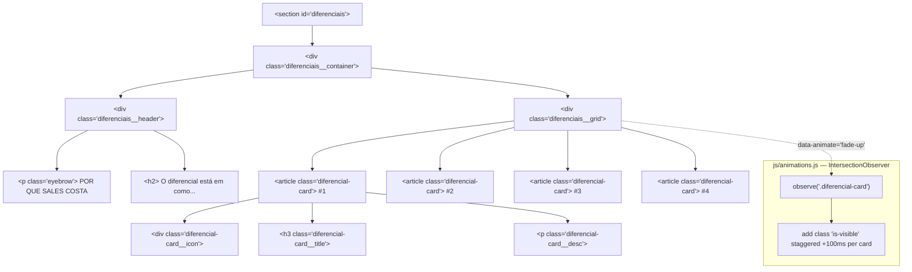

# SPEC — US-05: Por Que Sales Costa (Diferenciais de Atendimento)

> **PRD de Origem:** US-05
> **Componente:** Componente 5 — Seção Diferenciais
> **Stack:** HTML5 / Vanilla CSS3 / Vanilla JS (ES6+)
> **Status:** Ready for Development

---

## 1. System Architecture & Component Overview

A seção `#diferenciais` é o quinto bloco da landing page e cumpre a função de **diferenciação competitiva**: apresentar em formato de cards os atributos que distinguem o escritório Sales Costa Advogados de concorrentes genéricos. Ela vem logo após a seção de Áreas de Atuação e antes do bloco de Resultados/Depoimentos, funcionando como ponte de confiança.

- **Fundo escuro** (`--color-dark`) cria alternância visual com seções claras adjacentes.
- **Grid de 4 cards** iguais em peso visual (RN-01) — disposição horizontal em desktop, 2×2 em tablet, 1 coluna em mobile.
- **Animação staggered** via `IntersectionObserver` garante que cada card entre em cena sequencialmente ao rolar a página.
- Sem dependências externas além das fontes Google já carregadas no `<head>` do `index.html`.



---

## 2. HTML Structure

```html
<!-- ============================================================
     SEÇÃO: DIFERENCIAIS DE ATENDIMENTO  |  #diferenciais
     US-05
     ============================================================ -->
<section
  id="diferenciais"
  class="diferenciais"
  aria-labelledby="diferenciais-heading"
>
  <div class="diferenciais__container">

    <!-- Cabeçalho da seção -->
    <header class="diferenciais__header">
      <p class="eyebrow diferenciais__eyebrow" aria-hidden="true">
        Por que Sales Costa
      </p>
      <h2 id="diferenciais-heading" class="diferenciais__heading">
        O diferencial está em como acompanhamos cada caso.
      </h2>
    </header>

    <!-- Grid de cards -->
    <div
      class="diferenciais__grid"
      role="list"
      aria-label="Diferenciais de atendimento do escritório"
    >

      <!-- Card 1 — Atendimento personalizado -->
      <article
        class="diferencial-card"
        role="listitem"
        data-animate="fade-up"
        data-delay="0"
      >
        <div class="diferencial-card__icon" aria-hidden="true">
          <!-- SVG: silhueta de pessoas / parceria -->
          <svg
            xmlns="http://www.w3.org/2000/svg"
            width="40"
            height="40"
            viewBox="0 0 24 24"
            fill="none"
            stroke="currentColor"
            stroke-width="1.5"
            stroke-linecap="round"
            stroke-linejoin="round"
            focusable="false"
            role="img"
            aria-label="Ícone de atendimento personalizado"
          >
            <path d="M17 21v-2a4 4 0 0 0-4-4H5a4 4 0 0 0-4 4v2" />
            <circle cx="9" cy="7" r="4" />
            <path d="M23 21v-2a4 4 0 0 0-3-3.87" />
            <path d="M16 3.13a4 4 0 0 1 0 7.75" />
          </svg>
        </div>
        <h3 class="diferencial-card__title">Atendimento personalizado</h3>
        <p class="diferencial-card__desc">
          Acompanhamento direto pelos sócios responsáveis,
          sem delegação generalista.
        </p>
      </article>

      <!-- Card 2 — Equipe especializada -->
      <article
        class="diferencial-card"
        role="listitem"
        data-animate="fade-up"
        data-delay="100"
      >
        <div class="diferencial-card__icon" aria-hidden="true">
          <!-- SVG: livro / especialização -->
          <svg
            xmlns="http://www.w3.org/2000/svg"
            width="40"
            height="40"
            viewBox="0 0 24 24"
            fill="none"
            stroke="currentColor"
            stroke-width="1.5"
            stroke-linecap="round"
            stroke-linejoin="round"
            focusable="false"
            role="img"
            aria-label="Ícone de equipe especializada"
          >
            <path d="M2 3h6a4 4 0 0 1 4 4v14a3 3 0 0 0-3-3H2z" />
            <path d="M22 3h-6a4 4 0 0 0-4 4v14a3 3 0 0 1 3-3h7z" />
          </svg>
        </div>
        <h3 class="diferencial-card__title">Equipe especializada</h3>
        <p class="diferencial-card__desc">
          Formação dedicada por área, garantindo profundidade
          técnica em cada demanda.
        </p>
      </article>

      <!-- Card 3 — Resultados comprovados -->
      <article
        class="diferencial-card"
        role="listitem"
        data-animate="fade-up"
        data-delay="200"
      >
        <div class="diferencial-card__icon" aria-hidden="true">
          <!-- SVG: gráfico / resultados -->
          <svg
            xmlns="http://www.w3.org/2000/svg"
            width="40"
            height="40"
            viewBox="0 0 24 24"
            fill="none"
            stroke="currentColor"
            stroke-width="1.5"
            stroke-linecap="round"
            stroke-linejoin="round"
            focusable="false"
            role="img"
            aria-label="Ícone de resultados comprovados"
          >
            <line x1="18" y1="20" x2="18" y2="10" />
            <line x1="12" y1="20" x2="12" y2="4" />
            <line x1="6"  y1="20" x2="6"  y2="14" />
            <line x1="2"  y1="20" x2="22" y2="20" />
          </svg>
        </div>
        <h3 class="diferencial-card__title">Resultados comprovados</h3>
        <p class="diferencial-card__desc">
          Histórico consistente de êxito em negociações, defesas e
          operações societárias complexas.
        </p>
      </article>

      <!-- Card 4 — Ética & transparência -->
      <article
        class="diferencial-card"
        role="listitem"
        data-animate="fade-up"
        data-delay="300"
      >
        <div class="diferencial-card__icon" aria-hidden="true">
          <!-- SVG: escudo / ética -->
          <svg
            xmlns="http://www.w3.org/2000/svg"
            width="40"
            height="40"
            viewBox="0 0 24 24"
            fill="none"
            stroke="currentColor"
            stroke-width="1.5"
            stroke-linecap="round"
            stroke-linejoin="round"
            focusable="false"
            role="img"
            aria-label="Ícone de ética e transparência"
          >
            <path d="M12 22s8-4 8-10V5l-8-3-8 3v7c0 6 8 10 8 10z" />
          </svg>
        </div>
        <h3 class="diferencial-card__title">Ética &amp; transparência</h3>
        <p class="diferencial-card__desc">
          Comunicação clara sobre riscos, prazos e honorários
          desde a primeira consulta.
        </p>
      </article>

    </div><!-- /.diferenciais__grid -->
  </div><!-- /.diferenciais__container -->
</section>
```

---

## 3. CSS Specification

Adicionar em **`css/sections.css`** (após os estilos das seções anteriores).

### 3.1 Base styles (mobile-first)

```css
/* ================================================================
   SEÇÃO: DIFERENCIAIS  |  #diferenciais
   US-05
   ================================================================ */

.diferenciais {
  background-color: var(--color-dark);
  padding-block: var(--section-pad-y);
  padding-inline: var(--section-pad-x);
  width: 100%;
  overflow-x: hidden;
}

.diferenciais__container {
  max-width: var(--container-max);
  margin-inline: auto;
  display: flex;
  flex-direction: column;
  gap: clamp(2rem, 5vw, 3.5rem);
}

/* ── Cabeçalho ─────────────────────────────────────────────── */

.diferenciais__header {
  display: flex;
  flex-direction: column;
  gap: 0.75rem;
}

.diferenciais__eyebrow {
  /* Herda .eyebrow de components.css; sobrescreve cor */
  color: var(--color-lima);
  font-family: var(--font-body);
  font-size: var(--text-eyebrow);
  font-weight: 600;
  letter-spacing: 4px;
  text-transform: uppercase;
  line-height: 1;
}

.diferenciais__heading {
  color: var(--color-white);
  font-family: var(--font-display);
  font-size: var(--text-h2);
  font-weight: 400;
  line-height: 1.25;
  max-width: 40ch;
}

/* ── Grid de cards (mobile: 1 coluna) ───────────────────────── */

.diferenciais__grid {
  display: grid;
  grid-template-columns: 1fr;
  gap: 1.25rem;
}

/* ── Card ────────────────────────────────────────────────────── */

.diferencial-card {
  background-color: var(--color-dark-alt);
  border: 1px solid rgba(255, 255, 255, 0.07);
  border-radius: 4px;
  padding: 24px;                    /* CA-02: 24px interno em mobile */
  display: flex;
  flex-direction: column;
  gap: 1rem;
  /* Estado inicial para animação — sobrescrito por .is-visible */
  opacity: 0;
  transform: translateY(20px);
  transition:
    opacity 0.5s ease,
    transform 0.5s ease,
    border-color 0.3s ease;
}

/* Acessibilidade: sem animação quando preferida */
@media (prefers-reduced-motion: reduce) {
  .diferencial-card {
    opacity: 1;
    transform: none;
    transition: border-color 0.3s ease;
  }
}

/* ── Ícone ───────────────────────────────────────────────────── */

.diferencial-card__icon {
  color: var(--color-lima);
  display: flex;
  align-items: center;
  justify-content: flex-start;
  width: 44px;
  height: 44px;          /* touch-target mínimo, embora não interativo */
  flex-shrink: 0;
}

.diferencial-card__icon svg {
  width: 40px;
  height: 40px;
}

/* ── Título ──────────────────────────────────────────────────── */

.diferencial-card__title {
  color: var(--color-white);
  font-family: var(--font-body);
  font-size: 1.0625rem;   /* ~17px */
  font-weight: 700;
  line-height: 1.3;
  margin: 0;
}

/* ── Descrição ───────────────────────────────────────────────── */

.diferencial-card__desc {
  color: var(--color-text-light);
  font-family: var(--font-body);
  font-size: var(--text-body);
  font-weight: 400;
  line-height: 1.65;
  margin: 0;
}
```

### 3.2 Tablet breakpoint (≥ 768px)

```css
@media (min-width: 768px) {
  .diferenciais__grid {
    grid-template-columns: repeat(2, 1fr);
    gap: 1.5rem;
  }

  .diferencial-card {
    /* Padding maior em tablet+ para equilíbrio visual (RN-01) */
    padding: 2rem;
  }
}
```

### 3.3 Desktop breakpoint (≥ 1024px)

```css
@media (min-width: 1024px) {
  .diferenciais__grid {
    grid-template-columns: repeat(4, 1fr);
    gap: 1.5rem;
  }

  /* Alinhamento vertical consistente entre cards (RN-01) */
  .diferencial-card {
    /* Força todos os cards à mesma altura na linha */
    align-self: stretch;
    padding: 2.5rem 2rem;
  }

  /* Empurra a descrição para o fundo do card — mesma baseline */
  .diferencial-card__desc {
    margin-top: auto;
  }
}
```

### 3.4 States & interactions (hover, focus, active)

```css
/* Hover no card: realça borda com cor lima para sinalizar atividade */
.diferencial-card:hover {
  border-color: rgba(228, 255, 143, 0.35); /* --color-lima @ 35% */
}

/* Focus-visible para navegação por teclado */
.diferencial-card:focus-visible {
  outline: 2px solid var(--color-lima);
  outline-offset: 4px;
}
```

### 3.5 Animations & transitions

```css
/* ── Classe injetada pelo IntersectionObserver ───────────────── */
.diferencial-card.is-visible {
  opacity: 1;
  transform: translateY(0);
}

/*
  O delay por card é aplicado via JS com `style.transitionDelay`,
  usando o atributo data-delay definido no HTML.
  Exemplo resultante no DOM: style="transition-delay: 100ms"
*/
```

---

## 4. JavaScript Specification

### 4.1 Feature description

O bloco de animação observa cada `.diferencial-card` via `IntersectionObserver`. Quando um card entra no viewport (threshold 20%), a classe `is-visible` é adicionada após um delay individual controlado pelo atributo `data-delay` (em milissegundos). Isso cria o efeito **stagger** de 100 ms entre cards. O observer usa `once: true` equivalente — cada card é desobservado após a primeira intersecção.

### 4.2 Full JS code snippet

Adicionar em **`js/animations.js`**:

```js
// ================================================================
// SEÇÃO DIFERENCIAIS — Staggered fade-up via IntersectionObserver
// US-05
// ================================================================

/**
 * Inicializa a animação staggered dos cards de diferenciais.
 * Cada card lê seu `data-delay` (ms) e aplica via transitionDelay.
 * Respeita `prefers-reduced-motion`.
 */
function initDiferenciaisAnimation() {
  // Respeita preferência do SO por animações reduzidas
  const prefersReducedMotion = window.matchMedia(
    '(prefers-reduced-motion: reduce)'
  ).matches;

  const cards = document.querySelectorAll(
    '#diferenciais .diferencial-card[data-animate="fade-up"]'
  );

  if (!cards.length) return;

  // Se o usuário prefere sem movimento, torna todos visíveis imediatamente
  if (prefersReducedMotion) {
    cards.forEach((card) => card.classList.add('is-visible'));
    return;
  }

  // Aplica o delay individual de transição a cada card
  cards.forEach((card) => {
    const delay = parseInt(card.dataset.delay ?? '0', 10);
    card.style.transitionDelay = `${delay}ms`;
  });

  const observer = new IntersectionObserver(
    (entries, obs) => {
      entries.forEach((entry) => {
        if (!entry.isIntersecting) return;

        const card = entry.target;
        card.classList.add('is-visible');

        // Cada card é observado apenas uma vez
        obs.unobserve(card);
      });
    },
    {
      threshold: 0.2,       // 20% do card visível dispara a animação
      rootMargin: '0px 0px -40px 0px', // margem negativa evita disparo prematuro
    }
  );

  cards.forEach((card) => observer.observe(card));
}

// Exporta para ser chamado no DOMContentLoaded de main.js
// ou chama diretamente se este arquivo for carregado após o DOM
if (document.readyState === 'loading') {
  document.addEventListener('DOMContentLoaded', initDiferenciaisAnimation);
} else {
  initDiferenciaisAnimation();
}
```

### 4.3 Event listeners and their target elements

| Evento / API              | Elemento alvo                                     | Arquivo            |
|---------------------------|---------------------------------------------------|--------------------|
| `IntersectionObserver`    | `.diferencial-card[data-animate="fade-up"]` (×4)  | `js/animations.js` |
| `matchMedia` query        | `(prefers-reduced-motion: reduce)` — leitura única | `js/animations.js` |

> **Integração com `main.js`:** Caso `animations.js` não seja autônomo, adicionar no `main.js`:
> ```js
> import { initDiferenciaisAnimation } from './animations.js';
> document.addEventListener('DOMContentLoaded', () => {
>   initDiferenciaisAnimation();
> });
> ```
> Se os arquivos JS são carregados com `<script defer>`, o `DOMContentLoaded` interno de `animations.js` já é suficiente.

### 4.4 Edge cases handled in code

| Cenário                                      | Tratamento                                                               |
|----------------------------------------------|--------------------------------------------------------------------------|
| Seção não presente no DOM                    | `if (!cards.length) return` — sem erros silenciosos                      |
| `data-delay` ausente ou não numérico         | `parseInt(... ?? '0', 10)` — fallback seguro para `0`                   |
| `prefers-reduced-motion: reduce`             | Todos os cards recebem `is-visible` imediatamente, sem animação          |
| DOM já carregado ao executar o script        | Guarda via `document.readyState` — compatível com `<script defer>`       |
| Browser sem suporte a `IntersectionObserver` | Cards permanecem `opacity: 0` — adicionar polyfill se necessário para IE |

---

## 5. Accessibility (A11y) Requirements

### ARIA & Semântica

| Elemento                   | Atributo / Role                             | Razão                                                                 |
|----------------------------|---------------------------------------------|-----------------------------------------------------------------------|
| `<section>`                | `aria-labelledby="diferenciais-heading"`    | Associa o heading da seção ao landmark region                        |
| `.diferenciais__grid`      | `role="list"` + `aria-label="…"`            | Semântica explícita de lista para leitores de tela                   |
| `<article>` (cada card)    | `role="listitem"`                           | Filho semântico do `role="list"` do grid                             |
| `.diferencial-card__icon`  | `aria-hidden="true"` no `<div>` wrapper     | Ícone é decorativo; texto do `<h3>` fornece contexto suficiente      |
| SVGs                       | `focusable="false"` + `role="img"` + `aria-label` | Impede foco duplo em IE/Edge; label descritivo para screen readers |
| `.diferenciais__eyebrow`   | `aria-hidden="true"`                        | Texto decorativo repetido pelo `<h2>` no contexto                   |

### Navegação por teclado

- Os `<article>` cards **não são focáveis por padrão** (sem `tabindex`). Apenas se uma ação interativa (link, botão) for adicionada futuramente é que `tabindex` deve ser aplicado.
- Atualmente os cards são **informativos**, não interativos — sem necessidade de gerenciamento de foco.
- O estado `focus-visible` no card (via CSS) cobre cenário futuro de adição de `tabindex="0"`.

### Contraste de cores (WCAG AA — mínimo 4.5:1 para texto normal)

| Elemento                  | Cor do texto     | Fundo            | Ratio estimado |
|---------------------------|------------------|------------------|----------------|
| Eyebrow (lima)            | `#E4FF8F`        | `#404347`        | ~9.2:1 ✅      |
| H2 (branco)               | `#FFFFFF`        | `#404347`        | ~9.7:1 ✅      |
| Card title (branco)       | `#FFFFFF`        | `#484B4F`        | ~9.3:1 ✅      |
| Card description          | `#D1D5DB`        | `#484B4F`        | ~7.1:1 ✅      |
| Ícone SVG (lima)          | `#E4FF8F` (stroke)| `#484B4F`       | ~9.2:1 ✅      |

### `prefers-reduced-motion`

```css
@media (prefers-reduced-motion: reduce) {
  .diferencial-card {
    opacity: 1;
    transform: none;
    transition: border-color 0.3s ease; /* Apenas feedback de hover */
  }
}
```

Reforçado no JS via `window.matchMedia('(prefers-reduced-motion: reduce)')` — cards recebem `is-visible` instantaneamente.

---

## 6. Content Data Model

Fonte de verdade para todos os textos e metadados da seção. Pode ser usado para renderização dinâmica futura ou para documentação de conteúdo.

```js
// Conteúdo estático da seção Diferenciais (US-05)
const DIFERENCIAIS_CONTENT = {
  section: {
    id: 'diferenciais',
    eyebrow: 'Por que Sales Costa',
    heading: 'O diferencial está em como acompanhamos cada caso.',
    ariaLabel: 'Diferenciais de atendimento do escritório',
  },

  cards: [
    {
      id: 'card-atendimento',
      delay: 0,           // ms — stagger de animação
      iconAriaLabel: 'Ícone de atendimento personalizado',
      title: 'Atendimento personalizado',
      description:
        'Acompanhamento direto pelos sócios responsáveis, sem delegação generalista.',
    },
    {
      id: 'card-especializado',
      delay: 100,
      iconAriaLabel: 'Ícone de equipe especializada',
      title: 'Equipe especializada',
      description:
        'Formação dedicada por área, garantindo profundidade técnica em cada demanda.',
    },
    {
      id: 'card-resultados',
      delay: 200,
      iconAriaLabel: 'Ícone de resultados comprovados',
      title: 'Resultados comprovados',
      description:
        'Histórico consistente de êxito em negociações, defesas e operações societárias complexas.',
    },
    {
      id: 'card-etica',
      delay: 300,
      iconAriaLabel: 'Ícone de ética e transparência',
      title: 'Ética & transparência',
      description:
        'Comunicação clara sobre riscos, prazos e honorários desde a primeira consulta.',
    },
  ],
};
```

---

## 7. Acceptance Criteria (Technical)

### CA-01 — 4 diferenciais exibidos

| Verificação | Método |
|---|---|
| Exatamente 4 elementos `<article class="diferencial-card">` presentes no DOM | `document.querySelectorAll('#diferenciais .diferencial-card').length === 4` |
| Cada card contém `<div class="diferencial-card__icon">`, `<h3>`, e `<p>` | Inspeção manual ou teste de DOM (ex.: Playwright/Puppeteer) |
| Todos os 4 títulos do modelo de dados estão renderizados no HTML | Grep textual ou snapshot test |
| Ícones SVG possuem `aria-label` e `focusable="false"` | Validação ARIA com axe-core |

### CA-02 — 1 coluna em < 768px com padding 24px interno

| Verificação | Método |
|---|---|
| `.diferenciais__grid` tem `grid-template-columns: 1fr` em viewport < 768px | DevTools → Computed Styles em 375px de largura |
| Cada `.diferencial-card` tem `padding: 24px` computado em mobile | `getComputedStyle(card).padding === '24px'` em viewport mobile |
| Nenhum card transborda horizontalmente (`overflow-x`) | Scroll horizontal ausente; `document.body.scrollWidth <= window.innerWidth` |
| Cards empilhados verticalmente sem quebra de layout em 320px | Teste visual em Samsung Galaxy S8 (320px) via DevTools |

### CA-03 — Animação staggered funciona corretamente

| Verificação | Método |
|---|---|
| Cards iniciam com `opacity: 0` e `transform: translateY(20px)` | Computed styles antes do scroll |
| Após entrar no viewport, cards recebem classe `is-visible` | `card.classList.contains('is-visible')` após simular scroll |
| Delay entre cards é 0, 100, 200, 300 ms respectivamente | `getComputedStyle(card).transitionDelay` por card |
| Com `prefers-reduced-motion: reduce`, todos os cards ficam visíveis sem animação | Simular via DevTools → Rendering → "Emulate CSS media feature" |

### CA-04 — Grid 4 colunas em ≥ 1024px (RN-01 — peso visual igual)

| Verificação | Método |
|---|---|
| `.diferenciais__grid` tem `grid-template-columns: repeat(4, 1fr)` em 1440px | DevTools → Computed Styles |
| Todos os 4 cards têm a mesma `height` computada (align-self: stretch) | `card.getBoundingClientRect().height` igual para os 4 |
| Topo dos ícones alinhados verticalmente entre cards | Inspeção visual com régua do DevTools |

### CA-05 — Acessibilidade e contraste

| Verificação | Método |
|---|---|
| Ratio de contraste mínimo 4.5:1 para todos os textos | axe-core ou Colour Contrast Analyser |
| Zero erros de acessibilidade críticos detectados pelo axe-core | `axe.run('#diferenciais')` — `violations.length === 0` |
| Seção acessível via leitor de tela (NVDA/VoiceOver) com semântica correta | Teste manual com NVDA + Firefox |

---

## 8. Dependencies & Integration Points

### CSS Custom Properties utilizadas

| Variável                  | Uso                                          |
|---------------------------|----------------------------------------------|
| `--color-dark`            | Background da seção                          |
| `--color-dark-alt`        | Background dos cards                         |
| `--color-lima`            | Eyebrow text, cor dos ícones SVG             |
| `--color-white`           | H2, títulos dos cards                        |
| `--color-text-light`      | Parágrafos descritivos dos cards             |
| `--font-display`          | H2 da seção                                  |
| `--font-body`             | Eyebrow, títulos e descrições dos cards      |
| `--text-h2`               | Tamanho fluido do heading                    |
| `--text-eyebrow`          | Tamanho do eyebrow                           |
| `--text-body`             | Tamanho do texto de descrição                |
| `--section-pad-y`         | Padding vertical da seção                    |
| `--section-pad-x`         | Padding horizontal da seção                  |
| `--container-max`         | Largura máxima do container interno          |

### Arquivos CSS que precisam de regra `.eyebrow`

A classe `.eyebrow` base (font-size, letter-spacing, text-transform) deve ser definida em `css/components.css`. A seção Diferenciais **sobrescreve apenas a cor** via `.diferenciais__eyebrow`. Garantir que a regra base exista antes de aplicar a sobrescrita.

### Módulos JS

| Módulo            | Dependência                         |
|-------------------|-------------------------------------|
| `js/animations.js`| `IntersectionObserver` (nativo ES2019+) |
| `js/main.js`      | Chama ou importa `initDiferenciaisAnimation` no `DOMContentLoaded` |

### Anchor ID exposto

| ID              | Usado por                                      |
|-----------------|------------------------------------------------|
| `#diferenciais` | Links de navegação do `<nav>` principal (navbar) e botões CTA de seções anteriores |

### Recursos externos (já carregados via `index.html`)

| Recurso                    | Provedor       | Carregamento         |
|----------------------------|----------------|----------------------|
| `Cormorant Garamond`       | Google Fonts   | `<link>` no `<head>` |
| `DM Sans`                  | Google Fonts   | `<link>` no `<head>` |
| SVG icons (inline)         | —              | Embutidos no HTML    |

> **Nota:** Nenhuma dependência de CDN adicional é necessária. Todos os SVGs são inline, eliminando requisições de rede extras e garantindo controle total de estilo via CSS `currentColor`.
