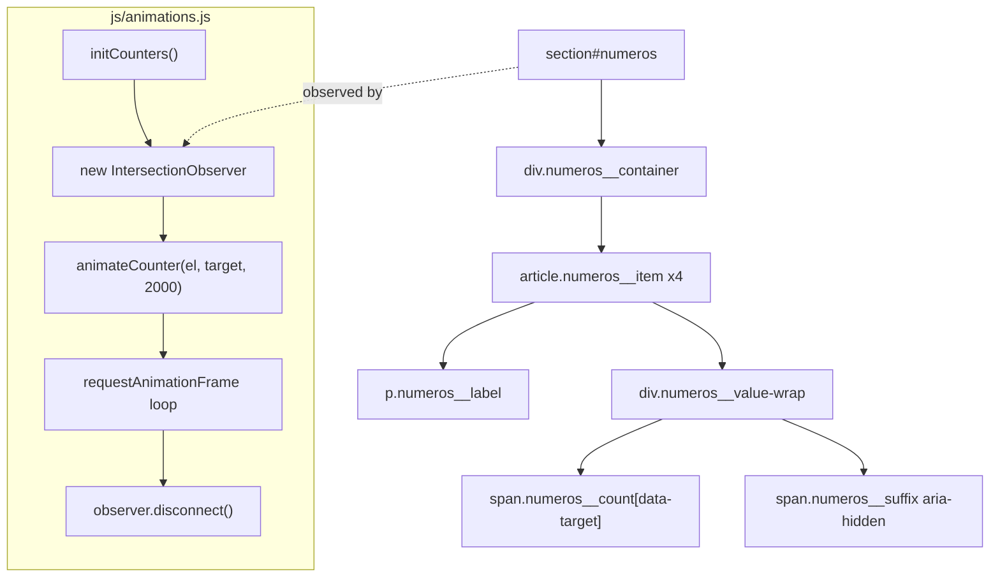

# SPEC — US-06: Em Números (Métricas de Autoridade)

> **PRD de Origem:** US-06
> **Componente:** Componente 6 — Seção de Métricas de Autoridade
> **Stack:** HTML5 / Vanilla CSS3 / Vanilla JS (ES6+)
> **Status:** Ready for Development

---

## 1. System Architecture & Component Overview

A seção **Em Números** é uma faixa horizontal de métricas de autoridade posicionada entre a seção de serviços e a de depoimentos. Seu propósito é gerar prova social e credibilidade por meio de números expressivos exibidos com uma animação de contagem que dispara uma única vez quando a seção entra no viewport.

- **Arquivo HTML:** `index.html` — `<section id="numeros">`
- **Estilos:** `css/sections.css` (layout da seção) + `css/components.css` (card de métrica reutilizável)
- **JS:** `js/animations.js` — `initCounters()` via `IntersectionObserver`
- **Sem dependências de terceiros** além das fontes já carregadas no `<head>`.



---

## 2. HTML Structure

```html
<!--
  SECTION: Em Números (#numeros)
  File: index.html
  Placed between: #servicos and #depoimentos
-->
<section
  id="numeros"
  class="numeros"
  aria-label="Métricas de autoridade do escritório Sales Costa Advogados"
>
  <div class="numeros__container">

    <!-- Métrica 1: Anos de Experiência -->
    <article class="numeros__item" aria-label="15 anos de experiência">
      <div class="numeros__value-wrap">
        <span
          class="numeros__count"
          data-target="15"
          aria-live="off"
        >0</span>
        <span class="numeros__suffix" aria-hidden="true">+</span>
      </div>
      <p class="numeros__label">Anos de Experiência</p>
    </article>

    <!-- Métrica 2: Clientes Atendidos -->
    <article class="numeros__item" aria-label="mais de 500 clientes atendidos">
      <div class="numeros__value-wrap">
        <span
          class="numeros__count"
          data-target="500"
          aria-live="off"
        >0</span>
        <span class="numeros__suffix" aria-hidden="true">+</span>
      </div>
      <p class="numeros__label">Clientes Atendidos</p>
    </article>

    <!-- Métrica 3: Casos Concluídos -->
    <article class="numeros__item" aria-label="mais de 300 casos concluídos">
      <div class="numeros__value-wrap">
        <span
          class="numeros__count"
          data-target="300"
          aria-live="off"
        >0</span>
        <span class="numeros__suffix" aria-hidden="true">+</span>
      </div>
      <p class="numeros__label">Casos Concluídos</p>
    </article>

    <!-- Métrica 4: Áreas de Especialização (sem sufixo "+") -->
    <article class="numeros__item numeros__item--no-divider" aria-label="5 áreas de especialização">
      <div class="numeros__value-wrap">
        <span
          class="numeros__count"
          data-target="5"
          aria-live="off"
        >0</span>
        <!-- Sem sufixo "+" neste item -->
      </div>
      <p class="numeros__label">Áreas de Especialização</p>
    </article>

  </div>
</section>
```

### Notas de Marcação

| Decisão | Justificativa |
|---|---|
| `<section>` com `aria-label` | Landmark navegável por leitores de tela sem precisar de `<h2>` visível |
| `<article>` por métrica | Cada métrica é unidade de conteúdo autossuficiente (número + rótulo) |
| `aria-live="off"` no `<span>` | Evita que leitores de tela anunciem cada frame da animação; o valor final é comunicado via `aria-label` no `<article>` pai |
| `data-target` | Hook para o JS sem poluir o DOM semântico |
| `.numeros__item--no-divider` | Remove o `border-right` do último item sem precisar de `:last-child` (mais explícito e resiliente a reordenação) |

---

## 3. CSS Specification

> Adicionar em **`css/sections.css`** na seção `/* === #numeros === */`.

### 3.1 Base Styles (Mobile-first, < 768px)

```css
/* ============================================================
   #numeros — Em Números  (mobile-first)
   ============================================================ */

.numeros {
  background-color: var(--color-off-white);   /* #F8F6F4 */
  padding-block: var(--section-pad-y);
  padding-inline: var(--section-pad-x);
}

.numeros__container {
  display: grid;
  /* Mobile: 2 colunas de largura igual */
  grid-template-columns: repeat(2, 1fr);
  gap: clamp(2rem, 5vw, 2.5rem) clamp(1rem, 4vw, 2rem);

  max-width: var(--container-max);    /* 1200px */
  margin-inline: auto;
}

/* Card individual de métrica */
.numeros__item {
  display: flex;
  flex-direction: column;
  align-items: center;
  text-align: center;
  gap: 0.5rem;
  padding-block: 0.75rem;

  /* Sem divisor no mobile */
  border-right: none;

  /* Estado inicial para animação de entrada (JS adiciona .is-visible) */
  opacity: 0;
  transform: translateY(12px);
  transition:
    opacity 0.5s ease,
    transform 0.5s ease;
}

.numeros__item.is-visible {
  opacity: 1;
  transform: translateY(0);
}

/* Stagger entre os 4 cards */
.numeros__item:nth-child(1) { transition-delay: 0ms;   }
.numeros__item:nth-child(2) { transition-delay: 80ms;  }
.numeros__item:nth-child(3) { transition-delay: 160ms; }
.numeros__item:nth-child(4) { transition-delay: 240ms; }

/* Wrapper do número + sufixo na mesma baseline */
.numeros__value-wrap {
  display: flex;
  align-items: baseline;
  gap: 0.1em;
}

/* Número principal */
.numeros__count {
  font-family: var(--font-body);           /* DM Sans */
  font-weight: 700;
  font-size: clamp(2.5rem, 8vw, 4rem);    /* fluido conforme PRD */
  color: var(--color-text-dark);           /* #2B2B2B */
  line-height: 1;

  /* Largura mínima evita layout shift durante a contagem */
  display: inline-block;
  min-width: 2ch;
  text-align: right;
  font-variant-numeric: tabular-nums;
}

/* Sufixo "+" */
.numeros__suffix {
  font-family: var(--font-body);
  font-weight: 700;
  font-size: clamp(1.75rem, 5vw, 2.75rem);  /* ~70% do tamanho do número */
  color: var(--color-taupe);                 /* #AA9B8F */
  line-height: 1;
}

/* Rótulo da métrica */
.numeros__label {
  font-family: var(--font-body);
  font-weight: 500;
  font-size: 0.6875rem;           /* ~11px */
  color: var(--color-taupe);      /* #AA9B8F */
  text-transform: uppercase;
  letter-spacing: 2px;
  line-height: 1.4;
  margin: 0;
}

/* prefers-reduced-motion */
@media (prefers-reduced-motion: reduce) {
  .numeros__item,
  .numeros__item.is-visible {
    opacity: 1;
    transform: none;
    transition: none;
  }
}
```

### 3.2 Tablet Breakpoint (≥ 768px)

```css
@media (min-width: 768px) {

  .numeros__container {
    /* 4 colunas em linha */
    grid-template-columns: repeat(4, 1fr);
    gap: 0; /* separação via border-right */
  }

  .numeros__item {
    /* Divisor vertical entre colunas */
    border-right: 1px solid var(--color-border);  /* #D9D3CE */
    padding-inline: clamp(1rem, 3vw, 2.5rem);
  }

  /* Remove divisor do último item */
  .numeros__item--no-divider,
  .numeros__item:last-child {
    border-right: none;
  }
}
```

### 3.3 Desktop Breakpoint (≥ 1024px)

```css
@media (min-width: 1024px) {

  .numeros__item {
    padding-block: 1.25rem;
    padding-inline: clamp(1.5rem, 3vw, 3rem);
  }

  .numeros__label {
    font-size: 0.75rem; /* --text-eyebrow */
  }
}
```

### 3.4 States & Interactions

Nenhum estado interativo (hover, focus, active) é necessário — os itens são puramente informativos e não são clicáveis.

### 3.5 Animations & Transitions

A animação de contagem é conduzida inteiramente por JS via `requestAnimationFrame`. O CSS gerencia apenas o fade-in de entrada (declarado em 3.1). O `prefers-reduced-motion` desativa ambas as animações (CSS transition + JS counter) conforme RN-02.

---

## 4. JavaScript Specification

> Adicionar em **`js/animations.js`**. Exportar `initCounters()` e chamá-la em `js/main.js` no `DOMContentLoaded`.

### 4.1 Feature Description

1. Um `IntersectionObserver` observa `<section id="numeros">`.
2. Quando **≥ 40%** da seção está visível, a callback:
   - Adiciona `.is-visible` em cada `.numeros__item` (fade-in CSS).
   - Dispara `animateCounter()` para cada `.numeros__count`.
   - Chama `observer.disconnect()` — **nunca re-anima**.
3. Se `prefers-reduced-motion: reduce` está ativo, pula a animação e exibe os valores finais diretamente (RN-02).

### 4.2 Full JS Code Snippet

```js
/**
 * js/animations.js
 *
 * initCounters()
 * Observa a seção #numeros e anima os contadores numéricos
 * ao entrar no viewport. Dispara uma única vez.
 *
 * RN-01: IntersectionObserver, dispara uma única vez.
 * RN-02: prefers-reduced-motion → exibe valor final imediatamente.
 */

/**
 * Anima um elemento <span> de 0 até `target` em `duration` ms.
 * Usa easeOutCubic para desaceleração suave ao final.
 *
 * @param {HTMLElement} el       - O <span class="numeros__count">
 * @param {number}      target   - Valor final
 * @param {number}      duration - Duração em ms (default: 2000)
 */
function animateCounter(el, target, duration = 2000) {
  const startTime = performance.now();

  function tick(currentTime) {
    const elapsed  = currentTime - startTime;
    const progress = Math.min(elapsed / duration, 1);

    // Easing: easeOutCubic — desacelera suavemente ao final
    const eased        = 1 - Math.pow(1 - progress, 3);
    const currentValue = Math.round(eased * target);

    el.textContent = currentValue;

    if (progress < 1) {
      requestAnimationFrame(tick);
    } else {
      // Garante o valor exato ao final (evita arredondamento)
      el.textContent = target;
    }
  }

  requestAnimationFrame(tick);
}

/**
 * Inicializa o IntersectionObserver para a seção #numeros.
 * Deve ser chamada no DOMContentLoaded em main.js.
 */
export function initCounters() {
  const section = document.getElementById('numeros');
  if (!section) return; // Seção não encontrada — encerra silenciosamente

  const counterEls = section.querySelectorAll('.numeros__count');
  const itemEls    = section.querySelectorAll('.numeros__item');

  // RN-02: prefers-reduced-motion — exibe valores finais sem animar
  const prefersReduced = window.matchMedia(
    '(prefers-reduced-motion: reduce)'
  ).matches;

  if (prefersReduced) {
    counterEls.forEach((el) => {
      el.textContent = el.dataset.target;
    });
    itemEls.forEach((el) => el.classList.add('is-visible'));
    return; // Não inicializa o observer
  }

  // RN-01: IntersectionObserver — dispara ao ≥ 40% de visibilidade
  const observer = new IntersectionObserver(
    (entries) => {
      entries.forEach((entry) => {
        if (!entry.isIntersecting) return;

        // Fade-in dos cards
        itemEls.forEach((el) => el.classList.add('is-visible'));

        // Animação dos contadores
        counterEls.forEach((el) => {
          const target = parseInt(el.dataset.target, 10);
          if (!Number.isFinite(target)) return; // Edge case: data-target inválido
          animateCounter(el, target, 2000);
        });

        // RN-01: desconecta após o primeiro disparo
        observer.disconnect();
      });
    },
    {
      threshold: 0.4, // 40% da seção visível
    }
  );

  observer.observe(section);
}
```

### 4.3 Event Listeners and Target Elements

| Listener / API | Elemento alvo | Arquivo | Quando |
|---|---|---|---|
| `IntersectionObserver` | `<section id="numeros">` | `js/animations.js` | Ao ≥ 40% de visibilidade, uma vez |
| `requestAnimationFrame` | `<span class="numeros__count">` ×4 | `js/animations.js` | Loop até `progress >= 1` |
| `DOMContentLoaded` | `document` | `js/main.js` | Chama `initCounters()` |

### 4.4 Edge Cases Handled

| Caso | Tratamento |
|---|---|
| `#numeros` não existe na página | `if (!section) return` — sem erro |
| `data-target` ausente ou NaN | `if (!Number.isFinite(target)) return` — pula aquele contador |
| `prefers-reduced-motion: reduce` | Exibe valor final imediatamente, sem observer |
| Observer dispara múltiplas vezes | `observer.disconnect()` dentro da callback — impossível re-animar |
| Valor final com arredondamento imperfeito | `el.textContent = target` após `progress >= 1` — garante exatidão |
| Leitor de tela durante a animação | `aria-live="off"` — não anuncia frames intermediários |

### 4.5 Integração em `js/main.js`

```js
// js/main.js (trecho a adicionar)
import { initCounters } from './animations.js';

document.addEventListener('DOMContentLoaded', () => {
  // ... outras inits ...
  initCounters();
});
```

---

## 5. Accessibility (A11y) Requirements

### ARIA & Roles

| Elemento | Atributo | Valor | Motivo |
|---|---|---|---|
| `<section>` | `aria-label` | `"Métricas de autoridade do escritório Sales Costa Advogados"` | Torna o landmark descritivo sem `<h2>` visível |
| `<article>` ×4 | `aria-label` | Ex: `"15 anos de experiência"` | Comunica o valor semântico final ao AT independentemente da animação |
| `.numeros__count` | `aria-live` | `"off"` | Impede anúncio de cada frame intermediário da contagem |
| `.numeros__suffix` | `aria-hidden` | `"true"` | O "+" já está representado no `aria-label` do `<article>` |

### Navegação por Teclado

Nenhum elemento interativo nesta seção. O foco do teclado passa pela seção de forma transparente. O `<section>` é navegável via atalho de landmarks (`D` / `R` no NVDA, `W` no JAWS).

### Contraste de Cores (WCAG AA)

| Elemento | Foreground | Background | Ratio estimado | Status |
|---|---|---|---|---|
| `.numeros__count` | `#2B2B2B` | `#F8F6F4` | ≈ 16.5:1 | ✅ Passa AA e AAA |
| `.numeros__label` / `.numeros__suffix` | `#AA9B8F` | `#F8F6F4` | ≈ 2.8:1 | ⚠️ Decorativo — informação completa via `aria-label` |

> **Nota:** O `#AA9B8F` (Taupe) sobre `#F8F6F4` não atinge 4.5:1. A mitigação é o `aria-label` descritivo no `<article>` pai, que comunica o valor completo com contraste suficiente.

### `prefers-reduced-motion`

```css
@media (prefers-reduced-motion: reduce) {
  .numeros__item,
  .numeros__item.is-visible {
    opacity: 1;
    transform: none;
    transition: none;
  }
}
```

```js
// JS — bloco em initCounters()
const prefersReduced = window.matchMedia('(prefers-reduced-motion: reduce)').matches;
if (prefersReduced) { /* exibe valores finais imediatamente, sem observer */ }
```

---

## 6. Content Data Model

```js
/**
 * Fonte única de verdade para o conteúdo da seção #numeros.
 * Pode ser usado para conferir o HTML estático ou populá-lo via template.
 */
const NUMEROS_DATA = [
  {
    id:        'experiencia',
    target:    15,
    suffix:    '+',
    label:     'Anos de Experiência',
    ariaLabel: '15 anos de experiência',
  },
  {
    id:        'clientes',
    target:    500,
    suffix:    '+',
    label:     'Clientes Atendidos',
    ariaLabel: 'mais de 500 clientes atendidos',
  },
  {
    id:        'casos',
    target:    300,
    suffix:    '+',
    label:     'Casos Concluídos',
    ariaLabel: 'mais de 300 casos concluídos',
  },
  {
    id:        'areas',
    target:    5,
    suffix:    null,       // Sem sufixo "+" neste item
    label:     'Áreas de Especialização',
    ariaLabel: '5 áreas de especialização',
  },
];
```

---

## 7. Acceptance Criteria (Technical)

### CA-01 — Counter anima de 0 → target em ~2s

| # | Verificação técnica | Como testar |
|---|---|---|
| CA-01.1 | `.numeros__count` começa em `0` e termina no `data-target` exato | Inspecionar `textContent` nos frames via DevTools Performance |
| CA-01.2 | Duração total entre 1.8s e 2.2s (tolerância ±10%) | `console.time` / `console.timeEnd` envolvendo `animateCounter` |
| CA-01.3 | Valor final exibido é exatamente 15, 500, 300 e 5 | Inspecionar `el.textContent` após o `rAF` terminar |
| CA-01.4 | Animação dispara **apenas uma vez** por visita | Rolar para baixo e para cima repetidas vezes — contador não reseta |
| CA-01.5 | Com `prefers-reduced-motion: reduce`, valores finais aparecem imediatamente sem animação | DevTools → Rendering → Enable `prefers-reduced-motion`; verificar `textContent` = valor final sem animação |

### CA-02 — Grid 2×2 em mobile (< 768px)

| # | Verificação técnica | Como testar |
|---|---|---|
| CA-02.1 | Em viewport < 768px, `.numeros__container` tem `grid-template-columns: repeat(2, 1fr)` | DevTools → Elements → Computed Styles |
| CA-02.2 | Os 4 itens se distribuem em 2 colunas × 2 linhas | DevTools Grid inspector |
| CA-02.3 | Nenhum `border-right` nos cards em mobile | Computed Styles → `border-right: none` |
| CA-02.4 | Em viewport ≥ 768px, 4 cards em linha com divisor vertical entre itens 1–3 | `grid-template-columns: repeat(4, 1fr)`; `border-right: 1px solid #D9D3CE` |
| CA-02.5 | `.numeros__item--no-divider` (4º card) sem `border-right` em qualquer breakpoint | Computed Styles → `border-right: none` |

---

## 8. Dependencies & Integration Points

### CSS Custom Properties Utilizadas

| Variável | Valor | Uso |
|---|---|---|
| `--color-off-white` | `#F8F6F4` | Background da seção |
| `--color-text-dark` | `#2B2B2B` | Cor do número principal |
| `--color-taupe` | `#AA9B8F` | Sufixo "+" e labels |
| `--color-border` | `#D9D3CE` | Divisor vertical entre colunas |
| `--font-body` | `'DM Sans', system-ui, sans-serif` | Toda a tipografia da seção |
| `--section-pad-y` | `clamp(3rem, 8vw, 6rem)` | Padding vertical |
| `--section-pad-x` | `clamp(1.25rem, 5vw, 5rem)` | Padding horizontal |
| `--container-max` | `1200px` | Largura máxima do container |

### Módulos JS

| Módulo | Função exportada | Papel |
|---|---|---|
| `js/animations.js` | `initCounters()` | Declara o IntersectionObserver + `animateCounter()` |
| `js/main.js` | — | Importa e chama `initCounters()` no `DOMContentLoaded` |

### Anchor IDs

| ID | Usado por |
|---|---|
| `#numeros` | Link de navegação na `<nav>` principal (se aplicável) |

### Recursos Externos

| Recurso | Fonte | Status |
|---|---|---|
| `DM Sans` (weights 500, 700) | Google Fonts no `<head>` | ✅ Compartilhado com toda a página |
| `IntersectionObserver` API | Browser nativo | ✅ Suporte ≥ 97% global (2026) |
| `requestAnimationFrame` API | Browser nativo | ✅ Suporte universal |

### Checklist de Integração

- [ ] `<section id="numeros">` inserido em `index.html` entre `#servicos` e `#depoimentos`
- [ ] Estilos adicionados em `css/sections.css` sob `/* === #numeros === */`
- [ ] `initCounters()` exportada de `js/animations.js` e importada em `js/main.js`
- [ ] `DM Sans` com `font-weight: 500` e `700` presentes no `<link>` do Google Fonts
- [ ] Testado com `prefers-reduced-motion: reduce` emulado no DevTools
- [ ] Testado em viewport 375px (iPhone SE) e 768px (iPad portrait)
- [ ] Validado com Axe DevTools ou Lighthouse Accessibility ≥ 90
