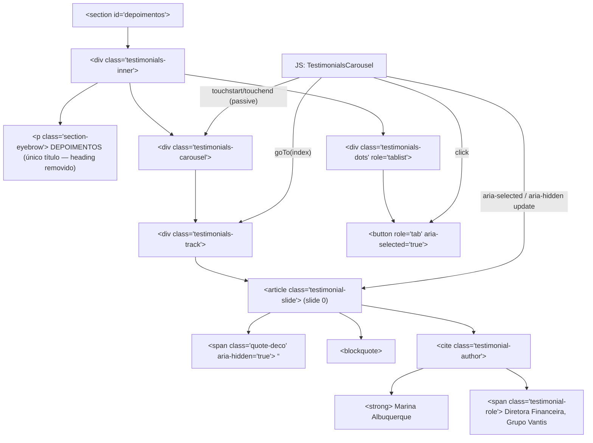

# SPEC — US-07: Depoimentos (Prova Social & Validação de Clientes)

> **PRD de Origem:** US-07
> **Componente:** Componente 7 — Seção de Depoimentos
> **Stack:** HTML5 / Vanilla CSS3 / Vanilla JS (ES6+)
> **Status:** Ready for Development

---

## 1. System Architecture & Component Overview

A seção `#depoimentos` apresenta prova social da firma através de depoimentos de clientes em formato carrossel. A arquitetura suporta múltiplos depoimentos (array de objetos), garantindo extensibilidade sem refatoração.

> **Estado atual (Fase 17):** `TESTIMONIALS_DATA` contém **3 depoimentos** — 1 real (Marina Albuquerque / Grupo Vantis) + 2 placeholders (marcados no código) para demonstrar o efeito de carrossel. Substituir os placeholders por depoimentos reais quando disponíveis.

A seção é posicionada **após `#numeros`** (hero → comunicado → sobre → areas → diferenciais → numeros → depoimentos), funcionando como gatilho de conversão emocional. O layout exibe um card centralizado (max-width 800px no desktop) com aspas decorativas, texto em itálico, identificação do autor e dots de navegação. No mobile, o swipe horizontal troca de depoimento; no desktop, os dots fazem o mesmo.



---

## 2. HTML Structure

```html
<!-- =============================================
     SEÇÃO: DEPOIMENTOS — #depoimentos
     Arquivo: index.html
     ============================================= -->
<section
  id="depoimentos"
  class="testimonials-section"
  aria-label="Depoimentos de clientes"
>
  <!-- Marca d'água decorativa — assets/logo_s_background.png (1634x2102) -->
  

  <div class="testimonials-inner container">

    <!-- Eyebrow (único título da seção — heading "O que nossos clientes dizem" removido a pedido) -->
    <p class="section-eyebrow" aria-hidden="true">DEPOIMENTOS</p>

    <!-- Carousel wrapper — touch target for swipe -->
    <div
      class="testimonials-carousel"
      role="region"
      aria-label="Carrossel de depoimentos"
      aria-live="polite"
    >
      <!-- Track — slides move via translateX -->
      <div
        class="testimonials-track"
        aria-atomic="false"
      >

        <!-- ── Slide 0 (static fallback; JS re-renders from TESTIMONIALS_DATA) ── -->
        <article
          class="testimonial-slide"
          role="group"
          aria-roledescription="slide"
          aria-label="Depoimento 1 de 1"
          data-index="0"
          id="testimonial-slide-0"
          aria-hidden="false"
        >
          <!-- Decorative opening quote -->
          <span class="quote-deco" aria-hidden="true">&ldquo;</span>

          <!-- Testimonial body -->
          <blockquote class="testimonial-quote" cite="">
            <p>
              A equipe conduziu uma reestruturação societária complexa com
              clareza e agilidade que não encontrávamos em outros escritórios.
            </p>
          </blockquote>

          <!-- Author attribution -->
          <cite class="testimonial-author">
            <strong class="testimonial-name">Marina Albuquerque</strong>
            <span class="testimonial-role">
              Diretora Financeira, Grupo Vantis
            </span>
          </cite>
        </article>
        <!-- ── /Slide 0 ── -->

      </div><!-- /.testimonials-track -->
    </div><!-- /.testimonials-carousel -->

    <!-- Navigation dots -->
    <div
      class="testimonials-dots"
      role="tablist"
      aria-label="Navegação de depoimentos"
    >
      <button
        class="testimonials-dot active"
        role="tab"
        aria-selected="true"
        aria-controls="testimonial-slide-0"
        aria-label="Ir para depoimento 1"
        data-index="0"
        tabindex="0"
      ></button>
      <!-- JS inserts additional dots when TESTIMONIALS_DATA has > 1 item -->
    </div><!-- /.testimonials-dots -->

  </div><!-- /.testimonials-inner -->
</section>
```

> **Note:** The static HTML serves as a no-JS fallback. When JS runs, `_renderSlides()` and `_renderDots()` replace the inner content with dynamically generated markup from `TESTIMONIALS_DATA`.

---

## 3. CSS Specification

All rules go into **`css/sections.css`** under the `/* === DEPOIMENTOS === */` block.

### 3.1 Base Styles (Mobile-first, < 768px)

```css
/* ================================================
   DEPOIMENTOS — Base (Mobile-first)
   ================================================ */

.testimonials-section {
  position: relative;
  background-color: var(--color-off-white);
  padding-block: var(--section-pad-y);
  padding-inline: var(--section-pad-x);
  overflow: hidden; /* contain horizontal bleed from track transforms + watermark */
}

/* Decorative watermark (assets/logo_s_background.png, 1634x2102) — fundo claro */
.testimonials-watermark {
  position: absolute;
  left: 50%;
  top: 50%;
  transform: translate(-50%, -50%);
  width: min(80%, 900px);
  height: auto;
  opacity: var(--watermark-opacity); /* 0.3 — token global das marcas d'água */
  filter: brightness(0);
  pointer-events: none;
  user-select: none;
  z-index: 0;
}

.testimonials-inner {
  position: relative;
  z-index: 1;
  max-width: var(--container-max);
  margin-inline: auto;
  display: flex;
  flex-direction: column;
  align-items: center;
  gap: 2rem;
}

/* Eyebrow */
.testimonials-section .section-eyebrow {
  letter-spacing: 0.18em;
  font-size: var(--text-eyebrow);
  font-family: var(--font-body);
  font-weight: 500;
  color: var(--color-taupe);
  text-transform: uppercase;
  text-align: center;
}

/* Section heading REMOVIDO a pedido — a seção usa apenas o eyebrow "DEPOIMENTOS".
   A regra .testimonials-heading foi excluída de css/sections.css. */

/* ── Carousel ── */
.testimonials-carousel {
  width: 100%;
  overflow: hidden;
  position: relative;
  min-height: 44px; /* Minimum swipe target height */
}

.testimonials-track {
  display: flex;
  width: 100%; /* Widened to 100% × N slides by JS */
  transition: transform 0.4s ease;
  will-change: transform;
}

/* ── Slide ── */
.testimonial-slide {
  flex: 0 0 100%;
  width: 100%;
  display: flex;
  flex-direction: column;
  align-items: center;
  position: relative;
}

.testimonial-slide[aria-hidden="true"] {
  visibility: hidden;
  pointer-events: none;
}

.testimonial-slide[aria-hidden="false"] {
  visibility: visible;
  pointer-events: auto;
}

/* Decorative opening quote */
.quote-deco {
  display: block;
  font-family: var(--font-display);
  font-size: 7.5rem; /* ~120px */
  line-height: 0.6;
  color: var(--color-taupe);
  opacity: 0.55;
  text-align: center;
  margin-bottom: 0.5rem;
  user-select: none;
  pointer-events: none;
  height: 4rem;
  overflow: visible;
}

/* Blockquote */
.testimonial-quote {
  margin: 0;
  padding: 0;
  text-align: center;
}

.testimonial-quote p {
  font-family: var(--font-display);
  font-style: italic;
  font-size: clamp(1.1rem, 2.5vw, 1.35rem);
  line-height: 1.65;
  color: var(--color-text-dark);
  max-width: 68ch;
  margin-inline: auto;
}

/* Author block */
.testimonial-author {
  display: flex;
  flex-direction: column;
  align-items: center;
  gap: 0.25rem;
  font-style: normal;
  margin-top: 1.75rem;
}

/* Separator line above author */
.testimonial-author::before {
  content: "";
  display: block;
  width: 2.5rem;
  height: 1px;
  background-color: var(--color-taupe);
  margin-bottom: 1rem;
}

.testimonial-name {
  font-family: var(--font-body);
  font-weight: 500;
  font-size: 0.9375rem; /* 15px */
  color: var(--color-text-dark);
  letter-spacing: 0.02em;
}

.testimonial-role {
  font-family: var(--font-body);
  font-weight: 400;
  font-size: 0.8125rem; /* 13px */
  color: var(--color-taupe);
  letter-spacing: 0.01em;
}

/* ── Dots ── */
.testimonials-dots {
  display: flex;
  gap: 0.5rem;
  justify-content: center;
  align-items: center;
}

.testimonials-dots.is-single {
  visibility: hidden;
  pointer-events: none;
  height: 0;
  margin: 0;
  overflow: hidden;
}

/* 44×44px touch target — visual dot is smaller via ::after */
.testimonials-dot {
  width: 44px;
  height: 44px;
  display: flex;
  align-items: center;
  justify-content: center;
  background: transparent;
  border: none;
  cursor: pointer;
  padding: 0;
}

.testimonials-dot::after {
  content: "";
  display: block;
  width: 8px;
  height: 8px;
  border-radius: 50%;
  background-color: var(--color-border);
  transition: background-color 0.25s ease, transform 0.25s ease;
}

.testimonials-dot.active::after,
.testimonials-dot[aria-selected="true"]::after {
  background-color: var(--color-taupe);
  transform: scale(1.35);
}

.testimonials-dot:focus-visible {
  outline: 2px solid var(--color-taupe);
  outline-offset: 2px;
  border-radius: 2px;
}
```

### 3.2 Tablet Breakpoint (≥ 768px)

```css
/* ================================================
   DEPOIMENTOS — Tablet (≥ 768px)
   ================================================ */

@media (min-width: 768px) {
  .testimonials-inner {
    gap: 2.5rem;
  }

  .quote-deco {
    font-size: 9rem;
    height: 4.5rem;
  }

  .testimonial-quote p {
    font-size: clamp(1.2rem, 2vw, 1.45rem);
  }

  .testimonials-dot::after {
    width: 10px;
    height: 10px;
  }
}
```

### 3.3 Desktop Breakpoint (≥ 1024px)

```css
/* ================================================
   DEPOIMENTOS — Desktop (≥ 1024px)
   ================================================ */

@media (min-width: 1024px) {
  .testimonials-inner {
    gap: 3rem;
  }

  /* Centered card — max-width 800px */
  .testimonials-carousel {
    max-width: 800px;
    margin-inline: auto;
  }

  .quote-deco {
    font-size: 10rem; /* ~160px — prominent on wide screens */
    height: 5rem;
  }
}
```

### 3.4 States & Interactions

```css
/* ================================================
   DEPOIMENTOS — States & Interactions
   ================================================ */

@media (hover: hover) {
  .testimonials-dot:hover::after {
    background-color: var(--color-taupe);
    opacity: 0.7;
  }
}

.testimonials-dot:active::after {
  transform: scale(0.9);
}
```

### 3.5 Animations & Transitions

```css
/* ================================================
   DEPOIMENTOS — Animations & Transitions
   ================================================ */

/* Track slide transition: JS-driven translateX */
.testimonials-track {
  transition: transform 0.4s ease;
}

/* Slide opacity fade-in on entrance (JS adds .is-entering) */
.testimonial-slide.is-entering {
  animation: slide-fade-in 0.4s ease forwards;
}

@keyframes slide-fade-in {
  from { opacity: 0; }
  to   { opacity: 1; }
}

/* IntersectionObserver entrance animation */
.testimonials-section .anim-fade-up {
  opacity: 0;
  transform: translateY(24px);
  transition: opacity 0.6s ease, transform 0.6s ease;
}

.testimonials-section .anim-fade-up.is-visible {
  opacity: 1;
  transform: translateY(0);
}

/* Reduced-motion overrides */
@media (prefers-reduced-motion: reduce) {
  .testimonials-track {
    transition: none;
  }

  .testimonial-slide.is-entering {
    animation: none;
  }

  .testimonials-section .anim-fade-up {
    opacity: 1;
    transform: none;
    transition: none;
  }

  .testimonials-dot::after {
    transition: none;
  }
}
```

---

## 4. JavaScript Specification

### 4.1 Feature Description

`TestimonialsCarousel` is a self-contained ES6 class instantiated from `js/main.js`. It manages:

1. **Initialization** — reads `TESTIMONIALS_DATA`, renders slides + dots dynamically, sets ARIA attributes.
2. **Navigation** — `_goTo(index)` moves the track via `translateX`, updates dots' `aria-selected`, and toggles `aria-hidden` on slides.
3. **Touch Swipe** — `touchstart` / `touchend` (both `{ passive: true }`) on `.testimonials-carousel`; threshold 50px triggers next/prev.
4. **Dot click** — each rendered dot button calls `_goTo(index)`.
5. **Keyboard navigation** — Left/Right arrow keys when focus is inside `.testimonials-dots`.
6. **Single-slide mode** — if `TESTIMONIALS_DATA.length === 1`, dots container receives `is-single` and swipe is a no-op.

### 4.2 Full JS Code

```js
// ================================================
// js/main.js — TestimonialsCarousel — US-07
// ================================================

/**
 * Static testimonials data.
 * Adding an object here automatically creates a new slide + dot.
 * @type {Array<{quote: string, name: string, role: string, company: string}>}
 */
const TESTIMONIALS_DATA = [
  {
    quote:
      "A equipe conduziu uma reestruturação societária complexa com clareza e " +
      "agilidade que não encontrávamos em outros escritórios.",
    name: "Marina Albuquerque",
    role: "Diretora Financeira",
    company: "Grupo Vantis",
  },
  // --- PLACEHOLDER — substituir por depoimento real ---
  {
    quote:
      "O acompanhamento próximo dos sócios fez diferença real na condução do " +
      "nosso contencioso tributário. Sentimos segurança em cada etapa.",
    name: "Ricardo Menezes",
    role: "Diretor Jurídico",
    company: "Nortlar Indústria",
  },
  // --- PLACEHOLDER — substituir por depoimento real ---
  {
    quote:
      "Recebemos orientação estratégica clara sobre governança e sucessão " +
      "familiar, com uma linguagem acessível e sem rodeios.",
    name: "Helena Prado",
    role: "Sócia-administradora",
    company: "Prado & Filhos Participações",
  },
];

/**
 * TestimonialsCarousel
 * Manages rendering, navigation, touch-swipe, and ARIA state
 * for the #depoimentos section.
 */
class TestimonialsCarousel {
  /**
   * @param {Object} opts
   * @param {string} opts.sectionSelector  - Root section selector
   * @param {number} opts.swipeThreshold   - Minimum px delta for swipe (default 50)
   * @param {Array}  opts.data             - Testimonials data array
   */
  constructor({
    sectionSelector = "#depoimentos",
    swipeThreshold = 50,
    data = TESTIMONIALS_DATA,
  } = {}) {
    this.section = document.querySelector(sectionSelector);
    if (!this.section) return; // Guard: section absent from DOM

    this.carousel      = this.section.querySelector(".testimonials-carousel");
    this.track         = this.section.querySelector(".testimonials-track");
    this.dotsContainer = this.section.querySelector(".testimonials-dots");

    this.data           = data;
    this.total          = data.length;
    this.current        = 0;
    this.swipeThreshold = swipeThreshold;
    this._touchStartX   = 0;
    this._touchEndX     = 0;

    this._init();
  }

  // ── Private: Initialization ──────────────────────

  _init() {
    this._renderSlides();
    this._renderDots();
    this._bindEvents();
    this._goTo(0, /* animate= */ false); // Set initial state without transition
    this._handleSingleSlide();
    this._setupIntersectionObserver();
  }

  /** Renders all slides from TESTIMONIALS_DATA into the track. */
  _renderSlides() {
    this.track.innerHTML = "";

    // Widen track so all slides fit side-by-side
    this.track.style.width = `${this.total * 100}%`;

    this.data.forEach((item, i) => {
      const article = document.createElement("article");
      article.className          = "testimonial-slide";
      article.id                 = `testimonial-slide-${i}`;
      article.dataset.index      = i;
      article.setAttribute("role",              "group");
      article.setAttribute("aria-roledescription", "slide");
      article.setAttribute("aria-label",        `Depoimento ${i + 1} de ${this.total}`);
      article.setAttribute("aria-hidden",       i === 0 ? "false" : "true");

      // Each slide occupies an equal share of the widened track
      const pct = 100 / this.total;
      article.style.flex  = `0 0 ${pct}%`;
      article.style.width = `${pct}%`;

      article.innerHTML = `
        <span class="quote-deco" aria-hidden="true">&ldquo;</span>
        <blockquote class="testimonial-quote" cite="">
          <p>${this._escape(item.quote)}</p>
        </blockquote>
        <cite class="testimonial-author">
          <strong class="testimonial-name">${this._escape(item.name)}</strong>
          <span class="testimonial-role">
            ${this._escape(item.role)}, ${this._escape(item.company)}
          </span>
        </cite>
      `;

      this.track.appendChild(article);
    });

    this.slides = Array.from(
      this.track.querySelectorAll(".testimonial-slide")
    );
  }

  /** Renders navigation dots from TESTIMONIALS_DATA. */
  _renderDots() {
    this.dotsContainer.innerHTML = "";

    this.data.forEach((_, i) => {
      const btn = document.createElement("button");
      btn.className = "testimonials-dot";
      btn.setAttribute("role",         "tab");
      btn.setAttribute("aria-selected", i === 0 ? "true" : "false");
      btn.setAttribute("aria-controls", `testimonial-slide-${i}`);
      btn.setAttribute("aria-label",    `Ir para depoimento ${i + 1}`);
      btn.dataset.index = i;
      btn.tabIndex      = i === 0 ? 0 : -1;

      btn.addEventListener("click", () => this._goTo(i));
      this.dotsContainer.appendChild(btn);
    });

    this.dots = Array.from(
      this.dotsContainer.querySelectorAll(".testimonials-dot")
    );
  }

  /**
   * Binds touch and keyboard events.
   * Touch events use { passive: true } for scroll performance.
   */
  _bindEvents() {
    this.carousel.addEventListener(
      "touchstart",
      (e) => { this._touchStartX = e.changedTouches[0].screenX; },
      { passive: true }
    );

    this.carousel.addEventListener(
      "touchend",
      (e) => {
        this._touchEndX = e.changedTouches[0].screenX;
        this._handleSwipe();
      },
      { passive: true }
    );

    // Keyboard navigation within dots container
    this.dotsContainer.addEventListener("keydown", (e) => {
      if (e.key === "ArrowRight") {
        e.preventDefault();
        const next = (this.current + 1) % this.total;
        this._goTo(next);
        this.dots[next].focus();
      }
      if (e.key === "ArrowLeft") {
        e.preventDefault();
        const prev = (this.current - 1 + this.total) % this.total;
        this._goTo(prev);
        this.dots[prev].focus();
      }
    });
  }

  // ── Private: Navigation ──────────────────────────

  /**
   * Navigates to a slide by index.
   * @param {number}  index   - 0-based target slide
   * @param {boolean} animate - Play transition (default true)
   */
  _goTo(index, animate = true) {
    if (index < 0 || index >= this.total) return;

    const reducedMotion =
      window.matchMedia("(prefers-reduced-motion: reduce)").matches;

    if (!animate || reducedMotion) {
      this.track.style.transition = "none";
    } else {
      this.track.style.transition = "transform 0.4s ease";
    }

    // Shift track: each slide is (100/total)% of track width,
    // equivalent to 100% of the carousel viewport width
    const offset = -(index * (100 / this.total));
    this.track.style.transform = `translateX(${offset}%)`;

    // Force reflow to prevent transition bleeding after no-animate call
    if (!animate) void this.track.offsetHeight;

    // ARIA + class updates
    this.slides.forEach((slide, i) => {
      const active = i === index;
      slide.setAttribute("aria-hidden", active ? "false" : "true");

      if (active) {
        slide.classList.add("is-entering");
        slide.addEventListener(
          "animationend",
          () => slide.classList.remove("is-entering"),
          { once: true }
        );
      }
    });

    this.dots.forEach((dot, i) => {
      const active = i === index;
      dot.classList.toggle("active", active);
      dot.setAttribute("aria-selected", active ? "true" : "false");
      dot.tabIndex = active ? 0 : -1;
    });

    this.carousel.setAttribute(
      "aria-label",
      `Depoimento ${index + 1} de ${this.total}`
    );

    this.current = index;
  }

  // ── Private: Swipe ───────────────────────────────

  /** Evaluates swipe direction and triggers navigation. */
  _handleSwipe() {
    const delta = this._touchEndX - this._touchStartX;
    if (Math.abs(delta) < this.swipeThreshold) return; // Ignore micro-swipes

    if (delta < 0) {
      // Swipe left → next
      this._goTo((this.current + 1) % this.total);
    } else {
      // Swipe right → previous
      this._goTo((this.current - 1 + this.total) % this.total);
    }
  }

  // ── Private: Single-slide handling ───────────────

  _handleSingleSlide() {
    if (this.total <= 1) {
      this.dotsContainer.classList.add("is-single");
    }
  }

  // ── Private: Intersection Observer ───────────────

  _setupIntersectionObserver() {
    const targets = this.section.querySelectorAll(
      ".section-eyebrow, .testimonials-carousel, .testimonials-dots"
    );
    targets.forEach((el) => el.classList.add("anim-fade-up"));

    if (!("IntersectionObserver" in window)) {
      targets.forEach((el) => el.classList.add("is-visible"));
      return;
    }

    const observer = new IntersectionObserver(
      (entries) => {
        entries.forEach((entry) => {
          if (entry.isIntersecting) {
            entry.target.classList.add("is-visible");
            observer.unobserve(entry.target);
          }
        });
      },
      { threshold: 0.15 }
    );

    targets.forEach((el) => observer.observe(el));
  }

  // ── Private: Utility ─────────────────────────────

  /** Escapes HTML entities in dynamic content to prevent XSS. */
  _escape(str) {
    const div = document.createElement("div");
    div.textContent = str;
    return div.innerHTML;
  }

  // ── Public API ───────────────────────────────────

  /** Navigate to index from external code. */
  goTo(index) { this._goTo(index); }

  /** @returns {number} Current active slide index. */
  get currentIndex() { return this.current; }
}

// ── Instantiation ────────────────────────────────────────────────────────────

document.addEventListener("DOMContentLoaded", () => {
  window.testimonialsCarousel = new TestimonialsCarousel({
    data: TESTIMONIALS_DATA,
    swipeThreshold: 50,
  });
});
```

### 4.3 Event Listeners

| Event | Target Element | Options | Handler |
|---|---|---|---|
| `touchstart` | `.testimonials-carousel` | `{ passive: true }` | Records `_touchStartX` |
| `touchend` | `.testimonials-carousel` | `{ passive: true }` | Records `_touchEndX`, calls `_handleSwipe()` |
| `click` | `.testimonials-dot` (each) | — | Calls `_goTo(index)` |
| `keydown` | `.testimonials-dots` | — | ArrowLeft/Right calls `_goTo()` + moves `focus()` |
| `DOMContentLoaded` | `document` | — | Instantiates `TestimonialsCarousel` |

### 4.4 Edge Cases Handled

| Edge Case | Handling |
|---|---|
| **Single testimonial** | Dots hidden via `is-single`; swipe is no-op (modulo 1 → always 0) |
| **`prefers-reduced-motion`** | `transition: none` in JS + CSS `@media` block disables all motion |
| **No `IntersectionObserver`** | Immediately adds `is-visible` to all animated targets |
| **Index out of bounds** | `_goTo()` returns early if `index < 0 \|\| index >= total` |
| **Swipe below threshold** | Deltas < 50px are ignored to prevent accidental nav on vertical scroll |
| **XSS in data strings** | `_escape()` sanitizes all dynamic content via a detached `<div>` |
| **Initial render flash** | `_goTo(0, false)` + `void offsetHeight` disables/re-enables transition cleanly |
| **Focus management** | Arrow key handler calls `dot.focus()` after `_goTo()` for keyboard continuity |

---

## 5. Accessibility (A11y) Requirements

### ARIA Roles & Attributes

| Element | Role / Attribute | Value |
|---|---|---|
| `<section>` | `aria-label` | `"Depoimentos de clientes"` (heading removido — não há mais `aria-labelledby`) |
| `.testimonials-carousel` | `role="region"` + `aria-label` | `"Carrossel de depoimentos"` |
| `.testimonials-carousel` | `aria-live="polite"` | Announces slide changes without interrupting speech |
| `.testimonial-slide` | `role="group"` + `aria-roledescription="slide"` | SR reads "slide X de Y" |
| `.testimonial-slide` | `aria-hidden` | `"true"` on inactive; prevents virtual cursor entry |
| `.testimonials-dots` | `role="tablist"` | Container for tab-style dot buttons |
| `.testimonials-dot` | `role="tab"` + `aria-selected` | Active dot = `"true"` |
| `.testimonials-dot` | `aria-controls` | Points to `id="testimonial-slide-{i}"` |
| `.quote-deco` | `aria-hidden="true"` | Decorative; excluded from reading order |
| `<blockquote>` | Semantic element | SR announces quote context automatically |
| `<cite>` | Semantic element | Proper attribution; `font-style: normal` via CSS |

### Keyboard Navigation

```
Tab              → focus first active dot
ArrowRight       → next slide + focus next dot
ArrowLeft        → previous slide + focus previous dot
Tab (exit dots)  → moves to next interactive element after the dots region
```

### Color Contrast (WCAG AA)

| Text / Element | Foreground | Background | Ratio | Result |
|---|---|---|---|---|
| Testimonial quote | `#2B2B2B` | `#F8F6F4` | ≈ 16.5:1 | ✅ AAA |
| Author name | `#2B2B2B` | `#F8F6F4` | ≈ 16.5:1 | ✅ AAA |
| Role / eyebrow (Taupe) | `#AA9B8F` | `#F8F6F4` | ≈ 3.2:1 | ✅ AA large text |
| Active dot | `#AA9B8F` | `#F8F6F4` | ≈ 3.2:1 | ✅ UI component |
| Inactive dot | `#D9D3CE` | `#F8F6F4` | — | ⚠️ Decorative only |

### Touch Targets

All `.testimonials-dot` buttons are **44×44px** (CSS explicit width/height). The visible dot visual lives in `::after` — padding is implicit.

### `prefers-reduced-motion`

Handled at two layers:
1. **CSS** — `@media (prefers-reduced-motion: reduce)` zeroes all transitions and animations.
2. **JS** — `_goTo()` checks `window.matchMedia("(prefers-reduced-motion: reduce)").matches` before setting `track.style.transition`.

---

## 6. Content Data Model

```js
/** Single source of truth — update here to change visible content.
 *  Fase 17: 1 real + 2 placeholders (ver §4.2). */
const TESTIMONIALS_DATA = [
  {
    quote:
      "A equipe conduziu uma reestruturação societária complexa com clareza e " +
      "agilidade que não encontrávamos em outros escritórios.",
    name:    "Marina Albuquerque",
    role:    "Diretora Financeira",
    company: "Grupo Vantis",
  },
  { quote: "O acompanhamento próximo dos sócios fez diferença real na condução do nosso contencioso tributário. Sentimos segurança em cada etapa.", name: "Ricardo Menezes", role: "Diretor Jurídico", company: "Nortlar Indústria" }, // PLACEHOLDER
  { quote: "Recebemos orientação estratégica clara sobre governança e sucessão familiar, com uma linguagem acessível e sem rodeios.", name: "Helena Prado", role: "Sócia-administradora", company: "Prado & Filhos Participações" }, // PLACEHOLDER
];

/** Static labels (in HTML, not data-driven). */
const TESTIMONIALS_STATIC = {
  eyebrow:         "DEPOIMENTOS",   // único título da seção (heading removido a pedido)
  ariaRegion:      "Carrossel de depoimentos",
  ariaDots:        "Navegação de depoimentos",
};
```

**Attribution render format (RN-01):**

```
[name]             → font-weight: 500, Montserrat, #2B2B2B
[role], [company]  → font-weight: 400, Montserrat, #AA9B8F
```

---

## 7. Acceptance Criteria (Technical)

| ID | PRD Criterion | Technical Verification Step |
|---|---|---|
| **CA-01a** | Citation text rendered | `document.querySelector('.testimonial-quote p').textContent` includes `"reestruturação societária complexa"` |
| **CA-01b** | Marina Albuquerque attribution shown | `.testimonial-name` textContent = `"Marina Albuquerque"`; `.testimonial-role` contains `"Diretora Financeira, Grupo Vantis"` |
| **CA-01c** | Decorative quote glyph visible | `.quote-deco` computed `font-size` ≈ 120px; computed `color` = `rgb(170, 155, 143)` |
| **CA-02** | Swipe left → next slide | Dispatch synthetic `touchstart` (x=300) + `touchend` (x=200) on `.testimonials-carousel`; `window.testimonialsCarousel.currentIndex` increments by 1 |
| **CA-03** | Swipe right → previous slide | Dispatch `touchstart` (x=200) + `touchend` (x=300); `currentIndex` decrements by 1 (wraps to `total-1` at 0) |
| **CA-04** | Dot navigation changes slide | With 2 items in data, click `[data-index="1"]` dot; `track.style.transform` = `translateX(-50%)` |
| **CA-05** | Single-slide hides dots | Com 1 item, `.testimonials-dots` recebe `is-single` (`visibility: hidden`). Com os 3 itens atuais (Fase 17), os 3 dots ficam visíveis e `is-single` **não** é aplicado. |
| **CA-06** | Touch listeners are passive | Chrome DevTools → Performance → No "Violation: Added non-passive event listener" for `.testimonials-carousel` |
| **CA-07** | Slide transition 0.4s ease | `.testimonials-track` computed `transition-property` = `transform`; `transition-duration` = `0.4s` |
| **CA-08** | Keyboard navigation | Focus a dot, press ArrowRight → `currentIndex` increments, next dot has `aria-selected="true"` and `tabIndex=0` |
| **CA-09** | Reduced motion disables animation | Emulate `prefers-reduced-motion: reduce` in DevTools; `track.style.transition` = `none` after `_goTo()` call |
| **CA-10** | WCAG AA — quote text contrast | Colour Contrast Analyser: `#2B2B2B` on `#F8F6F4` ≥ 4.5:1 ✓ (actual ≈16.5:1) |
| **CA-11** | Touch targets ≥ 44×44px | DevTools computed: `.testimonials-dot` `width` = `44px`, `height` = `44px` |
| **CA-12** | Max-width 800px on desktop | At viewport ≥ 1024px, `.testimonials-carousel` computed `max-width` = `800px` |
| **CA-13** | No overflow-x bleed | At any viewport, `document.body.scrollWidth <= window.innerWidth` |
| **CA-14** | `aria-hidden` updates on navigation | After navigating to slide 1, slide 0 `getAttribute('aria-hidden')` = `"true"` |

---

## 8. Dependencies & Integration Points

### CSS Variables Used

| Token | Usage |
|---|---|
| `--color-off-white: #F8F6F4` | Section background |
| `--color-taupe: #AA9B8F` | Quote deco, eyebrow, active dot, role text, separator line |
| `--color-text-dark: #2B2B2B` | Quote body, author name |
| `--color-border: #D9D3CE` | Inactive dot fill |
| `--font-display: 'Montserrat'` | Decorative quote glyph + blockquote text (fonte única) |
| `--font-body: 'Montserrat'` | Author name, role, eyebrow label |
| `--text-h2` | Section heading fluid size |
| `--text-eyebrow: 0.75rem` | Eyebrow label size |
| `--section-pad-y` | Vertical section padding |
| `--section-pad-x` | Horizontal section padding |
| `--container-max: 1200px` | `.testimonials-inner` max-width |

### JS Module Dependencies

| Module | Relationship |
|---|---|
| `js/main.js` | Hosts `TESTIMONIALS_DATA` constant + `TestimonialsCarousel` class; instantiated on `DOMContentLoaded` |
| `js/animations.js` | `_setupIntersectionObserver()` follows the same `anim-fade-up` / `is-visible` pattern; can be consolidated into a shared `observeElements(targets, threshold)` utility |

### Anchor IDs Exposed

| ID | Consumer |
|---|---|
| `#depoimentos` | Sem link de navegação na navbar (não está entre os 6 itens do menu — igual a `#numeros`). |
| `testimonial-slide-{i}` | `aria-controls` on each `.testimonials-dot` |

> **Nota:** o `<h2 id="testimonials-heading">` foi removido a pedido; a `<section>` passou a usar `aria-label="Depoimentos de clientes"` em vez de `aria-labelledby`.

### External Resources

| Resource | Provider | Already Loaded? |
|---|---|---|
| `Montserrat` | Google Fonts | ✅ Site-wide `<link>` in `<head>` (única fonte — `--font-body` e `--font-display`) |

### Files Modified / Created

| File | Action | Scope |
|---|---|---|
| `index.html` | **Edit** | Insert `<section id="depoimentos">` (com ``) **after `#numeros`** (§2) |
| `css/sections.css` | **Edit** | Append `/* === DEPOIMENTOS === */` block (§3), incl. `.testimonials-watermark` |
| `js/main.js` | **Edit** | Add `TESTIMONIALS_DATA` + `TestimonialsCarousel` class + instantiation (§4.2) |
| `js/animations.js` | **Edit** | Verify `anim-fade-up`/`is-visible` pattern is compatible with `_setupIntersectionObserver()` |
| `assets/logo_s_background.png` | **Reuse** | Já copiado na US-01. Marca d'água `.testimonials-watermark` — `width: min(80%, 900px)`, centralizada, `opacity: var(--watermark-opacity)` (0.3) + `filter: brightness(0)` |
