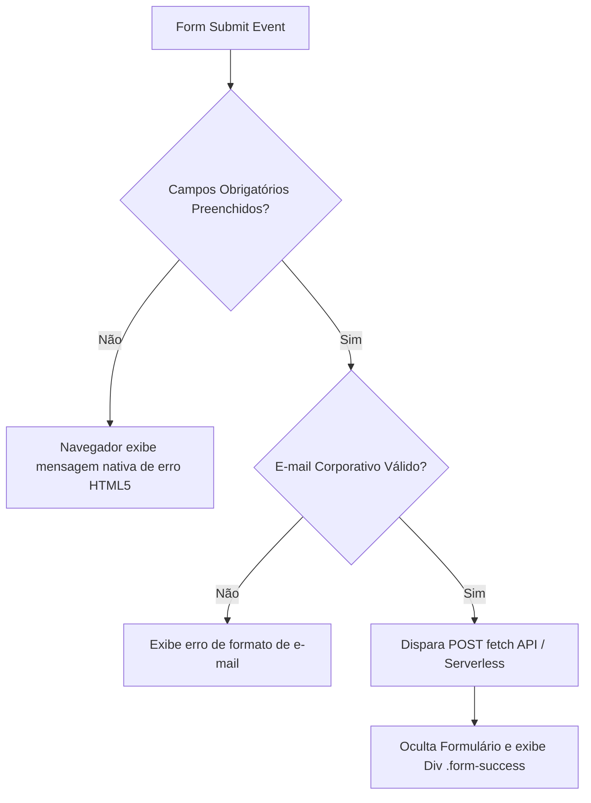

# SPEC — US-09: Fale Conosco (Formulário de Contato & Informações)

> **PRD de Origem:** [US-09-fale-conosco-formulario.md](../../spike-salescosta/PRDs/US-09-fale-conosco-formulario.md)  
> **Componente:** Componente 9 (Fale Conosco)  
> **Stack:** HTML5 Semântico / Vanilla CSS3 / Vanilla JS (ES6+)  
> **Status:** Ready for Development

---

## 1. System Architecture & Component Overview

A seção **Fale Conosco** (`<section id="contato">`) é o ponto crítico de conversão de leads da landing page. Em ambiente Dark Charcoal (`#404347`), a seção combina as informações institucionais de contato e localização à esquerda com um formulário minimalista de alta conversão à direita.

- **Desktop (≥ 1024px):** Layout em 2 colunas assimétricas (45% Dados de Contato / 55% Formulário).
- **Mobile/Tablet (< 1024px):** Layout empilhado em 1 coluna vertical (Dados no topo / Formulário abaixo).

### Diretriz Crítica de UX/Mobile (iOS Safari):
Todos os elementos de entrada (`<input>`, `<select>`, `<textarea>`) possuem obrigatoriamente `font-size: 16px` para impedir o zoom automático indesejado no iOS Safari.

### Mermaid Diagram: Form Flow



---

## 2. HTML Structure

```html
<section id="contato" class="contato" aria-labelledby="contato-title">
  <div class="contato__container">
    <!-- Coluna Esquerda: Informações de Contato -->
    <div class="contato__info">
      <span class="contato__eyebrow">FALE CONOSCO</span>
      <h2 id="contato-title" class="contato__title">Entre em contato com nossos advogados.</h2>
      <p class="contato__subtitle">
        Respondemos em até um dia útil. Para casos urgentes, prefira o telefone.
      </p>

      <div class="contato__details">
        <div class="contato__detail-item">
          <svg width="20" height="20" viewBox="0 0 24 24" fill="none" stroke="currentColor" stroke-width="2" aria-hidden="true"><path d="M21 10c0 7-9 13-9 13s-9-6-9-13a9 9 0 0 1 18 0z"/><circle cx="12" cy="10" r="3"/></svg>
          <span>Av. Paulista, 1000 — 12º andar, São Paulo/SP</span>
        </div>

        <div class="contato__detail-item">
          <svg width="20" height="20" viewBox="0 0 24 24" fill="none" stroke="currentColor" stroke-width="2" aria-hidden="true"><path d="M4 4h16c1.1 0 2 .9 2 2v12c0 1.1-.9 2-2 2H4c-1.1 0-2-.9-2-2V6c0-1.1.9-2 2-2z"/><polyline points="22,6 12,13 2,6"/></svg>
          <a href="mailto:contato@salescosta.com.br" class="contato__link">contato@salescosta.com.br</a>
        </div>

        <div class="contato__detail-item">
          <svg width="20" height="20" viewBox="0 0 24 24" fill="none" stroke="currentColor" stroke-width="2" aria-hidden="true"><path d="M22 16.92v3a2 2 0 0 1-2.18 2 19.79 19.79 0 0 1-8.63-3.07 19.5 19.5 0 0 1-6-6 19.79 19.79 0 0 1-3.07-8.67A2 2 0 0 1 4.11 2h3a2 2 0 0 1 2 1.72 12.84 12.84 0 0 0 .7 2.81 2 2 0 0 1-.45 2.11L8.09 9.91a16 16 0 0 0 6 6l1.27-1.27a2 2 0 0 1 2.11-.45 12.84 12.84 0 0 0 2.81.7A2 2 0 0 1 22 16.92z"/></svg>
          <a href="tel:+551130000000" class="contato__link">+55 (11) 3000-0000</a>
        </div>
      </div>
    </div>

    <!-- Coluna Direita: Formulário de Mensagem -->
    <div class="contato__form-wrapper">
      <form id="contact-form" class="contato__form" novalidate>
        <div class="form-group">
          <label for="nome" class="form-label">Nome Completo *</label>
          <input type="text" id="nome" name="nome" class="form-input" required autocomplete="name" placeholder="Seu nome completo">
        </div>

        <div class="form-group">
          <label for="email" class="form-label">E-mail Corporativo *</label>
          <input type="email" id="email" name="email" class="form-input" required autocomplete="email" placeholder="seuemail@empresa.com.br">
        </div>

        <div class="form-group">
          <label for="telefone" class="form-label">Telefone</label>
          <input type="tel" id="telefone" name="telefone" class="form-input" autocomplete="tel" placeholder="(11) 90000-0000">
        </div>

        <div class="form-group">
          <label for="area" class="form-label">Área de Interesse</label>
          <select id="area" name="area" class="form-select">
            <option value="empresarial">Direito Empresarial</option>
            <option value="tributario">Direito Tributário</option>
            <option value="trabalhista">Direito Trabalhista</option>
            <option value="civil">Direito Civil</option>
            <option value="societario">Direito Societário</option>
            <option value="compliance">Compliance & Governança</option>
          </select>
        </div>

        <div class="form-group">
          <label for="mensagem" class="form-label">Mensagem *</label>
          <textarea id="mensagem" name="mensagem" class="form-textarea" rows="4" required placeholder="Como podemos ajudar o seu negócio?"></textarea>
        </div>

        <button type="submit" class="btn btn--primary btn--full">
          Enviar mensagem
          <svg class="btn__icon" width="16" height="16" viewBox="0 0 24 24" fill="none" stroke="currentColor" stroke-width="2" aria-hidden="true"><path d="M5 12h14M12 5l7 7-7 7"/></svg>
        </button>
      </form>

      <!-- Mensagem Inline de Sucesso -->
      <div id="form-success" class="contato__success" aria-hidden="true">
        <svg width="48" height="48" viewBox="0 0 24 24" fill="none" stroke="currentColor" stroke-width="2" aria-hidden="true"><path d="M22 11.08V12a10 10 0 1 1-5.93-9.14"/><polyline points="22 4 12 14.01 9 11.01"/></svg>
        <h3>Mensagem enviada com sucesso!</h3>
        <p>Agradecemos o contato. Nossa equipe jurídica retornará em até um dia útil.</p>
      </div>
    </div>
  </div>
</section>

---

## 3. CSS Specification

```css
/* ==========================================================================
   3.1 Base Styles (Mobile First: < 768px)
   ========================================================================== */
.contato {
  background-color: var(--color-dark);
  color: var(--color-white);
  padding: var(--section-pad-y) var(--section-pad-x);
}

.contato__container {
  max-width: var(--container-max);
  margin: 0 auto;
  display: flex;
  flex-direction: column;
  gap: 48px;
}

.contato__eyebrow {
  display: inline-block;
  font-size: var(--text-eyebrow);
  font-weight: 500;
  color: var(--color-taupe);
  letter-spacing: 4px;
  margin-bottom: 16px;
  text-transform: uppercase;
}

.contato__title {
  font-family: var(--font-display);
  font-size: var(--text-h2);
  line-height: 1.25;
  font-weight: 400;
  color: var(--color-white);
  margin-bottom: 16px;
}

.contato__subtitle {
  font-size: var(--text-body);
  color: var(--color-text-light);
  line-height: 1.6;
  margin-bottom: 36px;
  font-weight: 300;
}

.contato__details {
  display: flex;
  flex-direction: column;
  gap: 20px;
}

.contato__detail-item {
  display: flex;
  align-items: center;
  gap: 12px;
  color: var(--color-text-light);
  font-size: 0.9375rem;
}

.contato__detail-item svg {
  color: var(--color-taupe);
  flex-shrink: 0;
}

.contato__link {
  color: var(--color-white);
  text-decoration: none;
  transition: color 0.3s ease;
}

.contato__link:hover {
  color: var(--color-taupe);
}

/* Estilização do Formulário Minimalista */
.contato__form {
  display: flex;
  flex-direction: column;
  gap: 24px;
}

.form-group {
  display: flex;
  flex-direction: column;
  gap: 8px;
}

.form-label {
  font-size: 0.875rem;
  font-weight: 500;
  color: var(--color-text-light);
}

/* Regra Obrigatória: font-size: 16px evita o zoom automático no iOS Safari */
.form-input,
.form-select,
.form-textarea {
  width: 100%;
  font-size: 16px !important;
  font-family: var(--font-body);
  background: transparent;
  border: none;
  border-bottom: 1px solid rgba(255, 255, 255, 0.4);
  padding: 12px 0;
  color: var(--color-white);
  border-radius: 0;
  transition: border-color 0.3s ease;
}

.form-select option {
  background-color: var(--color-dark);
  color: var(--color-white);
}

.form-input:focus,
.form-select:focus,
.form-textarea:focus {
  outline: none;
  border-bottom-color: var(--color-taupe);
}

.btn--full {
  width: 100%;
  margin-top: 12px;
}

/* Sucesso do Formulário */
.contato__success {
  display: none;
  text-align: center;
  padding: 40px 24px;
  background: rgba(255, 255, 255, 0.04);
  border-radius: 4px;
  border: 1px solid var(--color-taupe);
}

.contato__success--active {
  display: block;
}

.contato__success svg {
  color: var(--color-lima);
  margin-bottom: 16px;
}

.contato__success h3 {
  font-family: var(--font-display);
  font-size: 1.5rem;
  margin-bottom: 8px;
}

/* ==========================================================================
   3.2 Desktop Breakpoint (≥ 1024px)
   ========================================================================== */
@media (min-width: 1024px) {
  .contato__container {
    flex-direction: row;
    align-items: flex-start;
  }

  .contato__info {
    flex: 0 0 45%;
  }

  .contato__form-wrapper {
    flex: 0 0 55%;
  }

  .btn--full {
    width: auto;
  }
}
```

---

## 4. JavaScript Specification

```javascript
// js/main.js — Validação e Envio do Formulário Fale Conosco

document.addEventListener('DOMContentLoaded', () => {
  const form = document.getElementById('contact-form');
  const successDiv = document.getElementById('form-success');

  if (form) {
    form.addEventListener('submit', async (e) => {
      e.preventDefault();

      const nome = document.getElementById('nome').value.trim();
      const email = document.getElementById('email').value.trim();
      const mensagem = document.getElementById('mensagem').value.trim();

      if (!nome || !email || !mensagem) {
        alert('Por favor, preencha todos os campos obrigatórios (*).');
        return;
      }

      // Validação simples de e-mail
      const emailRegex = /^[^\s@]+@[^\s@]+\.[^\s@]+$/;
      if (!emailRegex.test(email)) {
        alert('Por favor, insira um e-mail corporativo válido.');
        return;
      }

      // Simulação / Envio para Endpoint Serverless
      try {
        const formData = new FormData(form);
        // Exemplo: await fetch('https://formspree.io/f/seu-id', { method: 'POST', body: formData });

        form.style.display = 'none';
        successDiv.classList.add('contato__success--active');
        successDiv.setAttribute('aria-hidden', 'false');
      } catch (err) {
        alert('Ocorreu um erro ao enviar a mensagem. Tente novamente.');
      }
    });
  }
});
```

---

## 5. Accessibility (A11y) Requirements

- **Entradas e Rótulos:** Todo `<input>` possui seu `<label>` correspondente vinculado via `id`.
- **Prevenção de Zoom iOS:** `font-size: 16px !important` aplicado em todos os controles do formulário.
- **Campos Obrigatórios:** Marcados explicitamente com o atributo `required` e indicativo `*`.

---

## 6. Content Data Model

```json
{
  "contato": {
    "title": "Entre em contato com nossos advogados.",
    "address": "Av. Paulista, 1000 — 12º andar, São Paulo/SP",
    "email": "contato@salescosta.com.br",
    "phone": "+55 (11) 3000-0000",
    "areas": ["Empresarial", "Tributário", "Trabalhista", "Civil", "Societário", "Compliance"]
  }
}
```

---

## 7. Acceptance Criteria (Technical)

### CA-01: Validação de Campos Obrigatórios
- O envio do formulário sem `Nome`, `E-mail` ou `Mensagem` aciona alerta e bloqueia a submissão.

### CA-02: Prevenção de Auto-Zoom no iOS
- Todos os campos de texto possuem `font-size: 16px`, prevenindo o zoom automático no Safari em dispositivos iOS.

---

## 8. Dependencies & Integration Points

- **CSS Variables:** `--color-dark`, `--color-taupe`, `--color-lima`, `--color-white`, `--font-display`.
- **Files Affected:** `index.html`, `css/sections.css`, `js/main.js`.

