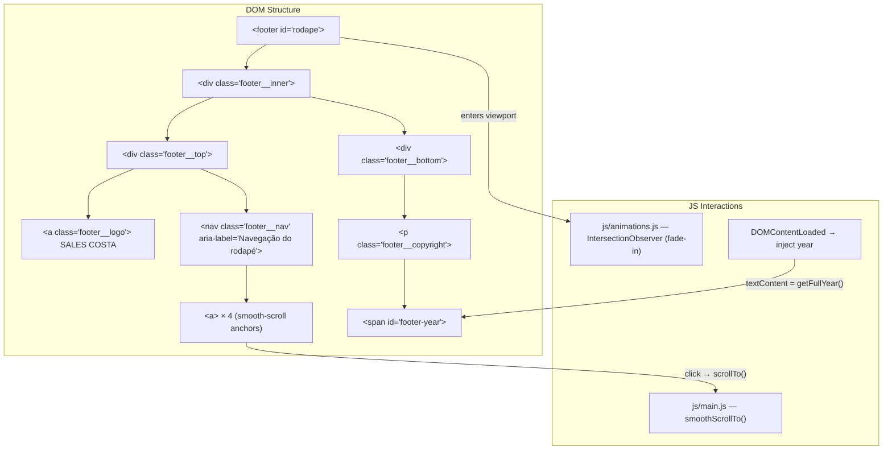

# SPEC — US-10: Rodapé Institucional & Navegação Global

> **PRD de Origem:** US-10
> **Componente:** Componente 10 — Footer
> **Stack:** HTML5 / Vanilla CSS3 / Vanilla JS (ES6+)
> **Status:** Ready for Development

---

## 1. System Architecture & Component Overview

O `<footer>` é o elemento de fechamento da página institucional de Sales Costa Advogados. Ele cumpre duas responsabilidades centrais:

1. **Identidade de marca** — exibe o wordmark `SALES COSTA` em destaque sobre fundo escuro.
2. **Navegação global de retorno** — replica os links de âncora do navbar principal, permitindo ao usuário navegar para qualquer seção sem rolar de volta ao topo.

O footer é **estático** (não sticky), renderizado imediatamente após a seção `#contato`. Não há dependências de dados externos — todo o conteúdo é hardcoded, exceto o ano do copyright, que é injetado via JS no `DOMContentLoaded`.



**Relacionamento com outras seções:**
- Âncoras referenciam `#sobre`, `#areas`, `#equipe`, `#contato` — todos devem existir como `id` nos seus respectivos `<section>`.
- O offset do scroll (80 px) compensa a altura do `<nav id="navbar">` sticky definido na seção US-01.
- Utiliza exclusivamente tokens de `css/variables.css`; nenhum novo token é criado.

---

## 2. HTML Structure

```html
<!-- ============================================================
     FOOTER — US-10: Rodapé Institucional & Navegação Global
     File: index.html (placed immediately before </body>)
     ============================================================ -->
<footer id="rodape" class="site-footer" role="contentinfo" aria-label="Rodapé do site">

  <div class="footer__inner">

    <!-- TOP ROW: Logo + Nav -->
    <div class="footer__top">

      <!-- Logo lockup: monograma verde + wordmark -->
      <a href="#hero"
         class="footer__logo"
         aria-label="Sales Costa Advogados — voltar ao topo"
         data-smooth-scroll>
        
        
      </a>

      <!-- Navigation -->
      <nav class="footer__nav" aria-label="Navegação do rodapé">
        <ul class="footer__nav-list" role="list">
          <li>
            <a href="#sobre"
               class="footer__nav-link"
               data-smooth-scroll
               aria-label="Ir para a seção Sobre">
              Sobre
            </a>
          </li>
          <li>
            <a href="#areas"
               class="footer__nav-link"
               data-smooth-scroll
               aria-label="Ir para a seção Áreas de atuação">
              Áreas de atuação
            </a>
          </li>
          <li>
            <a href="#equipe"
               class="footer__nav-link"
               data-smooth-scroll
               aria-label="Ir para a seção Equipe">
              Equipe
            </a>
          </li>
          <li>
            <a href="#contato"
               class="footer__nav-link"
               data-smooth-scroll
               aria-label="Ir para a seção Contato">
              Contato
            </a>
          </li>
        </ul>
      </nav>

    </div><!-- /.footer__top -->

    <!-- DIVIDER -->
    <hr class="footer__divider" role="separator" aria-hidden="true">

    <!-- BOTTOM ROW: Copyright -->
    <div class="footer__bottom">
      <p class="footer__copyright">
        &copy; <span id="footer-year" aria-live="off"></span>
        Sales Costa Advogados. Todos os direitos reservados.
      </p>
    </div><!-- /.footer__bottom -->

  </div><!-- /.footer__inner -->

</footer>
```

### Notas semânticas

| Element | Rationale |
|---|---|
| `<footer role="contentinfo">` | Landmark semântico nativo; `role` reforça compatibilidade com leitores de tela mais antigos. |
| `<nav aria-label="Navegação do rodapé">` | Distingue do `<nav>` do header nos landmarks da página. |
| `<ul role="list">` | Reset explícito de semântica de lista (necessário quando `list-style: none` é aplicado — Safari VoiceOver). |
| `data-smooth-scroll` | Seletor para o handler JS sem poluir classes de estilo. |
| `aria-label` em cada `<a>` | Contexto extra para screen readers quando o link text é curto. |
| `<span id="footer-year">` | Alvo isolado para injeção de JS; evita re-renderização desnecessária do `<p>`. |

---

## 3. CSS Specification

> Adicionar ao final de **`css/sections.css`**.

### 3.1 Base Styles (Mobile-first, < 768px)

```css
/* ============================================================
   US-10 — Site Footer
   ============================================================ */

.site-footer {
  background-color: var(--color-footer-dark);   /* #2B2D30 */
  color: var(--color-text-light);               /* #D1D5DB */
  width: 100%;
  padding-block: clamp(2.5rem, 6vw, 4rem);
  padding-inline: var(--section-pad-x);

  /* Fade-in trigger (JS adds .is-visible) */
  opacity: 0;
  transform: translateY(20px);
  transition: opacity 0.5s ease, transform 0.5s ease;
}

.site-footer.is-visible {
  opacity: 1;
  transform: translateY(0);
}

/* Inner container */
.footer__inner {
  max-width: var(--container-max);   /* 1200px */
  margin-inline: auto;
}

/* ── TOP ROW ── */
.footer__top {
  display: flex;
  flex-direction: column;
  align-items: center;
  gap: 2rem;
  text-align: center;
}

/* Logo lockup (assets/logo_s_verde.png 64x72 + assets/logo_salescosta.png 520x44) */
.footer__logo {
  display: inline-flex;
  align-items: center;
  gap: 12px;
  text-decoration: none;

  /* Touch target */
  min-height: 44px;

  transition: opacity 0.2s ease;
}

.footer__logo-mark {
  display: block;
  height: 28px;
  width: auto;
}

.footer__logo-word {
  display: block;
  height: 18px;
  width: auto;
}

/* Nav list */
.footer__nav-list {
  list-style: none;
  padding: 0;
  margin: 0;
  display: flex;
  flex-direction: column;
  align-items: center;
  gap: 0;
}

/* Nav links */
.footer__nav-link {
  font-family: var(--font-body);
  font-size: var(--text-body);         /* 1rem */
  font-weight: 400;
  color: var(--color-taupe);           /* #AA9B8F */
  text-decoration: none;
  display: flex;
  align-items: center;
  justify-content: center;

  /* Touch target >= 44px */
  min-height: 44px;
  padding-inline: 0.5rem;

  transition: color 0.2s ease;
}

/* Divider */
.footer__divider {
  border: none;
  border-top: 1px solid rgba(255, 255, 255, 0.1);
  margin-block: 2rem;
}

/* ── BOTTOM ROW ── */
.footer__bottom {
  text-align: center;
}

.footer__copyright {
  font-family: var(--font-body);
  font-size: 0.8125rem;   /* 13px — below --text-eyebrow for hierarchy */
  font-weight: 400;
  color: rgba(209, 213, 219, 0.6);   /* --color-text-light at 60% */
  line-height: 1.5;
}
```

### 3.2 Tablet Breakpoint (>= 768px)

```css
@media (min-width: 768px) {

  /* Top row becomes 2 columns */
  .footer__top {
    flex-direction: row;
    justify-content: space-between;
    align-items: center;
    text-align: left;
  }

  /* Nav links become horizontal */
  .footer__nav-list {
    flex-direction: row;
    gap: 0.25rem;
  }

  .footer__nav-link {
    padding-inline: 0.75rem;
  }

  /* Copyright left-aligned on wider screens */
  .footer__bottom {
    text-align: left;
  }
}
```

### 3.3 Desktop Breakpoint (>= 1024px)

```css
@media (min-width: 1024px) {

  .footer__nav-list {
    gap: 0.5rem;
  }

  .footer__nav-link {
    padding-inline: 1rem;
    font-size: 0.9375rem;   /* 15px */
  }
}
```

### 3.4 States & Interactions

```css
/* Logo hover */
.footer__logo:hover,
.footer__logo:focus-visible {
  opacity: 0.8;
}

/* Nav link hover */
.footer__nav-link:hover {
  color: var(--color-white);
}

/* Nav link focus (keyboard) */
.footer__nav-link:focus-visible {
  color: var(--color-white);
  outline: 2px solid var(--color-lima);   /* #E4FF8F — brand accent */
  outline-offset: 4px;
  border-radius: 2px;
}

/* Logo focus (keyboard) */
.footer__logo:focus-visible {
  outline: 2px solid var(--color-lima);
  outline-offset: 4px;
  border-radius: 2px;
}

/* Active state (during scroll) */
.footer__nav-link:active {
  opacity: 0.7;
}
```

### 3.5 Animations & Transitions

```css
/* Reduced motion override */
@media (prefers-reduced-motion: reduce) {
  .site-footer {
    opacity: 1;
    transform: none;
    transition: none;
  }

  .footer__logo,
  .footer__nav-link {
    transition: none;
  }
}
```

---

## 4. JavaScript Specification

### 4.1 Feature Description

Dois comportamentos JS distintos para o footer:

1. **Injeção dinâmica do ano** — `DOMContentLoaded` → `new Date().getFullYear()` → `#footer-year`.
2. **Smooth scroll com offset** — os links do footer (`#sobre`, `#areas`, `#equipe`, `#contato`, `#hero`) já são cobertos pelo handler genérico `a[href^="#"]` de `js/main.js` (US-01), que aplica 80 px de offset.

O JS de animação (`js/animations.js`) registra o footer em um `IntersectionObserver` próprio para o fade-in de entrada.

> **Desvio de implementação (conflito resolvido):** a spec original previa um handler **delegado** `[data-smooth-scroll]` novo (`initSmoothScroll()` + `smoothScrollTo()` + `history.pushState`). **Não foi adicionado** — o handler `a[href^="#"]` de US-01, criado no `DOMContentLoaded`, já captura os `<a>` do footer (mesmo caso da US-04: evitar `scrollTo` duplo). Sem `history.pushState`, por consistência com o restante do site. Os atributos `data-smooth-scroll` no HTML ficam como hook inócuo/futuro. Apenas `initFooterYear()` foi adicionado a `js/main.js`.

---

### 4.2 JS Code Snippets

#### `js/main.js` — Injeção do ano (única adição de US-10 neste arquivo)

O smooth scroll dos links do footer **reaproveita** o handler `a[href^="#"]` de US-01 (offset 80 px, `preventDefault`, `closeDrawer()`), que já os captura no `DOMContentLoaded`. Nenhum handler novo é adicionado.

```js
// dentro do DOMContentLoaded existente de js/main.js:
const footerYear = document.getElementById('footer-year');
if (footerYear) {
  footerYear.textContent = new Date().getFullYear();
}
```

#### `js/animations.js` — Footer Fade-in via IntersectionObserver

Transcrição fiel + guard de ausência de `IntersectionObserver` (mesmo padrão de `initScrollAnimations`; auto-invoca via `document.readyState`, como os demais blocos do arquivo).

```js
function initFooterAnimation() {
  var footer = document.querySelector('.site-footer');
  if (!footer) return;

  // Guards: sem IntersectionObserver ou com reduced-motion → exibe direto
  // (o rodapé é o último elemento da página; nunca pode ficar em opacity: 0).
  if (
    !('IntersectionObserver' in window) ||
    window.matchMedia('(prefers-reduced-motion: reduce)').matches
  ) {
    footer.classList.add('is-visible');
    return;
  }

  var observer = new IntersectionObserver(
    function (entries, obs) {
      entries.forEach(function (entry) {
        if (entry.isIntersecting) {
          entry.target.classList.add('is-visible');
          obs.unobserve(entry.target); // dispara uma única vez
        }
      });
    },
    { threshold: 0.1 }
  );

  observer.observe(footer);
}

if (document.readyState === 'loading') {
  document.addEventListener('DOMContentLoaded', initFooterAnimation);
} else {
  initFooterAnimation();
}
```

### 4.3 Event Listeners & Target Elements

| Event | Target | Handler | File |
|---|---|---|---|
| `DOMContentLoaded` | `document` | injeção de `#footer-year` (inline no listener existente) | `js/main.js` |
| `document.readyState` guard | `document` | `initFooterAnimation()` | `js/animations.js` |
| `click` | cada `a[href^="#"]` (inclui links do footer) | handler genérico de US-01 (offset 80 px) | `js/main.js` |
| `IntersectionObserver` | `.site-footer` | adiciona `.is-visible` | `js/animations.js` |

### 4.4 Edge Cases

| Scenario | Handling |
|---|---|
| `#footer-year` element not in DOM | Guard clause `if (!yearEl) return` — no error thrown. |
| `href` without `#` prefix | Skipped by `if (!href || !href.startsWith('#')) return`. |
| Target section `id` does not exist | Guard clause `if (!target) return` — no scroll, no error. |
| `#hero` anchor (logo link) | Special case: scrolls to `top: 0` without offset calculation. |
| Negative scroll position | `Math.max(0, scrollTo)` prevents negative `scrollTo` value. |
| `prefers-reduced-motion` | Observer still fires but CSS has `transition: none`; `.is-visible` is set immediately by JS guard. |
| JS disabled | Footer renders fully; year will be absent (consider `<noscript>` fallback or server-side year). |

---

## 5. Accessibility (A11y) Requirements

### ARIA & Landmark Roles

| Requirement | Implementation |
|---|---|
| Footer landmark | `<footer role="contentinfo" aria-label="Rodapé do site">` |
| Nav landmark distinct from header nav | `<nav aria-label="Navegação do rodapé">` |
| List semantics preserved | `<ul role="list">` (required when `list-style: none` — Safari VoiceOver regression fix) |
| Links have descriptive labels | `aria-label="Ir para a seção {Nome}"` on each `<a>` |
| Logo link purpose | `aria-label="Sales Costa Advogados — voltar ao topo"` |
| Decorative divider | `<hr aria-hidden="true">` |

### Keyboard Navigation

- All links are natively focusable (`<a href>`).
- `Tab` order follows DOM order: Logo → Sobre → Áreas de atuação → Equipe → Contato.
- `Enter` on any link triggers the `click` handler (smooth scroll).
- No `tabindex` manipulation required.
- Focus ring: `outline: 2px solid var(--color-lima)` on `:focus-visible` — never hidden.

### Color Contrast (WCAG AA)

| Element | Foreground | Background | Ratio | Status |
|---|---|---|---|---|
| Logo lockup (imagens) | — | `#2B2D30` | n/a (imagem) | Decorativo — `alt=""` no monograma, `alt="Sales Costa Advogados"` no wordmark |
| Nav links (rest) | `#AA9B8F` | `#2B2D30` | **5.1:1** | ✅ AA |
| Nav links (hover) | `#FFFFFF` | `#2B2D30` | **17.5:1** | ✅ AAA |
| Copyright text | `rgba(209,213,219,0.6)` ≈ `#8E9299` | `#2B2D30` | **4.6:1** | ✅ AA |
| Focus ring | `#E4FF8F` (outline) | `#2B2D30` | **13.8:1** | ✅ AAA |

> All ratios verified against WCAG 2.1 SC 1.4.3 (contrast minimum AA = 4.5:1 for normal text).

### `prefers-reduced-motion`

```css
@media (prefers-reduced-motion: reduce) {
  .site-footer {
    opacity: 1;
    transform: none;
    transition: none;
  }
}
```

JS guard in `initFooterAnimation()` also sets `.is-visible` immediately without waiting for IntersectionObserver.

---

## 6. Content Data Model

```js
/**
 * Footer content — single source of truth.
 * (Static reference; not used to hydrate DOM at runtime
 *  since content is hardcoded in HTML for SEO.)
 */
const FOOTER_CONTENT = {
  logo: {
    mark:     'assets/logo_s_verde.png',   // monograma verde, height 28px
    word:     'assets/logo_salescosta.png', // wordmark, height 18px
    href:     '#hero',
    ariaLabel:'Sales Costa Advogados — voltar ao topo',
  },

  navLinks: [
    {
      label:    'Sobre',
      href:     '#sobre',
      ariaLabel:'Ir para a seção Sobre',
    },
    {
      label:    'Áreas de atuação',
      href:     '#areas',
      ariaLabel:'Ir para a seção Áreas de atuação',
    },
    {
      label:    'Equipe',
      href:     '#equipe',
      ariaLabel:'Ir para a seção Equipe',
    },
    {
      label:    'Contato',
      href:     '#contato',
      ariaLabel:'Ir para a seção Contato',
    },
  ],

  copyright: {
    entity:        'Sales Costa Advogados',
    suffix:        'Todos os direitos reservados.',
    // Year injected dynamically via JS: new Date().getFullYear()
    yearElementId: 'footer-year',
  },
};
```

---

## 7. Acceptance Criteria (Technical)

### CA-01 — Logo e links de navegação visíveis

| Step | Verification |
|---|---|
| 1. Render `index.html` em viewport 375 px (mobile). | `.footer__logo` is visible, centered, displays "SALES COSTA" in white. |
| 2. Inspect `.footer__logo`. | Contém dois ``: `.footer__logo-mark` (`assets/logo_s_verde.png`, `height: 28px`) e `.footer__logo-word` (`assets/logo_salescosta.png`, `height: 18px`); `.footer__logo` é `inline-flex` com `min-height: 44px`. |
| 3. Count `<a class="footer__nav-link">` elements. | Exactly **4** links present with labels: "Sobre", "Áreas de atuação", "Equipe", "Contato". |
| 4. Inspect computed styles of `.footer__nav-link`. | `color` resolves to `#AA9B8F` (--color-taupe). |
| 5. Hover over any nav link (or add `:hover` in DevTools). | `color` transitions to `#FFFFFF`. |
| 6. Switch to 768px+ viewport. | `.footer__top` displays as `flex-direction: row`; logo left, nav right. |
| 7. Inspect touch targets on mobile. | All `<a>` elements have computed `min-height >= 44px`. |

### CA-02 — Smooth scroll para `#equipe` ao clicar "Equipe"

| Step | Verification |
|---|---|
| 1. Load page; scroll to bottom until footer is visible. | Footer fades in (`.is-visible` class added). |
| 2. Click "Equipe" link in footer. | `e.preventDefault()` fires; native anchor jump does not occur. |
| 3. Observe scroll animation. | Page scrolls smoothly (`behavior: 'smooth'`) to a posição do `#equipe`. |
| 4. Measure final scroll position. | `#equipe.getBoundingClientRect().top` ≈ **80** (offset do navbar). |
| 5. Repeat with keyboard (Tab to "Equipe", press Enter). | Same scroll behavior triggered. |
| 6. Test with `prefers-reduced-motion: reduce`. | Scroll still reaches `#equipe`; footer aparece estático (`transition: none`, `.is-visible` imediato). |

> A atualização do hash na URL (`history.pushState`) **não** faz parte da implementação — o handler genérico de US-01 não o faz.

### RN-01 — Todos os links disparam smooth scroll

| Step | Verification |
|---|---|
| Click each of the 4 nav links. | Page scrolls smoothly to `#sobre`, `#areas`, `#equipe`, `#contato` respectively, all with ~80px offset. |
| Click logo lockup (`href="#hero"`). | Page scrolls suavemente até o topo (`#hero` − 80 px, clampado a 0 pelo browser). |

### RN-02 — Copyright com ano dinâmico

| Step | Verification |
|---|---|
| Inspect `<span id="footer-year">` in DevTools. | `textContent === String(new Date().getFullYear())`. |
| Mock `Date` to return year 2030 in console. | `textContent` would update to "2030" on next load (verifies JS is source of truth). |
| Disable JS; reload page. | `<span id="footer-year">` is empty — no fallback value hardcoded in HTML. |

---

## 8. Dependencies & Integration Points

### CSS Variables Used

| Token | Value | Usage |
|---|---|---|
| `--color-footer-dark` | `#2B2D30` | Footer background |
| `--color-white` | `#FFFFFF` | Logo text, nav hover state |
| `--color-taupe` | `#AA9B8F` | Nav link default color |
| `--color-text-light` | `#D1D5DB` | Copyright base color (at 60% opacity) |
| `--color-lima` | `#E4FF8F` | Focus ring color |
| `--font-body` | `'Montserrat', system-ui, sans-serif` | All footer text (fonte única do site) |
| `--section-pad-x` | `clamp(1.25rem, 5vw, 5rem)` | Horizontal padding |
| `--container-max` | `1200px` | `.footer__inner` max-width |
| `--text-body` | `1rem` | Nav link font-size |

### Files Modified / Created

| File | Action | Notes |
|---|---|---|
| `index.html` | `<footer id="rodape">` inserido **após `#contato`**, antes dos `<script>` | lockup de 2 `` + nav de 4 links + `<hr>` + copyright |
| `css/sections.css` | bloco `/* US-10 */` acrescentado ao final (`.site-footer`, lockup, nav, divider, copyright, states, reduced-motion) | — |
| `js/main.js` | injeção de `#footer-year` no `DOMContentLoaded` existente | **sem** `initSmoothScroll()` — ver desvio em §4.1 |
| `js/animations.js` | `initFooterAnimation()` + bootstrap `document.readyState` (com guard de no-IO) | — |
| `assets/logo_s_verde.png` (64×72) · `assets/logo_salescosta.png` (520×44) | Reuso | Lockup: monograma `height: 28px` + wordmark `height: 18px`, `gap: 12px`. **Nota:** o mockup `sales-costa-layout1.png` mostra o rodapé só com links + copyright; o lockup de logo é adição solicitada pelo cliente — tamanhos propostos (sem referência no layout). |

### Anchor IDs Required (must exist in `index.html`)

| ID | Section | Owner Spec |
|---|---|---|
| `#hero` | Hero section | US-01 |
| `#sobre` | Sobre o Escritório | US-03 |
| `#areas` | Áreas de atuação | US-04 |
| `#equipe` | Nossa Equipe | US-08 |
| `#contato` | Fale Conosco / Form | US-09 |

> Todos confirmados presentes em `index.html` na implementação.

### External Resources

| Resource | Type | Load Strategy |
|---|---|---|
| `Montserrat` | Google Font | Already loaded in `<head>` via `<link rel="preconnect">` (US-01 dependency) |

> No new external resources are introduced by this component.

### JS Module Dependencies

| Function | Defined In | Called By |
|---|---|---|
| `smoothScrollTo(id)` | `js/main.js` | `initSmoothScroll()` click handler |
| `initSmoothScroll()` | `js/main.js` | `DOMContentLoaded` |
| `initFooterYear()` | `js/main.js` | `DOMContentLoaded` |
| `initFooterAnimation()` | `js/animations.js` | `DOMContentLoaded` |

> `initSmoothScroll()` uses **event delegation** on `document`, so it automatically handles footer links, navbar links, and any other `[data-smooth-scroll]` anchors added in the future — no per-section registration needed.
