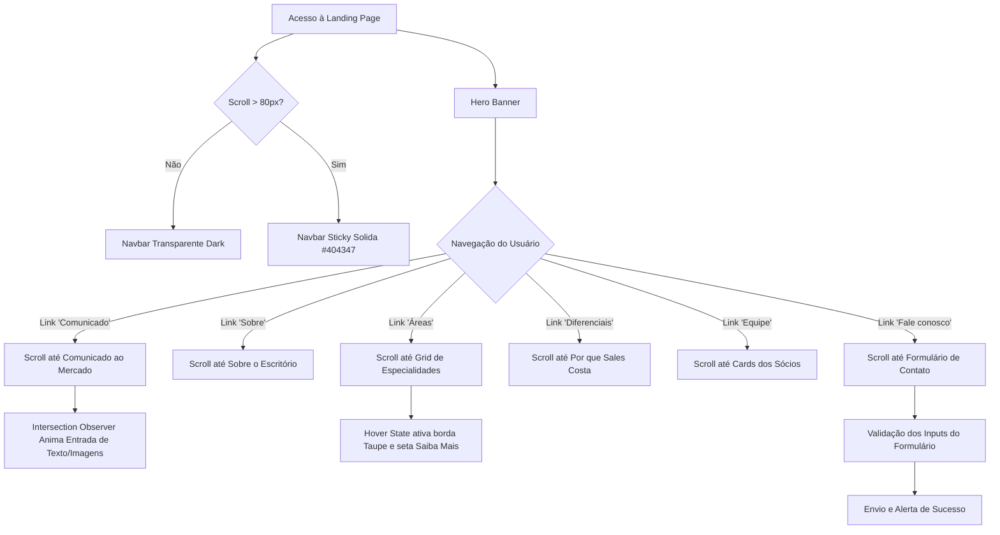

# 03. Flows · Fluxos de Navegação, Animações & Responsividade

> **Spike de Solução:** Landing Page — Sales Costa Advogados  
> **Data:** 2026-09-01  
> **Status:** Atualizado conforme Layout Oficial ([sales-costa-layout1.png](../images/sales-costa-layout1.png)) com Matriz Multi-Dispositivo

---

## 1. Diagrama Geral de Fluxo da Landing Page



---

## 2. Matriz Estrita de Responsividade por Dispositivo

A tabela abaixo especifica o comportamento exato de cada um dos 10 componentes em diferentes larguras de tela, **garantindo a ausência de quebras ou rolagem horizontal**:

| Componente | Smartphone (320px – 479px) | Tablet / Phablet (480px – 1023px) | Desktop / Ultra-wide (>= 1024px) |
|---|---|---|---|
| **Componente 1 (Navbar & Hero)** | Logo + Hambúrguer; H1 32px; CTAs empilhados | Logo + Hambúrguer; H1 44px; CTAs em linha | Logo + 6 Links Horizontais; H1 64px |
| **Componente 2 (Comunicado)** | 1 Coluna; Texto 15px; Marca d'água sutil | 1 Coluna; Citações destacadas | 1 Coluna ampla com marca d'água "S" à direita |
| **Componente 3 (Sobre)** | 1 Coluna empilhada; Pilares em cartões | 2 Colunas (40/60); Pilares lado a lado | 2 Colunas (40/60); Pilares com divisores |
| **Componente 4 (Áreas Grid)** | Grid 1 Coluna (1x6 cards) | Grid 2 Colunas (2x3 cards) | Grid 3 Colunas (3x2 cards) |
| **Componente 5 (Diferenciais)** | 1 Coluna por diferencial | Grid 2x2 | 4 Colunas horizontais |
| **Componente 6 (Números)** | Grid 2x2 sem divisores verticais | Grid 2x2 com divisores | 4 Colunas em linha com divisores |
| **Componente 7 (Depoimentos)** | 1 Card com toque tátil (swipe) | 1 Card com dots ampliados | 1 Card centralizado com aspas e dots |
| **Componente 8 (Nossa Equipe)** | 1 Card por linha (Sócios *AS*, *CC*, *FR*, *LM*) | Grid 2x2 | 4 Cards em linha horizontal |
| **Componente 9 (Fale Conosco)** | 1 Coluna (Dados no topo, Form abaixo) | 1 Coluna empilhada | 2 Colunas lado a lado |
| **Componente 10 (Rodapé)** | Logo no topo, links empilhados abaixo | Logo à esquerda, links à direita | Logo à esquerda, links à direita em linha |

---

## 3. Fluxos Interativos de JavaScript

### 3.1 Prevenção de Zoom em Navegadores Mobile (iOS Safari)
```javascript
// main.js - Garantia de tamanho mínimo de fonte para inputs móveis
document.querySelectorAll('input, select, textarea').forEach(input => {
  input.style.fontSize = '16px'; // Impede o zoom automático de tela no iOS
});
```

### 3.2 Suporte a Gestos Táteis no Carousel de Depoimentos (Touch Swipe)
```javascript
// Suporte a swipe em dispositivos móveis
let touchstartX = 0;
let touchendX = 0;

const carousel = document.querySelector('.testimonials-carousel');
if (carousel) {
  carousel.addEventListener('touchstart', e => {
    touchstartX = e.changedTouches[0].screenX;
  }, { passive: true });

  carousel.addEventListener('touchend', e => {
    touchendX = e.changedTouches[0].screenX;
    handleGesture();
  }, { passive: true });
}

function handleGesture() {
  if (touchendX < touchstartX - 50) nextSlide();
  if (touchendX > touchstartX + 50) prevSlide();
}
```
