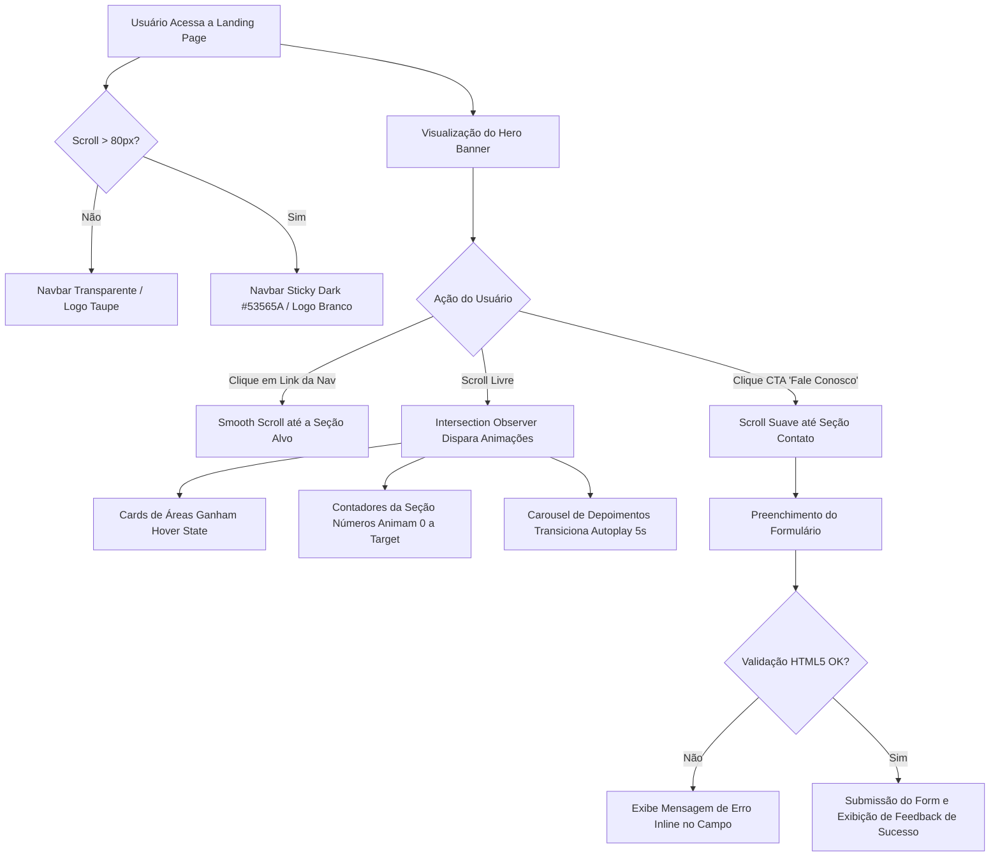

# 03. Flows · Fluxos de Navegação, Animações & Interações

> **Spike de Solução:** Landing Page — Sales Costa Advogados  
> **Data:** 2026-08-31  
> **Status:** Concluído / Pronto para Implementação

---

## 1. Diagrama Geral de Fluxo do Usuário

O diagrama abaixo ilustra o fluxo completo de interação do usuário ao navegar pela landing page one-page:



---

## 2. Fluxos Interativos de Javascript

### 2.1 Fluxo da Sticky Navbar

```javascript
// main.js - Gerenciamento de estado da Navbar ao rolar a página
const navbar = document.querySelector('.navbar');
const SCROLL_THRESHOLD = 80;

window.addEventListener('scroll', () => {
  if (window.scrollY > SCROLL_THRESHOLD) {
    navbar.classList.add('scrolled');
  } else {
    navbar.classList.remove('scrolled');
  }
}, { passive: true });
```

### 2.2 Fluxo de Smooth Scroll por Âncoras

```javascript
// Navegação suave com offset para compensar a altura da navbar fixa (80px)
document.querySelectorAll('a[href^="#"]').forEach(anchor => {
  anchor.addEventListener('click', function (e) {
    e.preventDefault();
    const targetId = this.getAttribute('href');
    if (targetId === '#') return;
    
    const targetElement = document.querySelector(targetId);
    if (targetElement) {
      const headerOffset = 80;
      const elementPosition = targetElement.getBoundingClientRect().top;
      const offsetPosition = elementPosition + window.pageYOffset - headerOffset;

      window.scrollTo({
        top: offsetPosition,
        behavior: 'smooth'
      });
    }
  });
});
```

### 2.3 Fluxo do Intersection Observer (Animação ao Scroll)

```javascript
// animations.js - Revelação progressiva dos elementos
const observerOptions = {
  root: null,
  rootMargin: '0px 0px -60px 0px',
  threshold: 0.15
};

const revealObserver = new IntersectionObserver((entries, observer) => {
  entries.forEach(entry => {
    if (entry.isIntersecting) {
      entry.target.classList.add('is-visible');
      observer.unobserve(entry.target); // Anima apenas na primeira entrada
    }
  });
}, observerOptions);

document.querySelectorAll('[data-animate]').forEach(el => revealObserver.observe(el));
```

```css
/* Respeito à preferência de redução de movimento do sistema operacional */
@media (prefers-reduced-motion: reduce) {
  [data-animate] {
    opacity: 1 !important;
    transform: none !important;
    transition: none !important;
  }
}
```

### 2.4 Fluxo do Contador Animado ("Em Números")

```javascript
function animateCounters() {
  const counters = document.querySelectorAll('.counter-number');
  const speed = 200; // Duração total aproximada em ms

  counters.forEach(counter => {
    const updateCount = () => {
      const target = +counter.getAttribute('data-target');
      const count = +counter.innerText;
      const inc = target / speed;

      if (count < target) {
        counter.innerText = Math.ceil(count + inc);
        setTimeout(updateCount, 15);
      } else {
        counter.innerText = target;
      }
    };
    updateCount();
  });
}
```

---

## 3. Matriz de Responsividade e Layout Breakpoints

```css
/* Breakpoints Padrão Mobile-First */
/* Smartphone portrait: < 480px */
/* Smartphone landscape / Phablet: 480px - 767px */
/* Tablet portrait: 768px - 1023px */
/* Desktop / Laptop: 1024px - 1279px */
/* Wide Desktop: >= 1280px */
```

| Seção | Mobile (< 768px) | Tablet (768px - 1023px) | Desktop (>= 1024px) |
|---|---|---|---|
| **Navbar** | Hambúrguer + Drawer Lateral | Hambúrguer + Drawer Lateral | Links Horizontais + Botão CTA |
| **Hero** | 1 Coluna, texto 32px | 1 Coluna, texto 48px | 1 Coluna Centralizada, texto 64px |
| **Sobre** | 1 Coluna empilhada | 2 Colunas (40/60) | 2 Colunas (40/60) |
| **Áreas** | 1 Card por linha | 2 Cards por linha | 3 Cards por linha |
| **Diferenciais**| 1 Coluna por diferencial | 2 Colunas x 2 Linhas | 4 Colunas em linha |
| **Números** | Grid 2 x 2 | Grid 2 x 2 | 4 Colunas em linha com divisores |
| **Equipe** | 1 Card por linha | 2 Cards por linha | 4 Cards por linha |
| **Contato** | 1 Coluna empilhada | 1 Coluna empilhada | 2 Colunas lado a lado |
