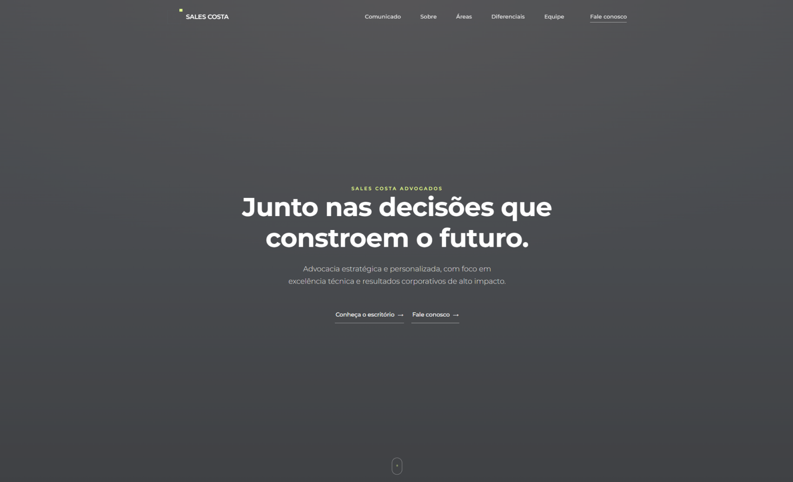
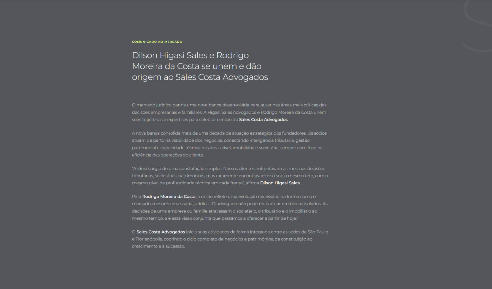
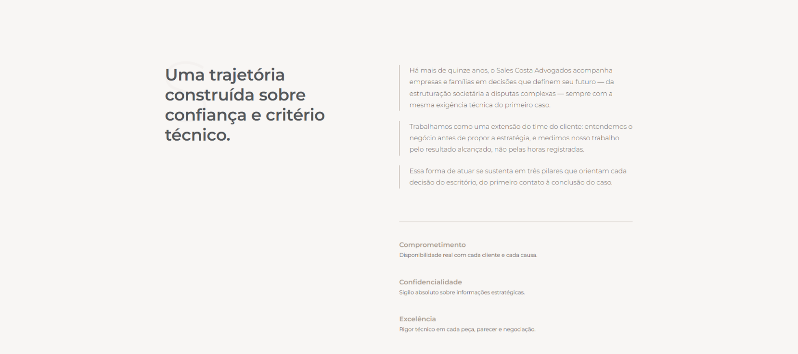
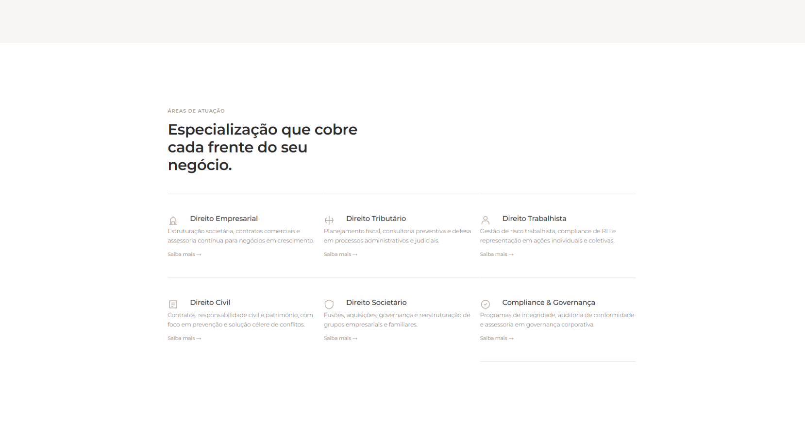
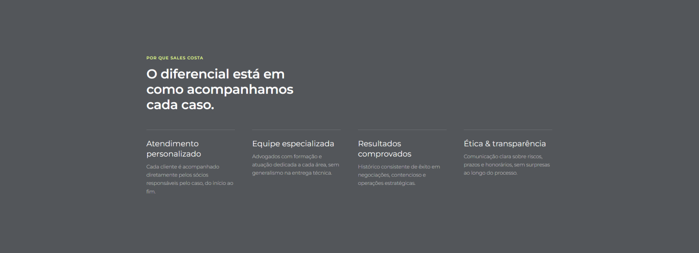
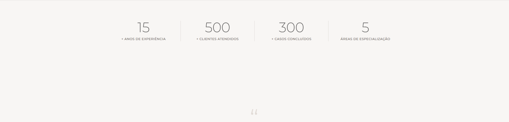
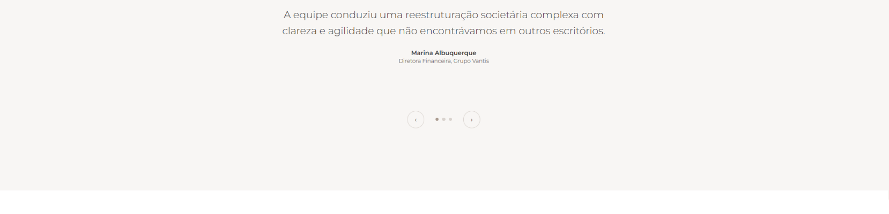
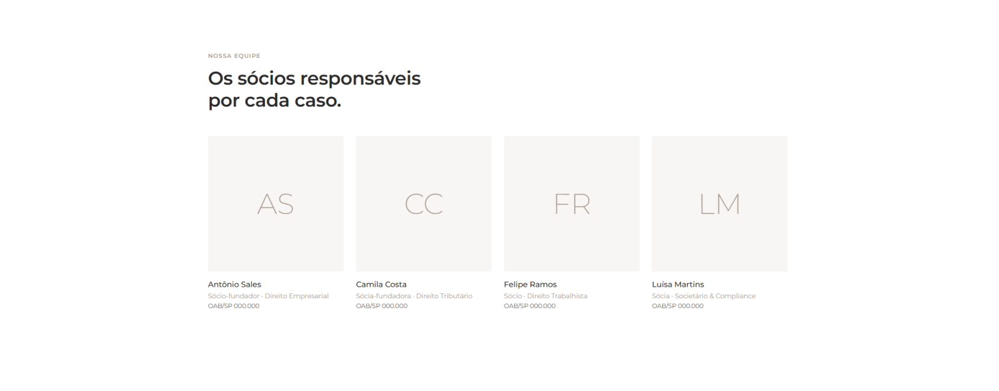
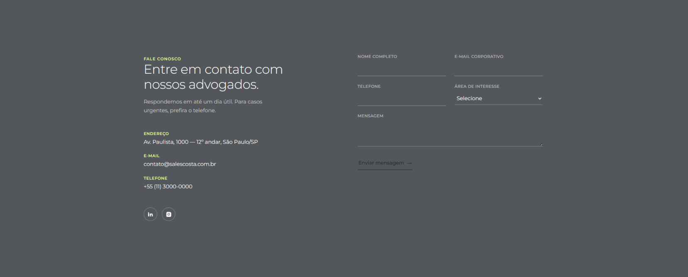
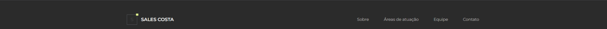

# 06. Visual Layout · Decomposição de Componentes, Design Oficial & Diretrizes de Responsividade

> **Spike de Solução:** Landing Page — Sales Costa Advogados  
> **Data:** 2026-09-01  
> **Fonte das Imagens:** Extraído diretamente de [images/sales-costa-layout-previa.png](../images/sales-costa-layout-previa.png)  
> **Garantia Estrutural:** Matriz de Adaptabilidade para SmartPhones (320px–479px), Tablets (480px–1023px) e Desktops (>= 1024px) sem Quebra de Layout

---

## 1. Visão Geral do Layout Oficial Completo

Abaixo apresenta-se o layout contínuo projetado para a landing page do Sales Costa Advogados:


---

## 2. Decomposição dos 10 Componentes e Ajustes de Responsividade

Abaixo estão detalhados cada um dos **10 componentes visuais** extraídos do layout oficial, acompanhados de suas **regras estritas de responsividade por tipo de tela**:

---

### Componente 1: Navbar & Hero Banner



#### Especificações Visuais & Layout Desktop (>= 1024px):
- **Background:** Dark Charcoal (`#484B4F` / `#404347`).
- **Navbar Layout:** Logo `SALES COSTA` à esquerda e 6 links de ancoragem horizontais à direita (`Comunicado`, `Sobre`, `Áreas`, `Diferenciais`, `Equipe`, `Fale conosco`).
- **Hero Typography:** Eyebrow `SALES COSTA ADVOGADOS` (Taupe `#AA9B8F`, 12px, `letter-spacing: 4px`), H1 *"Junto nas decisões que constroem o futuro."* (64px branca) e Subtítulo (18px). CTAs alinhados em linha.

#### 📱 Ajustes de Responsividade (Mobile & Tablet < 1024px):
- **Navbar:** Transforma-se em botão hambúrguer ($\ge 44\times 44\text{px}$) com drawer lateral deslizante (*slide-out*).
- **Tipografia Fluida:** H1 ajusta-se via `font-size: clamp(2rem, 5vw, 4rem)` (evita estouro de caixa).
- **CTAs:** Dispostos em 1 coluna empilhada no mobile (`width: 100%`), garantindo facilidade de toque.
- **Scroll Indicator:** Centralizado na base com espaçamento relativo `margin-top: clamp(2rem, 4vh, 4rem)`.

```
[ WIREFRAME MOBILE — COMPONENTE 1 ]
+-----------------------------------+
| LOGO [SALES COSTA]           [≡]  | (Hambúrguer >= 44px)
+-----------------------------------+
|                                   |
|       SALES COSTA ADVOGADOS       |
|                                   |
|   Junto nas decisões que          | (H1 fluido clamp)
|   constroem o futuro.             |
|                                   |
|  Advocacia estratégica e...       |
|                                   |
|  [ CONHEÇA O ESCRITÓRIO -> ]      | (CTA Full Width)
|  [ FALE CONOSCO -> ]              | (CTA Full Width)
|                                   |
|                (o)                |
+-----------------------------------+
```

---

### Componente 2: Comunicado ao Mercado



#### Especificações Visuais & Layout Desktop (>= 1024px):
- **Background:** Dark `#404347` com marca d'água "S" à direita (opacidade 5%).
- **Conteúdo:** Container centralizado de max-width `860px`, Eyebrow em Lima `#E4FF8F` (`COMUNICADO AO MERCADO`), H2 da fusão entre Dilson Higasi Sales e Rodrigo Moreira da Costa e 5 parágrafos explicativos.

#### 📱 Ajustes de Responsividade (Mobile & Tablet < 1024px):
- **Largura do Container:** Ocupa `100%` da largura da tela com padding lateral de `20px`.
- **Marca d'água:** Posiciona-se como overlay centralizado em background sem sobrepor ou prejudicar o contraste do texto (`z-index: 0`).
- **Tamanho de Fonte:** Parágrafos ajustados para `15px`/`16px` com `line-height: 1.65` para leitura tátil confortável.

```
[ WIREFRAME MOBILE — COMPONENTE 2 ]
+-----------------------------------+
| COMUNICADO AO MERCADO             | (Lima #E4FF8F)
| Dilson Higasi Sales e Rodrigo     |
| Moreira da Costa se unem...       | (H2 24px)
|                                   |
| O mercado jurídico ganha uma      |
| nova banca desenvolvida...        | (Parágrafo 15px)
|                                   |
| "A ideia surgiu de uma            |
| constatação simples...", afirma   | (Citação destacada)
| Dilson Higasi Sales.              |
+-----------------------------------+
```

---

### Componente 3: Sobre o Escritório



#### Especificações Visuais & Layout Desktop (>= 1024px):
- **Background:** Off-White Quente (`#F8F6F4`).
- **Layout:** Grid de 2 colunas (40% H2 / 60% texto & pilares).

#### 📱 Ajustes de Responsividade (Mobile < 768px):
- **Migração de Grid:** Converte-se de 2 colunas para **1 coluna vertical empilhada**.
- **Ordem de Leitura:** H2 no topo, seguido dos 3 parágrafos e dos 3 pilares (*Comprometimento*, *Confidencialidade*, *Excelência*).
- **Pilares:** Separados por linhas horizontais sutis em Taupe (`1px solid #D9D3CE`).

```
[ WIREFRAME MOBILE — COMPONENTE 3 ]
+-----------------------------------+
| Uma trajetória construída sobre   |
| confiança e critério técnico.     | (H2 26px)
|-----------------------------------|
| Há mais de quinze anos, o Sales   |
| Costa Advogados acompanha...      |
|-----------------------------------|
| Comprometimento                   |
| Disponibilidade real com cada...  |
|-----------------------------------|
| Confidencialidade                 |
| Sigilo absoluto sobre...          |
|-----------------------------------|
| Excelência                        |
| Rigor técnico em cada peça...     |
+-----------------------------------+
```

---

### Componente 4: Áreas de Atuação (Grid de Especialidades)



#### Especificações Visuais & Layout Desktop (>= 1024px):
- **Background:** Branco Puro (`#FFFFFF`).
- **Grid Desktop:** 2 Linhas × 3 Colunas (6 Cards).

#### 📱 Ajustes de Responsividade (Mobile & Tablet < 1024px):
- **Tablet (768px – 1023px):** Converte-se para **Grid 2 Colunas × 3 Linhas**.
- **Mobile (< 768px):** Converte-se para **1 Coluna x 6 Cards empilhados** (`grid-template-columns: 1fr`).
- **Alvos de Clique:** Links *"Saiba mais →"* possuem padding vertical expandido ($\ge 44\text{px}$) para toque seguro.
- **Card Hover:** Borda Taupe ativa no foco tátil (*touch/active state*).

```
[ WIREFRAME MOBILE — COMPONENTE 4 ]
+-----------------------------------+
| ÁREAS DE ATUAÇÃO                  |
| Especialização que cobre cada...  |
|                                   |
| +-------------------------------+ |
| | [Ícone] Direito Empresarial   | |
| | Estruturação societária...    | |
| | Saiba mais ->                 | | (>= 44px)
| +-------------------------------+ |
| +-------------------------------+ |
| | [Ícone] Direito Tributário    | |
| | Planejamento fiscal...        | |
| | Saiba mais ->                 | |
| +-------------------------------+ |
| (Demais 4 cards empilhados...)    |
+-----------------------------------+
```

---

### Componente 5: Por Que Sales Costa (Diferenciais)



#### Especificações Visuais & Layout Desktop (>= 1024px):
- **Background:** Dark Charcoal (`#404347`).
- **Layout:** 4 Colunas horizontais alinhadas.

#### 📱 Ajustes de Responsividade (Mobile & Tablet < 1024px):
- **Tablet (768px – 1023px):** Reorganiza-se em **Grid 2x2**.
- **Mobile (< 768px):** Empilha-se em **1 Coluna vertical** (4 cartões empilhados com padding interno de `24px`).

```
[ WIREFRAME MOBILE — COMPONENTE 5 ]
+-----------------------------------+
| POR QUE SALES COSTA               |
| O diferencial está em como...     |
|                                   |
| ① Atendimento personalizado       |
| Cada cliente é acompanhado...     |
|                                   |
| ② Equipe especializada            |
| Advogados com formação...         |
|                                   |
| ③ Resultados comprovados          |
| Histórico consistente de êxito... |
|                                   |
| ④ Ética & transparência           |
| Comunicação clara sobre riscos... |
+-----------------------------------+
```

---

### Componente 6: Em Números (Métricas)



#### Especificações Visuais & Layout Desktop (>= 1024px):
- **Background:** Off-White Quente (`#F8F6F4`).
- **Layout:** 4 Colunas alinhadas com divisores verticais.

#### 📱 Ajustes de Responsividade (Mobile < 768px):
- **Reorganização para Mobile:** Disposto em **Grid 2x2** (2 números por linha).
- **Divisores:** Divisores verticais ocultados no mobile para otimizar espaço tátil.
- **Tamanho dos Números:** Ajuste fluido via `font-size: clamp(2.5rem, 8vw, 4rem)`.

```
[ WIREFRAME MOBILE — COMPONENTE 6 ]
+-----------------------------------+
|     15            500             |
|  + ANOS DE     + CLIENTES         |
| EXPERIÊNCIA    ATENDIDOS          |
|-----------------------------------|
|     300            5              |
|  + CASOS       ÁREAS DE           |
| CONCLUÍDOS    ESPECIALIZAÇÃO      |
+-----------------------------------+
```

---

### Componente 7: Depoimentos



#### Especificações Visuais & Layout Desktop (>= 1024px):
- **Background:** Off-White Quente (`#F8F6F4`).
- **Anatomy:** Card de depoimento centralizado com aspas e dots de controle.

#### 📱 Ajustes de Responsividade (Mobile < 768px):
- **Gesto Touch Swipe:** Suporte a deslizamento tátil (*swipe esquerdo/direito*) via `touchstart` e `touchend`.
- **Dots de Navegação:** Pontos de controle expandidos para alvo de toque ($\ge 44\times 44\text{px}$).
- **Texto da Citação:** Fonte ajustada para `18px` em dispositivos móveis.

---

### Componente 8: Nossa Equipe (Cards dos Sócios)



#### Especificações Visuais & Layout Desktop (>= 1024px):
- **Background:** Branco Puro (`#FFFFFF`).
- **Layout:** 4 Cards de Sócios em 1 linha horizontal.

#### 📱 Ajustes de Responsividade (Mobile & Tablet < 1024px):
- **Tablet (768px – 1023px):** Reorganiza-se em **Grid 2x2**.
- **Mobile (< 768px):** Empilha-se em **1 Coluna vertical (1 card por linha)**.
- **Imagens/Avatares:** Mantêm proporção perfeita `aspect-ratio: 1/1` sem achatamento.

```
[ WIREFRAME MOBILE — COMPONENTE 8 ]
+-----------------------------------+
| NOSSA EQUIPE                      |
| Os sócios responsáveis por...     |
|                                   |
| +-------------------------------+ |
| |             AS                | | (Avatar 1:1)
| +-------------------------------+ |
| Antônio Sales                     |
| Sócio-fundador · Direito Empresar |
| OAB/SP 000.000                    |
| (Demais 3 sócios empilhados...)   |
+-----------------------------------+
```

---

### Componente 9: Fale Conosco (Formulário & Dados)



#### Especificações Visuais & Layout Desktop (>= 1024px):
- **Background:** Dark Charcoal (`#404347`).
- **Layout:** 2 Colunas (Dados à esquerda / Formulário à direita).

#### 📱 Ajustes de Responsividade (Mobile & Tablet < 1024px):
- **Empilhamento Vertical:** Coluna de dados de contato posiciona-se **no topo**, e o formulário fica **logo abaixo**.
- **Prevenção de Zoom iOS:** Inputs e select configurados com `font-size: 16px` para evitar zoom automático em telefones Apple.
- **Botão de Envio:** Ocupa `100%` da largura da tela no mobile com altura de `52px`.

```
[ WIREFRAME MOBILE — COMPONENTE 9 ]
+-----------------------------------+
| FALE CONOSCO                      |
| Entre em contato com nossos...    |
|                                   |
| ENDEREÇO: Av. Paulista, 1000...   |
| TELEFONE: +55 (11) 3000-0000      |
| E-MAIL: contato@salescosta.com.br |
|-----------------------------------|
| NOME COMPLETO                     |
| [_______________________________] |
| E-MAIL CORPORATIVO                |
| [_______________________________] |
| TELEFONE                          |
| [_______________________________] |
| ÁREA DE INTERESSE                 |
| [Selecione ------------------- v] |
| MENSAGEM                          |
| [                               ] |
| [ ENVIAR MENSAGEM -> ] (Full Width)|
+-----------------------------------+
```

---

### Componente 10: Rodapé Institucional



#### Especificações Visuais & Layout Desktop (>= 1024px):
- **Background:** Dark `#2B2D30`.
- **Layout:** Logo à esquerda e links horizontais à direita.

#### 📱 Ajustes de Responsividade (Mobile < 768px):
- **Alinhamento Vertical:** Logo centralizado no topo e links empilhados verticalmente com alvos de toque amplos.

---

## 3. Matriz Consolidada de Breakpoints

| Componente | Mobile (320px – 479px) | Tablet (480px – 1023px) | Desktop (>= 1024px) |
|---|---|---|---|
| **01. Navbar & Hero** | Hambúrguer + Drawer; CTAs 1 col | Hambúrguer + Drawer; CTAs em linha | 6 Links Horizontais + CTAs em linha |
| **02. Comunicado** | 1 Coluna 100%; Marca d'água overlay | 1 Coluna max 768px | Container max 860px + Marca d'água "S" |
| **03. Sobre** | 1 Coluna empilhada | 2 Colunas (40/60) | 2 Colunas (40/60) com divisores |
| **04. Áreas Grid** | Grid 1 Coluna (1x6 cards) | Grid 2 Colunas (2x3 cards) | Grid 3 Colunas (3x2 cards) |
| **05. Diferenciais** | 1 Coluna empilhada | Grid 2x2 | 4 Colunas horizontais |
| **06. Números** | Grid 2x2 sem divisores | Grid 2x2 com divisores | 4 Colunas em linha |
| **07. Depoimentos** | 1 Card com Touch Swipe | 1 Card com Dots $\ge 44\text{px}$ | 1 Card centralizado |
| **08. Nossa Equipe** | 1 Card por linha | Grid 2x2 | 4 Cards em linha |
| **09. Fale Conosco** | 1 Coluna empilhada; Form Full Width | 1 Coluna empilhada | 2 Colunas (Dados / Form) |
| **10. Rodapé** | Empilhado verticalmente | Logo à esq / Links à dir | Logo à esq / Links em linha à dir |
