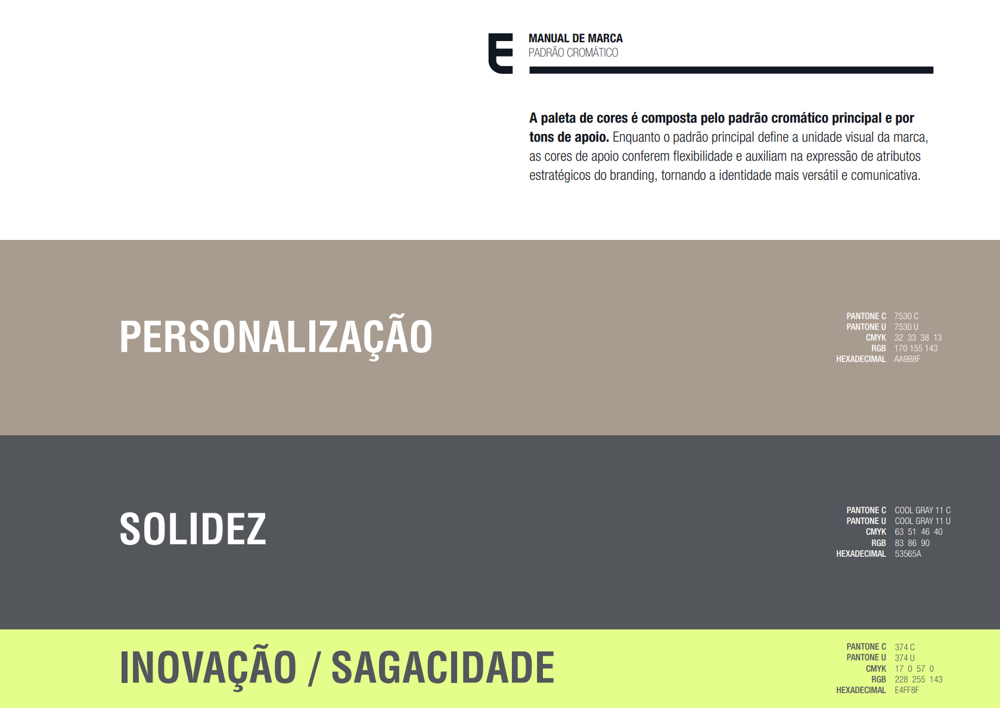

# 06. Visual Layout · Wireframes, Ativos & Previews da Interface

> **Spike de Solução:** Landing Page — Sales Costa Advogados  
> **Data:** 2026-08-31  
> **Status:** Concluído / Visualização Disponível

---

## 1. Ativos de Marca Mapeados e Aplicação

Abaixo estão dispostos os ativos visuais oficiais da marca Sales Costa Advogados mapeados no repositório, acompanhados de suas diretrizes de aplicação na interface:

### 1.1 Assinaturas e Wordmarks Principais

| Ativo da Marca | Arquivo Fonte | Aplicação Recomendada na UI |
|---|---|---|
| **Wordmark Horizontal** | `images/260701_sales_costa_marca_PREFERENCIAL_temp.png` | Utilizado na Navbar (fundo claro) e no Rodapé |
| **Assinatura Completa** | `images/260701_sales_costa_marca_ASSINATURA_temp.png` | Banner Hero e documentos de apresentação |
| **Brasão Colorido** | `images/260701_sales_costa_marca_BRASAO_COR_temp.png` | Favicon do site, Navbar Dark e marcas d'água |
| **Brasão Monocromático**| `images/260701_sales_costa_marca_BRASAO_temp.png` | Elemento gráfico decorativo em background |

#### Visualização dos Ativos da Marca:

  
*Figura 1.1 — Wordmark Preferencial Taupe (Utilizado na Navbar e Rodapé)*

  
*Figura 1.2 — Brasão Monograma "S" com Acento Lima (Utilizado como Favicon e Ícone Dark)*

---

## 2. Paleta Cromática Oficial

  
*Figura 2.1 — Padrão Cromático Oficial Sales Costa Advogados*

### Resumo dos Tokens Cromáticos:
- **Taupe (#AA9B8F):** Cor primária de personalização e sofisticação.
- **Cinza Chumbo (#53565A):** Cor secundária para fundos dark e solidez institucional.
- **Lima (#E4FF8F):** Cor de acento para inovação, destaques e badges ativadas.
- **Off-White (#F8F6F4):** Fundo secundário claro e quente para seções de leitura.

---

## 3. Mockups e Previews da Interface

### 3.1 Hero Banner & Navbar (Desktop View)

  
*Figura 3.1 — Renderização conceitual da Navbar Sticky e Hero Banner do escritório Sales Costa Advogados.*

#### Detalhes do Layout da Hero Section:
```
+-------------------------------------------------------------------------------+
| LOGO [SALESCOSTA]    Sobre  Áreas  Diferenciais  Equipe    [ FALE CONOSCO ]   | (Navbar Sticky)
+-------------------------------------------------------------------------------+
|                                                                               |
|                   SALES COSTA ADVOGADOS (Eyebrow Tag)                         |
|                                                                               |
|          Junto nas decisões que constroem o futuro.                           | (H1 Serif 64px)
|                                                                               |
|     Advocacia estratégica e personalizada com foco em excelência e           | (Subtítulo 18px)
|     resultados corporativos de alto impacto.                                 |
|                                                                               |
|             [ CONHEÇA O ESCRITÓRIO ]     [ FALE CONOSCO ]                     | (CTAs)
|                                                                               |
|                                     v (Scroll Indicator)                      |
+-------------------------------------------------------------------------------+
```

---

### 3.2 Seções de Conteúdo, Áreas de Atuação e Números

  
*Figura 3.2 — Renderização conceitual do grid de Áreas de Atuação, seção Sobre e banner Em Números.*

#### Wireframe da Seção "Áreas de Atuação" (3 Colunas Grid):
```
+-------------------------------------------------------------------------------+
|                         NOSSAS ESPECIALIDADES                                 |
|            Atuação estratégica em múltiplas frentes jurídicas                 |
|                                                                               |
|  +--------------------+  +--------------------+  +--------------------+       |
|  | [Ícone Direito Emp]|  | [Ícone Tributário] |  | [Ícone Imobiliário]|       |
|  | Direito Empresarial|  | Direito Tributário |  | Direito Imobiliário|       |
|  | Descrição curta    |  | Descrição curta    |  | Descrição curta    |       |
|  | Saiba mais ->      |  | Saiba mais ->      |  | Saiba mais ->      |       |
|  +--------------------+  +--------------------+  +--------------------+       |
|                                                                               |
|  +--------------------+  +--------------------+  +--------------------+       |
|  | [Ícone Cível]      |  | [Ícone Contratos]  |  | [Ícone M&A]        |       |
|  | Direito Cível      |  | Contratos Empres.  |  | Fusões & Aquisições|       |
|  | Descrição curta    |  | Descrição curta    |  | Descrição curta    |       |
|  | Saiba mais ->      |  | Saiba mais ->      |  | Saiba mais ->      |       |
|  +--------------------+  +--------------------+  +--------------------+       |
+-------------------------------------------------------------------------------+
```

---

### 3.3 Wireframe da Seção "Em Números" (Fundo Taupe #AA9B8F)

```
+-------------------------------------------------------------------------------+
|     +15              +500             +300              5                     |
|  Anos de          Clientes         Casos de         Áreas de                  |
| Experiência       Atendidos        Sucesso       Especialidade                |
+-------------------------------------------------------------------------------+
```

---

### 3.4 Wireframe da Seção "Fale Conosco" (Fundo Dark #53565A)

```
+---------------------------------------------------+---------------------------+
| ENTRE EM CONTATO                                  | FORMULÁRIO DE CONTATO     |
| Fale diretamente com nossos advogados.            |                           |
|                                                   | Nome Completo:            |
| Endereço: Av. Paulista, 1000 - São Paulo/SP       | [_______________________] |
| E-mail: contato@salescosta.com.br                 | E-mail Corporativo:       |
| Telefone: +55 (11) 3000-0000                      | [_______________________] |
| Redes: [LinkedIn] [Instagram]                     | Mensagem:                 |
|                                                   | [                       ] |
|                                                   | [ ENVIAR MENSAGEM ]       |
+---------------------------------------------------+---------------------------+
```
